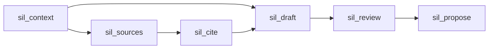

# Stage 10 / Wave 08-10 — MCP surface collapse (19 → 6)

**Status:** Design ready for implementation dispatch  
**On execute:** Ship code + docs per `prompts/PR-M1-mcp-collapse.md` (product code only when an implementer runs that prompt).

| Field | Value |
|-------|--------|
| **Project** | scientist-in-loop (`sil`) |
| **Date** | 2026-08-10 |
| **Baseline** | Stage 9 partial (19 MCP tools in `crates/sil-mcp`) |
| **Predecessor** | `docs/pr-plan-09-08/` |
| **Target path** | `docs/plan-08-10/` |

---

## 1. Overview

Collapse the MCP tool list from **19** fine-grained tools to **6** workflow-oriented tools. Agents pick fewer verbs; capability is preserved via `action` (or documented flags) dispatch into existing handlers.

| Track | Theme |
|-------|--------|
| **M1** | MCP collapse (code + tests + docs honesty) |



---

## 2. Problem

1. **Selection cost:** 19 tools with near-sibling names (`list`/`update`, `fetch`/`parse`, `upsert`/`promote`) raise wrong-tool rates.
2. **Docs drift:** README still claims **22** tools; code registers **19**.
3. **Agent loop is phased:** orient → literature → cite → draft → quality → propose. The API should match that mental model.

---

## 3. Key decisions (KD)

| ID | Decision |
|----|----------|
| **KD-1** | Target surface is exactly **6** tools (not 5). |
| **KD-2** | **Hard cut:** remove old names from `list_tools` / `call_tool`. No alias layer. |
| **KD-3** | Dispatch with **`action` enums** where multiple ops share a tool (pattern already used by `sil_get_structure`). |
| **KD-4** | **Reuse existing handler bodies** — thin re-registration only; no RAG/bib logic rewrite. |
| **KD-5** | **Never auto-commit.** Writes return Sci-Action proposals / `never_committed: true`. |
| **KD-6** | **`sil_review` `estimate`** remains read-only on `paper_draft.tex` (optional write under `.sil/reviews/` only). |
| **KD-7** | **`sil_propose` stays separate** from `sil_review` so quality gates and git governance are not confusable. |
| **KD-8** | Docs ship with M1: tool count, migration table, STAGES Stage 10 note, ADR mention if counts are claimed. |
| **KD-9** | No shell/generic `run_cli` MCP tool. No new top-level project dirs. |

---

## 4. Target surface (normative)

### 4.1 Six tools

| Tool | Role | Dispatch |
|------|------|----------|
| **`sil_context`** | Orient: snapshot, skills, structure read, list TODOs | Flags + optional skill name/input |
| **`sil_sources`** | Literature lifecycle | `action`: `search` \| `get` \| `fetch` \| `parse` \| `rank` |
| **`sil_cite`** | Bibliography + claim grounding | `action`: `suggest` \| `ground` \| `upsert` \| `promote` |
| **`sil_draft`** | Manuscript mutations | `action`: `edit` \| `todo` \| `structure` |
| **`sil_review`** | Quality gates | `action`: `estimate` \| `build` |
| **`sil_propose`** | Commit proposal only | `message` / Sci-Action category (same as today) |

### 4.2 Old → new migration table

| Old tool | New tool | Action / notes |
|----------|----------|----------------|
| `sil_get_workspace_context` | `sil_context` | flags `include_*` |
| `sil_list_skills` | `sil_context` | list skills (e.g. `list_skills=true` or omit skill name) |
| `sil_invoke_skill` | `sil_context` | `skill` + optional `input` |
| `sil_list_todos` | `sil_context` | `include_todos` / todo filters |
| `sil_get_structure` (read) | `sil_context` | structure included or `include_structure` |
| `sil_search_sources` | `sil_sources` | `action=search` |
| `sil_get_source_context` | `sil_sources` | `action=get` |
| `sil_fetch_source` | `sil_sources` | `action=fetch` |
| `sil_parse_source` | `sil_sources` | `action=parse` |
| `sil_rank_draft` | `sil_sources` | `action=rank` |
| `sil_suggest_citations` | `sil_cite` | `action=suggest` |
| `sil_ground_claims` | `sil_cite` | `action=ground` |
| `sil_upsert_bib` | `sil_cite` | `action=upsert` |
| `sil_promote_bib` | `sil_cite` | `action=promote` |
| `sil_edit_section` | `sil_draft` | `action=edit` |
| `sil_update_todo` | `sil_draft` | `action=todo` |
| `sil_get_structure` (update) | `sil_draft` | `action=structure` |
| `sil_estimate_paper` | `sil_review` | `action=estimate` |
| `sil_build_and_doctor` | `sil_review` | `action=build` |
| `sil_propose_commit` | `sil_propose` | same args as today |

### 4.3 Schema sketch

**`sil_sources`** (illustrative; implementers refine property sets from current schemas):

```json
{
  "name": "sil_sources",
  "description": "Literature lifecycle: search | get | fetch | parse | rank (hybrid RAG when onnx+models; else hash fallback)",
  "inputSchema": {
    "type": "object",
    "properties": {
      "action": {
        "type": "string",
        "enum": ["search", "get", "fetch", "parse", "rank"]
      },
      "query": { "type": "string" },
      "source_id": { "type": "string" },
      "chunk_id": { "type": "string" },
      "target": { "type": "string" },
      "path": { "type": "string" },
      "limit": { "type": "integer" },
      "hyde": { "type": "boolean" },
      "expand_parent": { "type": "boolean" },
      "no_parse": { "type": "boolean" },
      "all_unparsed": { "type": "boolean" },
      "min_score": { "type": "number" }
    },
    "required": ["action"]
  }
}
```

**Per-action required fields** (errors must name the missing field):

| Tool / action | Required beyond `action` |
|---------------|--------------------------|
| `sil_sources` / `search` | `query` |
| `sil_sources` / `get` | `source_id` |
| `sil_sources` / `fetch` | `target` |
| `sil_sources` / `parse` | one of `source_id`, `path`, or `all_unparsed=true` |
| `sil_sources` / `rank` | (none; optional `min_score`, `limit`) |
| `sil_cite` / `suggest` | `query` |
| `sil_cite` / `ground` | `claim` |
| `sil_cite` / `upsert` | `entry` |
| `sil_cite` / `promote` | `cite_key` |
| `sil_draft` / `edit` | `content` or (`search`+`replace`); section selector (`section_title` or `section_id`) |
| `sil_draft` / `todo` | `content` (create) or `id` (update) — match current `sil_update_todo` |
| `sil_draft` / `structure` | `section_id` + completion/claims fields |
| `sil_review` / `estimate` | (none; optional `mode`, `write`, …) |
| `sil_review` / `build` | (none; optional `engine`, `run_doctor`) |

**`sil_context`** — no `action` required if flags are enough; document:

- Default: workspace snapshot (sources/paper/todos flags like today).
- `skill` set → invoke skill (old `sil_invoke_skill`).
- `list_skills=true` → discover skills.
- Structure/todos can be embedded in the snapshot or toggled with include flags.

**`sil_propose`** — keep current `message` / `action` Sci-Action args.

### 4.4 Agent-facing one-liners (for tool descriptions)

| Tool | Description seed |
|------|------------------|
| `sil_context` | Orient: project snapshot, skills, structure/TODOs (read-mostly). |
| `sil_sources` | Literature: hybrid search, expand context, fetch, parse, rank vs draft. |
| `sil_cite` | Cite/bib: suggest keys, ground claims, upsert/promote BibTeX (never commits). |
| `sil_draft` | Write draft: edit section, update `# -- X -- #` TODOs, set structure completion. |
| `sil_review` | Quality: L0 estimate (read-only on draft) or build+doctor. |
| `sil_propose` | Format Sci-Action commit proposal; **never** auto-commits. |

---

## 5. Invariants

1. **Never auto-commit** from any MCP tool.
2. Sci-Action trailers remain correct per mutation type.
3. Estimate never writes `paper_draft.tex`.
4. ONNX wording: dense path only with `--features onnx` **and** successful model load; else honest hash/token fallback.
5. Workspace lock advisory behavior unchanged on edit paths.
6. Response JSON keeps `never_committed` / `proposal` where writers already return them.

---

## 6. Implementation notes

### Files (expected touch set)

| Area | Paths |
|------|--------|
| Registration / dispatch | `crates/sil-mcp/src/tools/mod.rs` |
| Server tests / allowlist | `crates/sil-mcp/src/server.rs` |
| Docs | `README.md` MCP section, `STAGES.md`, optionally `docs/adr/ADR-004` / `ADR-012` tool counts |
| Agent skills (if they name old tools) | `templates/agent/skills/*.md` |

### Approach

1. Keep private `handle_*` functions.
2. Replace `list_tools()` with 6 `Tool` definitions; richer `input_schema` unions.
3. Replace `call_tool` match with 6 arms that branch on `action` / flags and call existing handlers after validating required fields.
4. Update unit tests that call tools by old names (grep `sil_search_sources`, `sil_upsert_bib`, etc.).
5. Update `test_list_tools` count **19 → 6** and expected name list.
6. Docs: migration table + count honesty.

### Explicit non-goals

- Alias / dual registration of old names.
- New capabilities (GPU, golden F1, TUI estimate, releases).
- CLI surface redesign (`sil search` etc. stay).
- Changing ranking algorithms or bib upsert semantics.

---

## 7. PR / wave

| PR | Title | Role | Depends |
|----|-------|------|---------|
| **M1** | Collapse MCP tools 19 → 6 | mcp-engineer | — |

Optional follow-up (only if M1 becomes too large):

| PR | Title | Role | Depends |
|----|-------|------|---------|
| **M2** | Docs/ADR/skill string sweep for old tool names | docs-closer | M1 |

Default: **ship docs honesty inside M1**.

---

## 8. Acceptance criteria (M1)

1. `list_tools()` returns **exactly 6** tools with the normative names.
2. Every row in the migration table is reachable (behavior parity via action/flags).
3. No old tool name remains in `list_tools` or `call_tool` match arms.
4. Bib/edit/promote paths still leave git `HEAD` unchanged in tests.
5. Estimate path still does not write `paper_draft.tex`.
6. README / STAGES tool counts match code (6).
7. Migration table present in README (or linked plan) for agent authors.
8. `cargo test -p sil-mcp` and workspace tests green; clippy clean on touched crates.

---

## 9. Verify commands

```bash
cargo test -p sil-mcp
cargo test --workspace
cargo clippy -p sil-mcp --all-targets -- -D warnings
# Docs honesty:
rg -n 'sil_search_sources|sil_upsert_bib|22 tools|19 MCP' README.md STAGES.md || true
# Expect: migration mentions OK; live "N tools" claims == 6
```

---

## 10. Residual risks

| Risk | Mitigation |
|------|------------|
| Host agents / skill prompts still call old names | Migration table + skill template sweep in M1 |
| Fat JSON schemas confuse some clients | Clear `action` enum + per-action error messages |
| Structure split across context (read) vs draft (write) | Document in tool descriptions; mirror old `sil_get_structure` dual mode |

---

## 11. Prompt index

| Prompt | File |
|--------|------|
| PR-M1 implementation | [prompts/PR-M1-mcp-collapse.md](prompts/PR-M1-mcp-collapse.md) |
| Dispatch rules | [prompts/README.md](prompts/README.md) |
