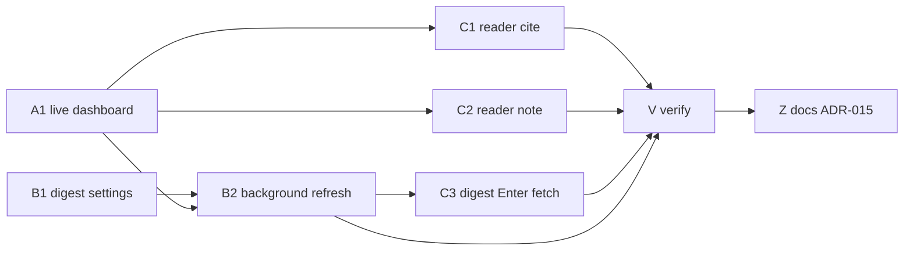
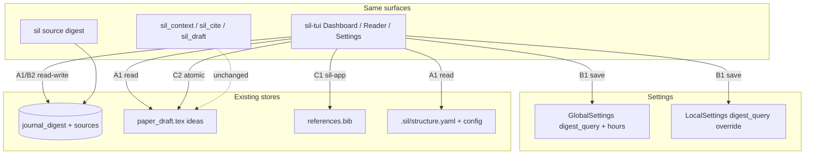

# Stage 13 / Wave 08-13 — Daily command center (honest dashboard)

**Status:** Design ready for implementation dispatch  
**On execute:** Ship code + docs per `prompts/PR-*.md` (product code only when an implementer runs those prompts).

| Field | Value |
|-------|--------|
| **Project** | scientist-in-loop (`sil`) |
| **Date** | 2026-08-13 |
| **Baseline** | Stage 12 complete (`sil-app` use-case layer); Stages 0–11 complete |
| **Predecessor** | `docs/plan-sil-app/` + leftover notes in `docs/pr-plan-09-08/` |
| **Target path** | `docs/plan-08-13/` |
| **User decisions** | Conversation 2026-08-13. Live dashboard **yes**. No `sil daily` command / no JSON dump (agent has MCP). Background digest + settings **yes**. Writing sessions / close ritual / Sci-Action notebook / experiments / multi-project morning **no**. Reading→cite/note **yes** (verbs A+B). Agent night-shift already shipped. |

---

## 1. Overview

`sil tui` already *claims* to be a daily scientist command center. The Dashboard tab is a **static mock**: hardcoded health (“Stage 5”, “labels OK”), dummy `# -- X -- #` TODOs, dummy Nature/IEEE titles, and a keymap. A scientist opening the TUI every morning cannot trust pane 1–3.

This wave does **not** invent a second daily app. It makes the existing four-pane dashboard honest, quietly refreshes the literature digest from settings, and adds two verbs inside the source reader already on tab 2: **keep this paper** (`b`) and **park this claim on my draft** (`n`).

| Track | Theme |
|-------|--------|
| **A** | Live dashboard — real structure, audit, TODOs, digest cache |
| **B** | Digest settings + TUI-lifetime background refresh |
| **C** | Reader verbs: cite (`b`) + capture note (`n`); digest row → existing fetch |
| **V** | Orchestrator verification (workspace test/clippy + scenario checklist) |
| **Z** | STAGES Stage 13 + ADR-015 + README honesty |



**Waves**

```text
Wave 0:  A1 | B1
Wave 1:  B2          (after A1 + B1)
Wave 2:  C1 | C2     (after A1; may overlap B2)
Wave 3:  C3          (after B2)
Wave 4:  V then Z
```

---

## 2. Code-truth audit (2026-08-13)

| Claim / fear | Code truth | 08-13 action |
|--------------|------------|--------------|
| Dashboard is a daily command center | **Mock.** `crates/sil-tui/src/ui/dashboard.rs` hardcodes stage, labels, three TODOs, three journal titles, keymap. Only bib coverage is live (`audit_manuscript` + `bib_citation_ratio`). | **A1** |
| `sil daily` exists | README mentions `sil dashboard` / `sil daily`. **No such command.** `sil tui dashboard` opens the TUI. | **Do not add.** Dashboard *is* daily. |
| Agent needs `sil daily --json` | Agent already has `sil_context` (structure, TODOs, sources, draft). | **Out.** No JSON orientation dump. |
| Digest is a daily inbox | `sil source digest` is a one-shot Crossref query. Rows land in `journal_digest` (`fetched_at` column exists). TUI never reads the table. No query/interval settings. | **B1 + B2** |
| Settings can hold digest prefs | `GlobalSettings` = author, grant, engine, template, RAG, recent projects. `LocalSettings` = title, co-authors, grants, notes. No digest fields. Settings tab is `GlobalField` + `LocalField` enums. | **B1** |
| TUI background jobs exist | Hydrate / parse / fetch / similarity / estimate already `thread::spawn` + `catch_unwind`. | **B2** reuses this chrome |
| Reader can cite | `handle_reading_source_md_mode` only scrolls + quit + help. `b` on the **Sources list** upserts bib via `sil-app`. | **C1** |
| Human can park a claim from a paper | MCP `sil_cite action=ground` goes the **other** way (my claim → search sources). No human capture from the reader. `update_or_insert_idea_block` already writes `# -- X -- #`. | **C2** |
| Digest feeds reading | Dashboard digest is dead text. Sources `a` is the only ingest. | **C3** (thin: Enter queues existing fetch) |
| Experiments / data/ | `data/` and `figures/` exist; runs live in other trees. | **Out** (user) |
| Close-the-day / writing session / activity log | Would be a second interface. | **Out** (user) |
| Multi-project morning | `sil paper recent` is a path list. User works one project at a time. | **Out** (user) |
| Agent proposal inbox | MCP 6 tools + Sci-Action proposals + TODOs already are the night shift. | **Out** (user: already implemented) |

### Pain points this wave closes

1. **Untrustworthy home screen** — scientist cannot use tab 1 as a morning glance.
2. **Stale / fake literature feed** — digest is a CLI one-shot the TUI ignores.
3. **Reading dead-ends** — after `Enter` on a source you can only scroll; cite and “this matters” live elsewhere (or only on the agent).

---

## 3. Goals / non-goals

### Goals

1. Dashboard panes 1–3 render **project truth**. Pane 4 stays the keymap (same interface).
2. Digest query + refresh interval live in **Settings**. While the TUI is open, a stale cache refreshes in the background (interval ≥ 1 hour). Empty query = disabled.
3. Inside the markdown reader: `b` upserts the current source into `references.bib` (same `sil-app` path as the list). `n` opens a one-line modal and inserts a `# -- X -- #` block tagged with the source filename.
4. On the dashboard digest list, `Enter` queues the **existing** fetch job for that DOI/URL. No new ingest pipeline.
5. Derived attention only (no new source states): unparsed sources, open TODOs, uncited bib, stale digest. Shown as facts on the dashboard, not as a planner.
6. Never auto-commit. Writes go through `write_atomic_str` / `sil-app` and return Sci-Action proposals where those surfaces already do.
7. Docs tell the truth (Stage 13, ADR-015). README stops advertising `sil daily`.

### Non-goals (hard forbidden)

- New CLI command `sil daily` (or aliases that dump a ritual)
- `sil daily --json` / extra MCP tool / extra `sil_context` orientation dump
- Writing-session timer, section-only focus mode, word-count ceremony
- Close-the-day command or “tomorrow first” writer
- Sci-Action weekly notebook / streaks / sparkline
- Experiment/`data/` watchers, symlinks to training trees, figure-vs-CSV freshness
- Cross-project daily view
- Agent proposal inbox UI
- Highlight / annotation layer, new “triaged / read / cited” source workflow
- Pin-to-`structure.yaml` section picker (formulation C; later if ever)
- Multi-query digest watch list
- OS daemon / cron / launchd — refresh is **TUI-lifetime only**
- Auto-commit, auto-edit of prose beyond inserting a TODO block the user typed
- New top-level project directories

---

## 4. Product decisions (KD)

| ID | Decision |
|----|----------|
| **KD-1** | Dashboard **is** the daily view. No second ritual command. |
| **KD-2** | Agents keep using `sil_context` / the 6 MCP tools. No JSON twin. |
| **KD-3** | Four panes stay. Layout unchanged. Dummy strings die. |
| **KD-4** | Pane 4 remains the shortcut guide (not a “next action” coach). |
| **KD-5** | Effective digest query = `LocalSettings.digest_query` if non-empty, else `GlobalSettings.digest_query`. Both empty → auto-refresh **off**. |
| **KD-6** | `GlobalSettings.digest_refresh_hours: u32`, default **1**, minimum **1**. No sub-hour refresh. |
| **KD-7** | Refresh only when **Dashboard is shown** (tab 1) and cache age ≥ interval. One in-flight digest job at a time. Reuse job history chrome (`J`). |
| **KD-8** | `sil source digest` stays the manual CLI trigger and still writes `journal_digest`. |
| **KD-9** | Reader `b` = library verb. Same `sil_app::upsert_bib` policy as Sources-list `b` (`draft: true`, preserve cite key, never commit). |
| **KD-10** | Reader `n` = argument verb. One-line note → `# -- X -- #` via `sil_latex::update_or_insert_idea_block`. First line of content: `from: <filename>`. Tag `from-source`. `author_type: human`. Append near end of draft unless `section_id` is known (default: none). |
| **KD-11** | No new SQLite “reading” / “triaged” column. “In bib?” and “cited in draft?” are derived. |
| **KD-12** | No new `SciAction` variant. Cite → `UpdateBibliography`. Note → `EditDraft`. |
| **KD-13** | Digest `Enter` calls the existing TUI fetch queue (`sil_app::fetch_source`, `parse=false` to match current TUI fetch). Status tells the user to parse/read on tab 2. Do **not** auto-open the reader. |
| **KD-14** | Same interface family: existing tabs, existing job chrome, existing add-link-style modal for `n`. New `InputMode` only if required for the note modal (`ModalCaptureNote`). |
| **KD-15** | Never auto-commit. |

---

## 5. Target behavior (normative)

### 5.1 Dashboard panes (A1)

| Pane | Title (keep) | Data source |
|------|----------------|-------------|
| **[1] Health** | Manuscript Completion & Health Audit | `config.project.stage` (not “Stage 5”); `config.latex.main` + `config.latex.engine`; `audit_manuscript` for bib coverage **and** unmatched labels (do not hardcode “OK”); optional word count / TODO count from the same report |
| **[2] Ideas** | Active Ideas & TODO Blocks | `parse_idea_blocks(paper_draft.tex)` or SQLite `todo_ideas` if already hydrated — prefer the draft file as source of truth (same as `sil paper todo`). Show up to ~8 open/in_progress items: section, line range, first line of content. Empty state: the existing tip about `# -- X -- #` |
| **[3] Digest** | Literature Digest | `SilDb::list_journal_publications` (extend to expose `fetched_at` / last refresh). Empty: “no digest yet — set digest query in Settings”. Stale: show age + “refreshing…” if a job is in flight |
| **[4] Shortcuts** | Scientist Command Center | Keep keymap. Add **one** factual status line at the top if cheap: e.g. `unparsed N · open TODOs M · digest 3h ago` — counts only, no advice |

Health must stop claiming “Stage 5 (Polish & Production)” and “OK (all labels matched)” unless the audit says so.

Pull dashboard **model** construction out of the draw function into a testable helper (e.g. `DashboardModel` in `sil-tui` or a small `sil-app` read helper). Draw stays dumb.

### 5.2 Digest settings (B1)

```yaml
# ~/.config/sil/settings.yaml  (GlobalSettings)
digest_query: ""                 # empty = inherit nothing; auto-refresh off unless local set
digest_refresh_hours: 1          # min 1

# .sil/config.yaml  (LocalSettings)
digest_query: "semantic entropy" # optional; wins when non-empty
```

TUI Settings tab:

- New **Digest** divider (or two fields under Global + one under Local).
- Fields: global query, refresh hours, local query override.
- Save via existing `Ctrl+S` / `s` → `GlobalSettings::save` / config atomic write.
- `serde` defaults so old YAML still loads.

### 5.3 Background refresh (B2)

On each TUI tick / when entering the Dashboard tab:

1. Resolve effective query (KD-5). If empty, do nothing.
2. Read newest `fetched_at` from `journal_digest` (or a single `digest_meta` if you add it — prefer **no new table**; `MAX(fetched_at)` is enough).
3. If missing or age ≥ `digest_refresh_hours`, and no digest job in flight, spawn `JobKind::Digest`.
4. Worker: `fetch_journal_publications(query, limit)` (default limit 10, same as CLI), `save_journal_publication` each row. Panic-isolated.
5. On success, dashboard reloads the list. Failures go to job history (`J`) like fetch/hydrate.

Do not block the event loop. Do not refresh on CLI `sil status`.

### 5.4 Reader verbs (C1, C2)

`ReadingSourceMd` today: `j/k`, PageUp/Down, `?`, `q/Esc`.

| Key | Verb | Effect |
|-----|------|--------|
| `b` | Keep this paper | `sil_app::upsert_bib` for the **current** source (same as list `b`). Status line + job/proposal chrome unchanged. |
| `n` | This sentence matters | Open `ModalCaptureNote`. Placeholder: “Why does this paper matter for the draft?” Enter commits; Esc cancels. Empty note is a no-op. |

Note block shape (normative):

```latex
% # -- X -- #
% from: attention.pdf
% Residual stream carries the unembedding (Smith 2024, §3)
% # -- X -- #
```

- `id`: `from-{source_id}-{short_hash(note)}` so two notes do not clobber.
- `tags`: `from-source`
- `author_type`: `human`
- `status`: `open`, `priority`: `medium`
- Write `paper_draft.tex` with `write_atomic_str`.
- Reload paper draft + idea list (dashboard pane 2 becomes true after C2).
- Help overlay for `HelpMode::ReadingSourceMd` lists `b` and `n`.

### 5.5 Digest → fetch (C3)

Dashboard pane 3 becomes a **small selectable list** (j/k when `ActiveTab::Dashboard`). Highlight does not change the other panes.

- `Enter` on a row with DOI or URL → existing `queue_fetch` / `sil_app::fetch_source` (`parse=false`).
- No DOI/URL → status “cannot fetch (no DOI or URL)”.
- Do not switch tab. Do not open the reader.

This is how the morning feed joins the existing Sources ingest. Reading stays on tab 2.

---

## 6. Architecture (after 08-13)



No new crate. Prefer:

- Settings types in `sil-core` (`settings.rs`)
- Digest list + `fetched_at` in `sil-db`
- Dashboard model + jobs + reader handlers in `sil-tui`
- Bib write via **`sil-app`** (do not fork upsert)
- Idea insert via **`sil-latex`** (do not fork the parser)

---

## 7. PR DAG

| PR | Title | Depends | Parallel with | Prompt |
|----|-------|---------|---------------|--------|
| **A1** | Live dashboard model + render | — | B1 | [PR-A1-live-dashboard.md](prompts/PR-A1-live-dashboard.md) |
| **B1** | Digest settings (types + Settings tab) | — | A1 | [PR-B1-digest-settings.md](prompts/PR-B1-digest-settings.md) |
| **B2** | Background digest job | A1, B1 | C1, C2 | [PR-B2-background-digest.md](prompts/PR-B2-background-digest.md) |
| **C1** | Reader `b` cite | A1 | C2, B2 | [PR-C1-reader-cite.md](prompts/PR-C1-reader-cite.md) |
| **C2** | Reader `n` note | A1 | C1, B2 | [PR-C2-reader-note.md](prompts/PR-C2-reader-note.md) |
| **C3** | Digest Enter → fetch | B2 | — | [PR-C3-digest-open.md](prompts/PR-C3-digest-open.md) |
| **V** | Verification stage | A1, B1, B2, C1, C2, C3 | — | [PR-V-verify.md](prompts/PR-V-verify.md) |
| **Z** | STAGES + ADR-015 + README | V | last | [PR-Z-docs-adr-015.md](prompts/PR-Z-docs-adr-015.md) |

A1 can render digest from whatever `list_journal_publications` already returns; B2 only adds freshness + job. If A1 ships first with no `fetched_at` in the domain type, show the cached titles without age until B2.

---

## 8. Subagent roles

One agent per PR. Roles are **constraints**, not extra process.

| Role | PRs | Owns | Must not |
|------|-----|------|----------|
| **Dashboard engineer** | A1 | `DashboardModel`, `dashboard.rs` draw, App load hooks | New tabs, keymap rewrite, digest HTTP |
| **Settings engineer** | B1 | `GlobalSettings` / `LocalSettings`, Settings tab fields, serde defaults | TUI jobs, dashboard layout |
| **Jobs engineer** | B2 | `JobKind::Digest`, stale check, save to SQLite, job chrome | Reader keys, new CLI |
| **Reader-cite engineer** | C1 | `b` in `ReadingSourceMd` → `sil-app` | Note modal, digest |
| **Reader-note engineer** | C2 | `n` modal + idea insert + help overlay | Bib upsert logic |
| **Digest-inbox engineer** | C3 | Dashboard selection + Enter → existing fetch queue | Auto-parse, auto-open reader |
| **Verifier** | V | Workspace tests, clippy, scenario checklist, residual risk | Product features |
| **Docs agent** | Z | `STAGES.md`, `README.md`, `ADR-015` | Logic changes |

Shared invariants for every implementer (also in `prompts/README.md`):

1. Minimal diff; no drive-by refactors.
2. Never auto-commit.
3. Same five tabs. Same never-auto-commit contract.
4. Reuse `sil-app` / `sil-latex` / TUI jobs. Do not reimplement upsert, fetch, or idea parsing.
5. Clippy `-D warnings` on touched crates. Prefer co-located unit tests.

---

## 9. Verification stage (normative)

Verification is a **first-class PR (V)**, not a vibe-check after Z.

### 9.1 Per-PR gates (must be green before merge of that PR)

| PR | Gate |
|----|------|
| A1 | `cargo test -p sil-tui -p sil-latex`; dashboard helper tests: empty project, real structure/TODOs/audit, empty digest |
| B1 | `cargo test -p sil-core -p sil-tui`; old YAML without digest keys still deserializes; hours `< 1` clamps to 1 |
| B2 | `cargo test -p sil-tui -p sil-db`; stale/fresh/empty-query cases; no second job while in flight |
| C1 | `cargo test -p sil-tui`; reader `b` calls upsert path; Esc still exits reader |
| C2 | `cargo test -p sil-tui -p sil-latex`; note insert contains `from:`; empty note does not write; atomic write |
| C3 | `cargo test -p sil-tui`; Enter without DOI/URL is a no-op with status; Enter with DOI queues fetch |

### 9.2 Wave gate (PR-V)

```bash
cargo test --workspace
cargo clippy --workspace --all-targets -- -D warnings
cargo fmt --check
```

Plus the **scenario checklist** in `prompts/PR-V-verify.md` (human or agent walking a throwaway `sil init` project). V does not add features; it may file residual bugs as notes, not drive-by fixes outside listed PRs.

### 9.3 Honesty grep (Z)

- README must **not** claim `sil daily` as a command.
- Dashboard docs must say panes are live.
- MCP tool count remains **6**.
- No claim of daemon/cron digest, writing sessions, or experiment sync.

---

## 10. Implementation checklist

Use this as the wave scoreboard (also copied into PR-V).

**A — Live dashboard**

- [ ] Dummy health / TODO / digest strings removed from `dashboard.rs`
- [ ] Stage, engine, main file, label status, bib coverage come from config + `audit_manuscript`
- [ ] Idea pane lists real `# -- X -- #` blocks (or a clear empty state)
- [ ] Digest pane lists `journal_digest` rows (or a clear empty state)
- [ ] Pane 4 keymap preserved; optional count line is factual only
- [ ] `DashboardModel` (or equivalent) unit-tested without a full TUI

**B — Digest settings + refresh**

- [ ] `digest_query` + `digest_refresh_hours` on global settings; local query override
- [ ] Settings tab can edit and save them (`Ctrl+S`)
- [ ] Old settings YAML still loads
- [ ] Empty effective query disables auto-refresh
- [ ] Interval minimum 1 hour
- [ ] Dashboard-open stale cache starts one background job
- [ ] Job isolated (`catch_unwind`); visible in `J`; writes `journal_digest`
- [ ] `sil source digest` still works and fills the same table

**C — Reading verbs**

- [ ] Reader `b` upserts current source via `sil-app` (`draft: true`)
- [ ] Reader `n` modal; Esc cancels; empty no-op
- [ ] Inserted block has `from: <filename>` and tag `from-source`
- [ ] `paper_draft.tex` written atomically; never git commit
- [ ] Help overlay lists `b` / `n`
- [ ] Dashboard digest j/k + Enter fetches via existing queue when DOI/URL present
- [ ] Enter does not auto-parse or auto-open reader

**V / Z**

- [ ] Workspace test + clippy + fmt green
- [ ] Scenario checklist walked
- [ ] `STAGES.md` Stage 13
- [ ] `docs/adr/ADR-015-daily-command-center.md`
- [ ] README dashboard / digest / reader / no-`sil-daily` honesty

---

## 11. Residuals (explicit, do not “fix” in this wave)

1. CLI `sil status` does not refresh digest (TUI-lifetime only).
2. Search/rank surface drift (CLI FTS vs MCP hybrid) — leftover from Stage 12.
3. No pin-to-section (`structure.yaml` main_claim).
4. No source triage state machine.
5. Digest is a single effective query, not a watch list.
6. TUI fetch remains `parse=false`; user still parses on tab 2.
7. Advisory workspace lock still last-writer-wins (Stage 11 residual).

---

## 12. Docs contract (Z)

- `STAGES.md`: Stage 13 ✅ — live dashboard, settings-backed digest refresh, reader cite/note.
- New `docs/adr/ADR-015-daily-command-center.md`: Accepted; KDs; residuals above.
- `README.md`: Dashboard description matches live panes; Settings lists digest fields; reader keys `b`/`n`; delete or reword the `sil daily` mention; MCP still 6 tools.

---

## 13. Conversation map (why this wave is small)

| Original idea | User mark | Wave 08-13 |
|---------------|-----------|------------|
| 1 Live dashboard | Great | **A1** |
| 2 `sil daily` + JSON | Filling TBD; JSON overengineering | **KD-1, KD-2** — no new command |
| 3 Digest inbox | Background, ≥1 h, in Settings | **B1, B2, C3** |
| 4 Writing session | Not this app | Out |
| 5 Close-the-day | Minimalism / same interface | Out |
| 6 Sci-Action notebook | Overengineering | Out |
| 7 Read → claim → cite | Formulate | **C1 + C2** (A+B verbs) |
| 8 Experiments | Other directory, not unifiable | Out |
| 9 Agent night shift | Already implemented | Out |
| 10 Multi-project morning | Did not land | Out |
