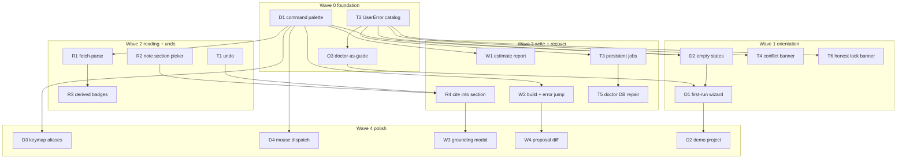
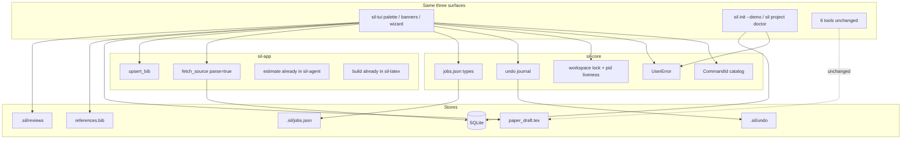

# Stage 14 / Wave 08-14 — Scientist-facing TUI & visible robustness

**Status:** Design ready for implementation dispatch  
**On execute:** Ship code + docs per `prompts/PR-*.md` (product code only when an implementer runs those prompts).

| Field | Value |
|-------|--------|
| **Project** | scientist-in-loop (`sil`) |
| **Date** | 2026-08-14 |
| **Baseline** | Stage 13 complete (live dashboard, digest refresh, reader `b`/`n`); Stages 0–12 complete |
| **Predecessor** | `docs/plan-08-13/` + residuals in ADR-013 / ADR-015 / Stage 9 leftovers |
| **Target path** | `docs/plan-08-14/` |
| **User decisions** | Conversation 2026-08-14. User agreed with **all five themes**: TUI discoverability, read→cite→write loop, visible robustness, first-hour onboarding, writing + agent handshake. Formalize as one Stage-14 wave. |

---

## 1. Overview

Stages 0–13 made `sil` durable and feature-complete for an engineer who already knows the cockpit: atomic writes, WAL, retries, panic-isolated jobs, a 5-tab Ratatui TUI, reader cite/note, digest inbox, MCP, never auto-commit.

A scientist who is not the author still cannot:

1. **Find the next action** without memorizing overloaded keys (`v`/`p`/`P`/`b`/`X`/`J`).
2. **Finish the reading loop** without hopping tabs (digest fetch does not parse; notes land at end of draft; no cite-into-section).
3. **See or reverse failure** (advisory lock is silent, doctor cannot repair SQLite, jobs die with the TUI, errors are status-bar Rust strings).
4. **Start** without a compiler toolchain mental model.
5. **Review writing / agent work** inside the TUI (estimate job exists but has no report viewer; no compile-error jump; no proposal diff).

This wave does **not** invent a second product (no web/Tauri GUI, no daemon, no sixth tab). It makes the existing TUI a **scientist desk**: findable commands, a complete read→cite→write loop, visible/reversible failure, a first-run that lands on a living dashboard, and a thin writing/agent handshake.

| Track | Theme | Scientist job |
|-------|--------|----------------|
| **D** | Discoverability | “What do I press?” |
| **R** | Reading loop | “I found a paper, now what?” |
| **T** | Trust / visible robustness | “Did I just lose work?” |
| **O** | Onboarding | “Can I open this at all?” |
| **W** | Writing + agent handshake | “Is the paper getting better?” |
| **V** | Verification | Workspace green + scenario checklist |
| **Z** | Docs | Stage 14, ADR-016, README honesty |



**Waves**

```text
Wave 0 (parallel):  D1 | T2 | O3
Wave 1 (parallel):  D2 | O1 | T4 | T6          (after Wave 0 as noted)
Wave 2 (parallel):  R1 | R2 | R3 | T1
Wave 3 (parallel):  R4 | W1 | W2 | T3 | T5
Wave 4 (parallel):  D3 | D4 | W3 | W4 | O2
Wave 5:             V then Z
```

If the wave must slip, **keep D1 + T2 + R1 + R2 + T1 + O1 + T6**. Cut D4 / W3 / W4 / O2 first (listed as slip-ok in §11).

---

## 2. Code-truth audit (2026-08-14)

| Claim / fear | Code truth | 08-14 action |
|--------------|------------|--------------|
| Scientist can find commands | Footer cheatsheet + `?` overlay. Keys overloaded (`v` = refs / `$EDITOR` / venue). No command palette. `handle_key` is a large mode match. | **D1, D3** |
| Empty project teaches the next step | Dashboard has empty copy for digest/ideas. Sources/refs/draft do not coach. No-project `sil tui` is a half-empty settings surface. | **D2, O1** |
| Mouse | Crossterm keys only. No `EnableMouseCapture`. | **D4** |
| Digest Enter finishes ingest | C3 queues `sil_app::fetch_source(parse=false)`. User must switch to tab 2 and parse. ADR-015 residual. | **R1** (composite; Enter becomes fetch+parse, not auto-open) |
| Note lands in the right section | C2 inserts `# -- X -- #` at end unless `section_id` set. **`update_or_insert_idea_block` already honors `section_id`.** | **R2** (picker only) |
| Cite while reading | Reader `b` upserts the *paper* into `references.bib`. Does not insert `\cite{...}` into a draft section. | **R4** |
| Source triage | No SQLite columns (ADR-015 KD-11). “In bib / cited” are derivable today, not shown as badges. | **R3** (derived badges only) |
| Split source + draft | Separate tabs 2 and 4. | **Out** (layout risk; residual) |
| Undo delete / bad note | Confirm modal for delete source. No generation journal. Atomic write ≠ undo. | **T1** |
| Errors a scientist can act on | `status_message` strings, often `anyhow` / `{err}`. No error catalog. | **T2** |
| Jobs survive quit | In-memory `recent_job_outcomes` ring. Digest/parse/fetch die with process. | **T3** |
| External editor / agent races | `pending_external_editor` exists. `.sil/workspace.lock` is advisory last-writer-wins (ADR-013). No mtime banner. | **T4, T6** |
| Doctor repairs a dead DB | `PRAGMA integrity_check` is reported. `--fix` repairs bib entries, not SQLite. ADR-013 residual. | **T5** |
| First hour | `install.sh --check-only`, `sil paper recent`, `GlobalSettings.recent_projects`. No TUI wizard, no demo paper. | **O1, O2, O3** |
| Prebuilt binaries | Stage 9 F1 leftover. No Releases this wave. | **Out** (residual) |
| Estimate in TUI | `run_estimate_job` already exists (L0 quick, status line + job history). No report viewer. | **W1** |
| Compile from draft tab | `sil paper build` is CLI only. | **W2** |
| Claim grounding UI | MCP `sil_cite action=ground` exists. No TUI. | **W3** |
| Accept/reject agent diffs | Sci-Action proposals print; never commit. No TUI diff. `.sil/improvement/` exists. | **W4** (thin, never commit) |
| New web GUI / daemon / 6th tab | Explicitly rejected in conversation + ADR-015. | **Out** |

### Pain this wave closes

1. Cockpit without a search box.
2. Reading dead-ends after fetch.
3. Silent data races and unrestorable deletes.
4. Empty first run.
5. Writing quality tools exist on CLI/MCP but not on the desk.

---

## 3. Goals / non-goals

### Goals

1. Every scientist-facing verb is a **named command** (`CommandId`) invokable from a palette (`:` / `Ctrl-K`). Existing keys become shortcuts to those IDs.
2. Empty states name the next command (“3 unparsed — Parse selected / Parse all”).
3. Digest / add-source can **fetch and parse** as one job. Reader is opened only by an explicit Open command (default: do not auto-open).
4. Reader note (`n`) offers a **section picker** (draft `\section` + `structure.yaml` ids). Insert uses existing `update_or_insert_idea_block`.
5. Reader can **insert `\cite{key}`** into a chosen section after the source is in `references.bib`.
6. Sources show **derived badges**: parsed / in bib / cited in draft. No new SQLite workflow columns.
7. TUI mutations keep a **local undo journal** (delete source, delete bib, note insert, cite insert). Never git revert.
8. Errors map to **`UserError { code, title, hint, retry }`**. Status bar shows title; detail is in help/toast.
9. Job queue persists under `.sil/jobs.json` and resumes on TUI start (no OS daemon).
10. File mtime + lock PID liveness produce a **banner**. Writes while another live holder exists require confirm.
11. `sil project doctor` speaks English (fix-it lines). `--repair-db` backups a corrupt SQLite and rebuilds from `sources/` (best effort). Never deletes PDFs.
12. `sil tui` with no project opens a **wizard** (recent / open path / `init` / doctor). `sil init --demo` seeds a tiny synthetic paper.
13. Draft tab: open last estimate report; run build; jump to first LaTeX error.
14. Thin grounding modal + thin uncommitted-diff / proposal viewer. **Never auto-commit.**
15. Docs: Stage 14, ADR-016, README honesty. MCP tool count stays **6**.

### Non-goals (hard forbidden)

- Web / Tauri / egui second GUI
- Sixth TUI tab
- OS daemon / cron / launchd for digest or jobs
- Auto-commit, auto journal submit, auto-open reader after parse
- Full in-TUI IDE (keep `$EDITOR` + existing popup)
- Split-pane source+draft (residual)
- SQLite “triaged / reading / cited” state machine
- Multi-query digest watch list
- Experiment / `data/` / wandb dashboard
- GitHub Releases / prebuilt binaries (Stage 9 F1 leftover)
- Hard OS `flock` across NFS as a correctness guarantee
- New MCP tools or `sil daily`
- Drive-by keymap rewrite that breaks `1–5`, `?`, `q`, `j/k` without aliases

---

## 4. Product decisions (KD)

| ID | Decision |
|----|----------|
| **KD-1** | Same five tabs. New UI = palette, modals, banners, empty states. No sixth tab. |
| **KD-2** | **Command registry is the spine.** `CommandId` + title + hint + `is_available(ctx)` + `run`. Keys, palette, mouse, and empty-state buttons all dispatch the same IDs. |
| **KD-3** | Palette keys: `:` and `Ctrl-K`. Fuzzy filter on title + id + aliases. Esc closes. Enter runs. |
| **KD-4** | Do not break muscle memory in D1. D3 only *adds* aliases and documents collisions in `?`. No mass rebind. |
| **KD-5** | Mouse (D4) is optional polish: click tabs, click list rows to select, double-click = Enter, click footer hint chips. No drag-resize. |
| **KD-6** | Digest `Enter` and Sources `a` success path become **fetch + parse** (`parse=true`) via `sil_app::fetch_source`. Do **not** auto-open the reader. Status: “parsed — Open from Sources or palette”. |
| **KD-7** | Palette command `open-source` opens the reader. Optional setting `open_after_parse` default **false**. |
| **KD-8** | Note `n` opens section picker (draft sections first, then “end of draft”). Writes `IdeaBlock.section_id`. Reuses `sil_latex::update_or_insert_idea_block`. |
| **KD-9** | Cite-into-section (`c` in reader, after source is in bib) inserts `\cite{key}` before the last `\par` / end of chosen section via a **new** `sil-latex` helper. Does not invent cite keys; uses `sil_app::upsert_bib` first if missing. |
| **KD-10** | Badges are **derived** at render time (parsed flag, bib key match, draft `\cite` scan). No new DB columns. Reversal of “don’t show triage”; not a reversal of “don’t store triage”. |
| **KD-11** | Undo journal: `.sil/undo/` (gitignored). Last **10** generations. Scope: TUI delete source, delete bib entry, note insert, cite insert. Restore is a command. Not a general VCS. |
| **KD-12** | `UserError` lives in `sil-core`. Surfaces map failures through it. Raw `Debug` stays in logs / `--json`, not the status bar. |
| **KD-13** | Persistent jobs: `.sil/jobs.json` (atomic write). Kinds: fetch, parse, digest, estimate, build. On TUI start, incomplete jobs are listed as failed-or-stale and can **Retry** (J). No resume of a half-written PDF (re-run from start). |
| **KD-14** | Conflict banner: watch mtime of `paper_draft.tex`, `references.bib`, `.sil/config.yaml`. If disk changed since last load and TUI is dirty, banner: Reload / Keep TUI / View diff (W4 helper). |
| **KD-15** | Honest lock: still a file, but **PID liveness** is checked (`kill -0` / `sysinfo`). If another holder is alive, banner shows holder+op; mutating commands require confirm. Dead PID is cleared. Not an NFS mutex. |
| **KD-16** | `sil project doctor --repair-db`: copy `db.sqlite` → `db.sqlite.corrupt-<ts>`, create fresh DB, reparse each on-disk source (best effort). Never delete `sources/`. Default `--fix` still means bib repair only. |
| **KD-17** | Doctor human report: each check has `ok`, `title`, `detail`, `hint` (install/fix line). JSON schema adds `hint` (backward compatible). |
| **KD-18** | No-project TUI: wizard first (recent projects from `GlobalSettings.recent_projects`, Open path, `sil init` name, Run doctor). Opening a project records recent as today. |
| **KD-19** | `sil init --demo` copies a **synthetic** fixture (tiny `.md` source + stub draft + 2 bib keys + 1 idea block). No copyrighted PDFs. |
| **KD-20** | W1 reuses `run_estimate_job`. Adds “Open last review” modal rendering `.sil/reviews/*/report.md` (or JSON summary). Does not claim peer-review truth. |
| **KD-21** | W2 runs existing `sil paper build` as a job. On failure, parse first `*.log` / engine stderr for `file:line` and jump draft viewer to that line. |
| **KD-22** | W3 grounding: modal on current section (or selected line). Calls existing ground-claims helper. Display-only ranked sources. Insert cite is explicit (R4). |
| **KD-23** | W4 thin review: show `git status` + uncommitted diff of `paper_draft.tex` / `references.bib` + last `sil git propose` text. Actions: Copy proposal / Discard TUI-only via undo (T1). **Never `git commit` / `git checkout`.** |
| **KD-24** | Never auto-commit. Atomic write ≠ git commit. |
| **KD-25** | No new crate. Types in `sil-core`, composites in `sil-app`, UI in `sil-tui`, repair in `sil-db` + `sil-parse`, section/cite helpers in `sil-latex`. |
| **KD-26** | MCP stays 6 workflow tools. New verbs are TUI/CLI only unless an existing action already covers them (`fetch`/`parse`/`estimate`/`build`). |
| **KD-27** | Split view, Releases, hard flock, multi-query digest, experiment dashboard stay residuals. |

---

## 4.1 ADR-015 / ADR-013 reversals (explicit)

| Previous residual | 08-14 |
|-------------------|--------|
| TUI fetch `parse=false` | Composite path `parse=true` (KD-6). Old CLI `sil source fetch` policy unchanged unless it already optional-parses. |
| No section picker | **In** (KD-8). Parser already supports it. |
| No triage states | Still no stored states. **Badges derived** (KD-10). |
| Advisory lock last-writer-wins | Still last-writer at FS layer; **visible + confirm** (KD-15). |
| Doctor no DB rebuild | **`--repair-db`** (KD-16). |
| TUI estimate leftover (R4 of 09-08) | **W1** report viewer. |

---

## 5. Target behavior (normative)

### 5.1 Command registry + palette (D1)

```text
pub enum CommandId { SaveAll, OpenPalette, FetchParse, ParseSelected, ParseAll,
  OpenSource, CiteSource, CaptureNote, CiteIntoSection, Undo, Redo,
  OpenJobHistory, RunEstimate, OpenLastReview, BuildDraft, RepairDb, ... }

pub struct CommandSpec {
  id: CommandId,
  title: &'static str,      // "Parse selected source"
  aliases: &'static [&'static str],
  default_keys: &'static str, // "e" / "Ctrl+S"
  tab: Option<ActiveTab>,
}
```

- `App::dispatch(CommandId)` is the only place new verbs grow.
- Existing `handle_key` maps keys → `dispatch`. D1 may do this incrementally for globals + 8–10 high-value verbs; remaining keys can still be inline until D3.
- Palette UI: centered modal, filter input, up/down, Enter, Esc. Unavailable commands are hidden or dimmed with reason (“not in a project”).
- Tests: filter “parse” lists parse commands; Esc restores previous `InputMode`; dispatch SaveAll is the same as `Ctrl+S`.

### 5.2 Empty states (D2)

| Surface | Empty / stalled copy | Button = CommandId |
|---------|----------------------|--------------------|
| Dashboard digest | “No digest — set query in Settings or run Refresh digest” | `RefreshDigest` |
| Sources none | “Drop a PDF in `sources/` or Fetch by DOI” | `AddSourceLink` |
| Sources unparsed | “N unparsed — Parse selected / Parse all” | `ParseSelected` / `ParseAll` |
| Refs right empty | “Extract refs from a parsed source (Sources → v)” | — |
| Draft no sections | “Draft has no `\\section` yet — Open in $EDITOR” | `OpenExternalEditor` |
| Wizard (no project) | See O1 | |

Copy is factual, not coaching essays (keep ADR-015 KD-4 spirit).

### 5.3 Fetch + parse (R1)

New job kind or sequenced jobs:

1. `sil_app::fetch_source(target, parse: true)` (already exists; TUI currently forces `false`).
2. On success: reload sources, status via `UserError`/`UserOk`.
3. Do not switch tab. Do not open reader.
4. Digest Enter and modal-add-source use this path.
5. Sources `e` remains parse-only for already-on-disk files.

Failures: retry via J (existing). Persistent record via T3 once that PR lands; until then in-memory is OK.

### 5.4 Note section picker (R2)

After `n` text is non-empty:

1. Modal list: draft `\section{...}` titles (from `sil_latex` split) + “End of draft”.
2. Choosing a section sets `IdeaBlock.section_id` to that title (existing parser convention).
3. Same tags as C2: `from-source`, `from: <filename>`, `author_type: human`.
4. Esc on picker cancels insert (do not write).
5. Help overlay lists the picker.

### 5.5 Derived badges (R3)

Sources list row suffix, e.g. `[parsed · in bib · cited]` / `[unparsed]`.

Derivation:

- parsed: existing source flag
- in bib: cite key or title/DOI match against `bib_file_entries`
- cited: `\cite{key}` / `\citep` present in `paper_draft.tex`

Unit-test the helper with fixtures; do not hit the network.

### 5.6 Cite into section (R4)

Reader / sources command `CiteIntoSection`:

1. Ensure bib upsert (`sil_app::upsert_bib`, `draft: true`) if not already in bib.
2. Section picker (reuse R2 widget).
3. Insert `\cite{<key>}` at end of that section body (before next `\section` or EOF) via `sil_latex::insert_cite_in_section`.
4. Atomic write `paper_draft.tex`. Record undo generation (T1).
5. Sci-Action: `EditDraft` (no new variant). Never commit.

### 5.7 Undo (T1)

```text
.sil/undo/
  0001.json   # { op, files: [{path, sha256, blob}] }
  ...
```

- Blobs stored next to the json or as `0001/<relpath>`.
- Before a covered mutation, snapshot previous file bytes.
- `Undo` restores last generation; `Redo` optional if cheap (push popped gen).
- Gitignore `.sil/undo/` in the managed block (`sil init --update` refreshes it).
- Tests: delete bib → undo restores exact bytes; crash mid-write still leaves atomic target intact (existing `write_atomic`).

### 5.8 UserError (T2)

```rust
pub struct UserError {
    pub code: &'static str,      // "crossref.rate_limited"
    pub title: String,           // "Literature service is busy"
    pub hint: String,            // "Retry in a few seconds. Palette: Retry last job"
    pub retry: Option<CommandId>, // once CommandId lives in sil-core or as string
}
```

If putting `CommandId` in `sil-core` creates a layering mess, store `retry` as `&'static str` id.

Map: network 429, missing latex engine, marker missing, sqlite busy, parse fail, no project, lock held.

TUI status bar shows `title`. `?` while a toast is active shows `hint`.

### 5.9 Persistent jobs (T3)

Schema (JSON array, atomic):

```json
{ "id": 12, "kind": "parse", "label": "attention.pdf", "status": "running|ok|fail|stale",
  "started": 0, "ended": null, "error_code": null }
```

- On spawn: append `running`.
- On complete: `ok`/`fail`.
- On TUI start: any `running` → `stale` (process died). Retry allowed.
- J modal reads this file, not only memory.
- Cap 50.

### 5.10 Conflict banner (T4)

On tick / focus / `R`:

- Compare remembered mtimes vs disk.
- If TUI dirty and disk newer: banner, do not silently overwrite on Save.
- Reload re-reads files (existing `R` path) and clears dirty if user confirms.

### 5.11 Honest lock (T6)

- TUI start: `write_lock(holder=tui, op=session)`.
- TUI quit / panic hook: `clear_lock` if we own it.
- Before mutating commands: `read_lock`; if other holder and PID alive → confirm.
- Banner: `MCP is editing section (pid 1234)`.
- Dead PID: clear and take lock.
- Tests: stale lock with dead pid is ignored; live pid (simulate with current pid + other holder) blocks without confirm flag.

### 5.12 Doctor-as-guide + repair (O3, T5)

O3 (CLI + types first):

- Each check gains `hint`.
- Human output: `✓ git` / `✗ latex engine — brew install tectonic` (hint from catalog).
- JSON adds optional `hint`.

T5:

- `sil project doctor --repair-db`
- Refuse if no `sources/` dir.
- Backup then rebuild.
- Report per-source parse ok/fail.
- TUI palette command `Repair database` shells the same use-case (or `sil-app` wrapper).

### 5.13 First-run wizard + demo (O1, O2)

O1: if `project_root` is `None`, `InputMode::Wizard`:

1. Recent projects (skip missing paths)
2. Open path (modal)
3. Create project (`sil init` name)
4. Run doctor (host checks only)

O2: `sil init --demo [name]`:

- Calls normal init
- Writes `sources/demo-attention.md` (short synthetic notes)
- Parses it into SQLite
- Writes a 2-section draft + one `# -- X -- #` + one bib entry
- So dashboard/ideas/sources are non-empty

### 5.14 Estimate, build, ground, propose (W1–W4)

- **W1:** Palette `Run estimate` (existing job) + `Open last review`. Modal is a scrollable markdown/JSON summary. Empty: “no reviews yet”.
- **W2:** Palette `Build draft` → background job wrapping existing compile. Failure jumps draft tab + line. Success status with PDF path.
- **W3:** Palette / draft key `Ground section` → ranked source hits (reuse MCP/app helper). Display only.
- **W4:** Palette `Review changes` → diff widget (already have ratatui lists). Copy proposal text to clipboard if available, else status “proposal printed / saved under .sil/”. Discard = T1 undo if the change was TUI-origin; otherwise tell the user to use git themselves.

### 5.15 Mouse + keymap (D3, D4)

- D3: `keymap_for(HelpMode)` lists CommandId + keys. Collisions noted (“`v` is contextual”). Palette search is the escape hatch.
- D4: `EnableMouseCapture` on enter, disable on exit. Map click zones: tab bar, current list, footer chips. Ignore motion floods.

---

## 6. Architecture (after 08-14)



Layering rules:

- `sil-tui` may depend on `sil-app`, `sil-core`, `sil-latex`, `sil-db`, `sil-agent` (as today).
- Do not put Ratatui types in `sil-core`.
- Do not reimplement upsert/fetch/idea parse.
- `CommandId` in `sil-core` as a stringly/enum catalog **if** CLI doctor hints need it; otherwise keep enum in `sil-tui` and use string codes in `UserError.retry`.

---

## 7. PR DAG

| PR | Title | Depends | Parallel with | Prompt |
|----|-------|---------|---------------|--------|
| **D1** | Command registry + palette | — | T2, O3 | [PR-D1-command-palette.md](prompts/PR-D1-command-palette.md) |
| **T2** | `UserError` catalog + status mapping | — | D1, O3 | [PR-T2-user-errors.md](prompts/PR-T2-user-errors.md) |
| **O3** | Doctor human report + hints | T2 | D1 | [PR-O3-doctor-guide.md](prompts/PR-O3-doctor-guide.md) |
| **D2** | Empty states / next-command chips | D1, T2 | O1, T4, T6 | [PR-D2-empty-states.md](prompts/PR-D2-empty-states.md) |
| **O1** | No-project wizard + recent open | D1, O3 | D2, T4, T6 | [PR-O1-first-run-wizard.md](prompts/PR-O1-first-run-wizard.md) |
| **T4** | mtime conflict banner | T2 | D2, O1, T6 | [PR-T4-conflict-banner.md](prompts/PR-T4-conflict-banner.md) |
| **T6** | PID-live lock + confirm | T2 | D2, O1, T4 | [PR-T6-honest-lock.md](prompts/PR-T6-honest-lock.md) |
| **R1** | Fetch+parse composite | D1 | R2, R3, T1 | [PR-R1-fetch-parse.md](prompts/PR-R1-fetch-parse.md) |
| **R2** | Note section picker | — | R1, R3, T1 | [PR-R2-note-section.md](prompts/PR-R2-note-section.md) |
| **R3** | Derived source badges | R1 | R2, T1 | [PR-R3-source-badges.md](prompts/PR-R3-source-badges.md) |
| **T1** | Undo journal | — | R1, R2, R3 | [PR-T1-undo.md](prompts/PR-T1-undo.md) |
| **R4** | Cite into section | R2, T1 | W1, W2, T3, T5 | [PR-R4-cite-section.md](prompts/PR-R4-cite-section.md) |
| **W1** | Estimate report viewer | D1 | R4, W2, T3, T5 | [PR-W1-estimate-view.md](prompts/PR-W1-estimate-view.md) |
| **W2** | Build job + error jump | D1 | R4, W1, T3, T5 | [PR-W2-build-errors.md](prompts/PR-W2-build-errors.md) |
| **T3** | Persistent job queue | T2 | R4, W1, W2, T5 | [PR-T3-job-persist.md](prompts/PR-T3-job-persist.md) |
| **T5** | `doctor --repair-db` | O3 | R4, W1, W2, T3 | [PR-T5-repair-db.md](prompts/PR-T5-repair-db.md) |
| **D3** | Keymap aliases via registry | D1 | D4, W3, W4, O2 | [PR-D3-keymap-aliases.md](prompts/PR-D3-keymap-aliases.md) |
| **D4** | Mouse dispatch | D1 | D3, W3, W4, O2 | [PR-D4-mouse.md](prompts/PR-D4-mouse.md) |
| **W3** | Grounding modal | R4 | D3, D4, W4, O2 | [PR-W3-grounding.md](prompts/PR-W3-grounding.md) |
| **W4** | Proposal / uncommitted diff | W2, T1 | D3, D4, W3, O2 | [PR-W4-proposal-diff.md](prompts/PR-W4-proposal-diff.md) |
| **O2** | `sil init --demo` | O1 | D3, D4, W3, W4 | [PR-O2-demo-project.md](prompts/PR-O2-demo-project.md) |
| **V** | Verification stage | all code PRs | — | [PR-V-verify.md](prompts/PR-V-verify.md) |
| **Z** | STAGES + ADR-016 + README | V | last | [PR-Z-docs-adr-016.md](prompts/PR-Z-docs-adr-016.md) |

R2 does not depend on D1 because `n` already exists; wire picker in the existing modal path, and register the command if D1 has landed (feature-detect / same PR stack).

---

## 8. Subagent roles

One agent per PR. Roles are constraints, not extra process.

| Role | PRs | Owns | Must not |
|------|-----|------|----------|
| **Palette engineer** | D1, D3 | `CommandId`, palette modal, key→dispatch | Mouse, fetch policy, doctor |
| **Empty-state engineer** | D2 | Copy + chips on empty lists | New jobs |
| **Mouse engineer** | D4 | Crossterm mouse → CommandId | Key rebinds |
| **Ingest engineer** | R1 | TUI `parse=true` path, digest Enter | Auto-open reader |
| **Reader-note engineer** | R2 | Section picker → existing idea insert | Bib upsert rewrite |
| **Badge engineer** | R3 | Derived badge helper + Sources row | New SQLite columns |
| **Cite-insert engineer** | R4 | `insert_cite_in_section` + reader command | New Sci-Action |
| **Undo engineer** | T1 | `.sil/undo/` journal + command | `git checkout` |
| **Error engineer** | T2 | `UserError` + TUI/CLI mapping | New features |
| **Jobs engineer** | T3 | `jobs.json` persist + stale-on-start | Daemon |
| **Watch engineer** | T4 | mtime banner + save guard | Git mergetool |
| **Lock engineer** | T6 | PID liveness + confirm | `flock` / NFS claims |
| **Doctor engineer** | O3, T5 | Hints + `--repair-db` | Deleting `sources/` |
| **Onboarding engineer** | O1, O2 | Wizard + demo fixture | Releases / install.sh rewrite |
| **Estimate engineer** | W1 | Review modal | Changing L0 scoring |
| **Build engineer** | W2 | Build job + log line jump | New engines |
| **Grounding engineer** | W3 | Display-only ground modal | Auto-insert cites |
| **Diff engineer** | W4 | Uncommitted diff + copy proposal | `git commit` |
| **Verifier** | V | Gates + checklist | Features |
| **Docs agent** | Z | STAGES, README, ADR-016 | Logic |

Shared invariants (also in `prompts/README.md`):

1. Minimal diff; no drive-by refactors.
2. Never auto-commit.
3. Same five tabs. Same never-auto-commit contract.
4. Reuse `sil-app` / `sil-latex` / TUI jobs. Do not fork upsert, fetch, idea parse, estimate.
5. Clippy `-D warnings` on touched crates. Prefer co-located unit tests.
6. New verbs register a `CommandId` once D1 exists.
7. User-visible errors go through `UserError` once T2 exists.
8. Covered TUI mutations snapshot undo once T1 exists.

---

## 9. Verification strategy

Verification is a **first-class PR (V)**, not a vibe-check after Z.

### 9.1 Per-PR gates

| PR | Gate |
|----|------|
| D1 | `cargo test -p sil-tui`; palette filter; Esc restores mode; `:` / `Ctrl-K` open |
| T2 | `cargo test -p sil-core -p sil-tui`; 429 maps to `crossref.rate_limited`; status bar ≠ `Debug` of anyhow |
| O3 | `cargo test -p sil`; e2e doctor JSON has `hint`; missing tectonic still `ok: false` with install hint |
| D2 | `cargo test -p sil-tui`; empty sources fixture shows fetch chip, not a blank list |
| O1 | `cargo test -p sil-tui`; no-project starts in Wizard; picking missing recent path is a `UserError` |
| T4 | `cargo test -p sil-tui`; dirty + newer mtime blocks save without confirm |
| T6 | `cargo test -p sil-core -p sil-tui`; dead pid cleared; other live holder requires confirm |
| R1 | `cargo test -p sil-tui -p sil-app`; digest Enter uses `parse=true`; reader not auto-opened |
| R2 | `cargo test -p sil-tui -p sil-latex`; picker writes `section_id`; Esc no write |
| R3 | `cargo test -p sil-tui`; helper: parsed/in-bib/cited combinations |
| T1 | `cargo test -p sil-core -p sil-tui`; delete + undo restores bytes; journal capped at 10 |
| R4 | `cargo test -p sil-latex -p sil-tui`; cite inserted in chosen section only; atomic write |
| W1 | `cargo test -p sil-tui`; missing reviews empty-state; existing report opens |
| W2 | `cargo test -p sil-tui -p sil-latex`; log line `file:line` parsed; jump clamps |
| T3 | `cargo test -p sil-tui`; restart marks running jobs stale; retry re-spawns |
| T5 | `cargo test -p sil` e2e; corrupt db backup exists; sources/ untouched; new db opens |
| D3 | `cargo test -p sil-tui`; help overlay lists CommandId titles |
| D4 | `cargo test -p sil-tui`; mouse click on tab changes `active_tab` (unit-level event) |
| W3 | `cargo test -p sil-tui`; modal does not write draft |
| W4 | `cargo test -p sil-tui`; discard does not call git; copy/propose is text only |
| O2 | `cargo test -p sil` e2e_init demo; dashboard fixtures non-empty; no network |

### 9.2 Wave gate (PR-V)

```bash
cargo test --workspace
cargo clippy --workspace --all-targets -- -D warnings
cargo fmt --check
```

Honesty greps (code, not docs):

- No sixth `ActiveTab` variant.
- No `git commit` in `sil-tui` / `sil-app`.
- Palette exists (`CommandId` / `OpenPalette`).
- `fetch_source` TUI digest path is `parse: true`.
- Doctor `--repair-db` does not `remove_dir_all` on `sources/`.
- MCP tool count remains 6.

Scenario checklist (throwaway `sil init --demo` + TUI walk or code-path walk): see `prompts/PR-V-verify.md`.

### 9.3 Test policy

| Kind | Where | Rule |
|------|-------|------|
| Unit | crate of the type | Helpers (badges, UserError map, undo, lock liveness, cite insert, log parse) **must** be unit-tested |
| TUI | `crates/sil-tui/src/app/tests` | Mode transitions, dispatch, banners, wizard, palette |
| E2E | `crates/sil/tests` | `init --demo`, `doctor --repair-db`, doctor JSON `hint` |
| Forbidden | — | Network in unit tests; golden PDF copyright fixtures for demo |

---

## 10. Implementation checklist

**D — Discoverability**

- [ ] `CommandId` registry + `App::dispatch`
- [ ] Palette modal (`:` / `Ctrl-K`)
- [ ] Empty states with command chips
- [ ] Help overlay generated from registry
- [ ] Mouse clicks dispatch the same IDs
- [ ] `1–5`, `?`, `q`, `j/k`, `Ctrl+S` still work

**R — Reading loop**

- [ ] Digest Enter / add-source: fetch+parse, no auto-open
- [ ] Note `n` section picker; `section_id` set
- [ ] Derived badges on Sources rows
- [ ] Cite-into-section helper + undo snapshot
- [ ] Help lists new reader verbs

**T — Trust**

- [ ] `.sil/undo/` + Undo command + gitignore
- [ ] `UserError` on TUI status + doctor/CLI
- [ ] `.sil/jobs.json` persist + stale-on-start
- [ ] mtime conflict banner blocks blind save
- [ ] Lock PID liveness + confirm
- [ ] `--repair-db` backup + rebuild

**O — Onboarding**

- [ ] No-project wizard
- [ ] Recent projects skip missing paths
- [ ] Doctor hints
- [ ] `sil init --demo` synthetic fixture

**W — Writing / agent**

- [ ] Open last estimate report
- [ ] Build job + first-error jump
- [ ] Grounding modal read-only
- [ ] Uncommitted diff + copy proposal; never commit

**V / Z**

- [ ] Workspace test + clippy + fmt
- [ ] Scenario checklist
- [ ] `STAGES.md` Stage 14
- [ ] `docs/adr/ADR-016-scientist-facing-tui.md`
- [ ] README: palette, badges, doctor repair, wizard, demo; MCP still 6

---

## 11. Residuals (do not “fix” in this wave)

1. Split-pane source + draft.
2. GitHub Releases / prebuilt binaries (Stage 9 F1).
3. Hard OS `flock` / NFS-safe mutex.
4. Multi-query digest watch list; TUI-lifetime digest only (ADR-015).
5. Experiment / `data/` dashboard.
6. CLI vs MCP search/rank drift (Stage 12).
7. Embed-cache PK still `content_hash` (ADR-013).
8. Windows atomic rename still unproven (no Windows CI this wave).
9. Full hunk-level agent review; W4 is uncommitted diff only.
10. Auto-open reader after parse (setting exists, default off; do not market it).

**Slip-ok PRs** (ship spine without them if time-boxed): D4, W3, W4, O2.

---

## 12. Docs contract (Z)

- `STAGES.md`: Stage 14 ✅ — scientist-facing TUI (palette, empty states, fetch-parse, section note/cite, badges), visible robustness (undo, UserError, jobs persist, conflict/lock banners, `--repair-db`), onboarding (wizard, doctor hints, optional demo), writing handshake (estimate view, build errors, thin ground/diff).
- New `docs/adr/ADR-016-scientist-facing-tui.md`: Accepted; KD table; reversals vs ADR-013/015; residuals above.
- `README.md`: TUI keybindings add palette; reader `n` section picker + cite-into-section; doctor `--repair-db`; `sil init --demo`; first-run wizard. Do **not** claim a GUI, daemon, hard lock, or auto-commit.
- MCP tool count remains **6**.

---

## 13. Conversation map

| Theme from 2026-08-14 talk | Wave 08-14 |
|----------------------------|------------|
| Command palette, consistent verbs, empty states, mouse | **D1–D4** |
| Fetch-parse-open, note into section, cite-while-reading, badges, split view | **R1–R4**; open is explicit; **split view residual** |
| Undo, doctor repair, conflict banner, persistent jobs, plain errors | **T1–T6** |
| Wizard, demo, doctor-as-guide, prebuilts | **O1–O3**; **prebuilts residual** |
| Estimate in TUI, compile errors, grounding, accept/reject diffs, real lock | **W1–W4** + **T6** (honest lock, not flock) |

---
