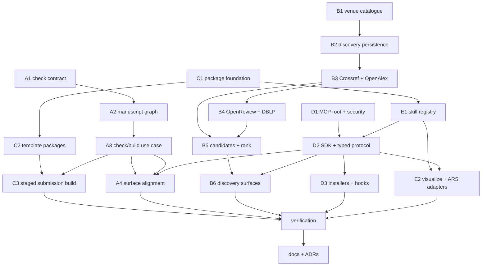
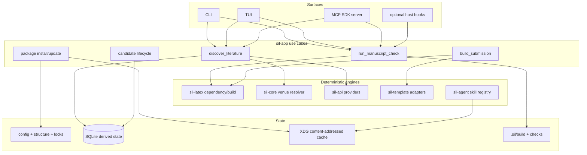

# Stage 15 / Wave 08-15 - Deterministic scientific workspace

**Status:** Design ready for implementation dispatch  
**On execute:** Ship code and docs per `prompts/PR-*.md`; this plan itself changes no product behavior.

| Field | Value |
|-------|-------|
| **Project** | scientist-in-loop (`sil`) |
| **Date** | 2026-08-15 |
| **Baseline** | Stage 14 complete: scientist-facing TUI, visible robustness, six workflow MCP tools |
| **Predecessor** | `docs/plan-08-14/`, ADR-013 through ADR-016, Stage 12 `sil-app` use-case layer |
| **Target path** | `docs/plan-08-15/` |
| **User decisions** | Make deterministic code the product spine; keep `sil check` quiet; build a large canonical venue alias catalogue; replace hard-coded templates; improve manuscript tools; productionize MCP and skills; do not implement external experiment execution before its value is concrete. |

---

## 1. Overview

Stages 0-14 established a durable paper workspace, literature database, TUI, MCP surface, local search, bibliography verification, template rendering, and agent skills. The pieces are useful, but the project does not yet have one stable scientific contract shared by CLI, TUI, MCP, builds, templates, and skills.

Stage 15 makes `sil` a **deterministic scientific workspace with optional AI operators**:

1. `sil paper check` evaluates current project invariants without treating ordinary scientific-result changes as failures.
2. Literature discovery resolves raw venue strings through a versioned catalogue with canonical identities and a large synonym set.
3. Templates become versioned packages described by `template.yaml`, sourced from official bundles, pinned by digest, and compiled in a staging tree.
4. Manuscript dependency, citation, label, asset, build, and venue-compliance checks share one structured report.
5. MCP becomes project-rooted, protocol-conformant, typed, and installable without unsafe config replacement.
6. Skills become versioned packs with provenance, compatibility, permissions, explicit updates, and host capability reporting.
7. External experiment code remains outside this stage. Stage 15 records the unresolved use case but does not add symlinks, runners, or experiment manifests.

| Track | Theme | Scientist job |
|-------|-------|---------------|
| **A** | Deterministic check and manuscript model | "Is the current workspace mechanically coherent?" |
| **B** | Venue catalogue and literature discovery | "Find relevant work from venues I actually mean." |
| **C** | Template packages and submission builds | "Compile against a real, pinned venue template." |
| **D** | Production MCP and host installation | "Let an assistant use this project reliably and safely." |
| **E** | Skill packs and external methodology adapters | "Install serious workflows without copying random Markdown." |
| **V** | Verification | Cross-surface parity, offline fixtures, conformance, deterministic archives |
| **Z** | Documentation | Stage 15, ADRs, migration and licensing honesty |



**Execution waves**

```text
Wave 0 (parallel): A1 | B1 | C1 | D1
Wave 1 (parallel): A2 | B2 | C2
Wave 2 (parallel): A3 | B3 | E1
Wave 3 (parallel): B4 | C3 | D2
Wave 4 (parallel): A4 | B5 | D3 | E2
Wave 5:            B6
Wave 6:            V
Wave 7:            Z
```

The wave is intentionally broad but not monolithic. Each PR has one owner, a constrained file surface, offline tests, and a verification gate.

---

## 2. Feedback translated into hard constraints

| User feedback | Stage-15 interpretation |
|---------------|-------------------------|
| Result changes can happen for many valid reasons | `sil check` checks **current-state invariants**, not whether scientific values changed since the last run. No implicit baseline, stale-result alarm, or score-regression failure. |
| Check output must not be noisy | Default output is one summary plus actionable findings, deduplicated and capped. Observations require `--verbose` or `--json`. Network checks are opt-in. |
| Venue names have many forms | Canonical venue IDs are resolved through a large, versioned alias catalogue. Raw names are preserved. Ambiguity is explicit and never silently guessed. |
| Template manifest is good | `template.yaml` is normative, templates are pinned, official files are staged, and the manuscript is not destructively regenerated. |
| Smarter manuscript tools are useful | Dependency graph, citation/label checks, assets, compiler diagnostics, citation contexts, and venue constraints join the same report. |
| MCP/skills direction is accepted | Production MCP, safe installers, pack manifests, explicit updates, tested host adapters, and honest capability degradation are in scope. |
| External-code proposal was unclear | No external-code feature ships. The future purpose would be linking a figure/table to the repository revision that generated it; execution and symlinks stay out until separately approved. |

---

## 3. Code-truth audit (2026-08-15)

| Area | Current truth | Stage-15 action |
|------|---------------|-----------------|
| Manuscript health | `sil-latex::audit_manuscript` has counts and `Info/Warning/Error`, but scopes citations, labels, included files, and assets inconsistently. | A1-A3: typed report, one dependency snapshot, stable finding codes. |
| Check noise | Doctor mixes host, network, manuscript, and optional-tool checks. Severity partly depends on check-name strings. | A1: explicit class and policy; online checks separate; compact output. |
| Assets | `sil paper assets` owns a CLI-private regex report and is not shared by doctor/TUI/MCP. | A2: move TeX dependency and asset resolution into `sil-latex`. |
| Build | `sil-latex::build` returns a PDF path or concatenated output; success does not verify the PDF exists. MCP build currently does not execute compilation. | A3/A4: structured build result and one `sil-app` use case. |
| Estimates | CLI/MCP/TUI can supply different structure inputs; estimate reruns health logic. | A4: consume the shared check snapshot and fingerprint. |
| Discovery | Digest is one Crossref `journal-article` relevance query. No conference discovery, query snapshot, candidate lifecycle, or provider provenance. | B2-B6: provider records, candidates, deterministic rank, UI/API surfaces. |
| Venue identity | `ReferenceEntry.venue` is a raw string. Extraction uses a small ordered substring list. | B1: canonical series/edition/track identity with aliases and external IDs. |
| Digest DB | `journal_digest` is global rather than query-scoped and uses DOI/title identity shortcuts. | B2: additive migration to discovery-run and work/candidate tables. |
| Templates | Six enum variants render hard-coded LaTeX, including 2024 style names and final switches. Original preambles/macros can be lost. | C1-C3: manifests, locks, official bundles, staging, no workspace rewrite. |
| Submission archive | Archive collection does not prove complete TeX dependency closure; release build can continue after compile failure. | C3: dependency-driven archive, compile-required release, deterministic manifest. |
| MCP root | Tools resolve the project from process CWD; installed desktop clients receive no explicit project root. | D1: mandatory canonical root and confined paths. |
| MCP protocol | Hand-written JSON-RPC implements a narrow protocol slice; tool calls block the read loop and schemas are not typed validators. | D2: maintained Rust SDK, parity tests, resources/prompts, structured outputs. |
| MCP installer | Hard-coded paths, direct writes, no backup/status/uninstall; malformed JSON may be replaced. | D3: client adapters, fail-closed parse, backup, atomic update, idempotency. |
| Skills | Four hard-coded Markdown routes; `init --update` overwrites managed skill files; no version/license/digest/permissions. | E1: registry, managed/local split, lock, update diff and approval. |
| External packs | `visualize-article` is MIT; Academic Research Skills (ARS) is CC-BY-NC and host-specific. A local nested snapshot is already behind upstream. | E2: pinned MIT pack; optional ARS adapter with attribution/license/capability boundary, no silent MIT redistribution. |
| External experiments | Only README conventions exist for `agent/`, `data/`, and plots. | Explicitly out of Stage 15. |

### Existing strengths to preserve

1. `sil-app` is the cross-surface use-case layer.
2. Atomic project writes, SQLite WAL, retries, undo, conflict banners, and never-auto-commit already exist.
3. Six workflow-oriented MCP tool names are a shipped compatibility surface.
4. `paper_draft.tex` remains the prose source of truth.
5. SQLite remains rebuildable memory; tracked manifests and locks are the portable contract.

---

## 4. Goals and non-goals

### Goals

1. One stable `CheckReport` shared by CLI, TUI, MCP, doctor, builds, assets, and estimates.
2. Quiet draft-default policy with explicit strict/submission profiles.
3. One deterministic TeX dependency graph over the configured main file and its reachable inputs.
4. Stable finding codes and structured evidence, not parsing human messages.
5. Versioned canonical venue catalogue with at least an initial reviewed CS/AI set and a scalable maintenance format.
6. Multi-provider discovery with immutable request/result provenance and partial-failure honesty.
7. Candidate inbox; discovery never writes directly to `references.bib`.
8. Transparent, deterministic ranking with stored score components and stable tie-breaking.
9. `template.yaml`, verified file inventory, explicit source/license, lock file, staged build, dependency-complete archive.
10. Explicit MCP project root, confined paths, typed protocol implementation, structured results, progress/cancellation where supported.
11. Safe MCP install/status/uninstall for tested clients and platforms, including OpenCode.
12. Skill-pack manifest/lock, explicit updates, managed/local separation, host capability report.
13. First-party MIT `visualize-article` pack and an optional, separately licensed ARS adapter.
14. Full offline testability for deterministic behavior and provider fixtures.

### Non-goals (hard boundaries)

- Detecting whether experimental numbers became "better" or "worse"
- Implicit comparison with the previous check run
- Hashing all `data/`, plots, checkpoints, or scientific results by default
- A prestige score, universal top-venue ranking, impact-factor clone, or hidden venue tier
- Automatic citation insertion from discovery results
- Automatically resolving ambiguous venue aliases
- Scraping provider websites when an API/export exists
- Rewriting `paper_draft.tex` into a venue template in place
- Redistributing venue files without a verified license
- Vendoring ARS into the MIT distribution or calling partial host support "full ARS"
- Generic shell execution through MCP
- External experiment clone/run/install, GPU scheduling, containers, DVC/MLflow/W&B dashboard, or symlink management
- Auto-commit
- A new GUI or daemon

---

## 5. Product decisions (KD)

### Check and manuscript

| ID | Decision |
|----|----------|
| **KD-A1** | Command is `sil paper check`; `sil project doctor` remains environment/project recovery. Doctor may embed the deterministic report but does not own its policy. |
| **KD-A2** | Check evaluates the current project. It does not infer regressions from a prior run. |
| **KD-A3** | Finding classes: `invariant_error`, `actionable_warning`, `observation`. No baseline-drift class in Stage 15. |
| **KD-A4** | Default draft profile exits nonzero only when the check cannot establish a coherent current state or an explicitly requested operation fails. Warnings do not fail. |
| **KD-A5** | `--profile submission` blocks the core warning codes listed below plus `constraints.blocking_codes` from the selected template. `--strict` blocks every actionable warning. Both are explicit opt-ins; draft remains the default. |
| **KD-A6** | Default human output: summary + at most 20 unique errors/warnings. `--all` removes the display cap. `--verbose` includes observations. `--json` emits the complete report. |
| **KD-A7** | Findings deduplicate by stable code, canonical path, line, and evidence key. TUI renders a cached report and does not rerun checks on every frame. |
| **KD-A8** | Network bibliography verification is `--online`; unavailable providers are environment warnings, not manuscript failures. The canonical **static** report is byte-stable for identical normalized inputs/checker versions. Build/network run metadata is volatile and excluded from that claim and from `input_fingerprint`. |
| **KD-A9** | One immutable input snapshot resolves the configured main TeX, reachable includes, bibliography, assets, config, structure, and selected template. |
| **KD-A10** | TeX static analysis is deliberately scoped. Compiler `.aux/.log/.fls` evidence may refine static findings; neither is advertised as a complete TeX interpreter. |
| **KD-A11** | Result values, table cells, plot contents, estimate scores, word counts, and artifact hashes are observations only. They never fail because they changed. |
| **KD-A12** | Build success requires successful process exit **and** a newly produced expected PDF. A stale pre-existing PDF cannot satisfy the run. |

### Venue identity and discovery

| ID | Decision |
|----|----------|
| **KD-B1** | Venue identity is a stable canonical ID, e.g. `conf.neurips`, not a display string. Series, edition, workshop/track, journal, repository, and hosting platform are distinct concepts. |
| **KD-B2** | Store raw venue text forever. Canonical matches record alias ID, catalogue version, normalizer version, evidence, and resolution state. |
| **KD-B3** | Alias resolution returns `resolved`, `ambiguous`, or `unknown`. A tied/short alias is never silently selected. |
| **KD-B4** | Normalization is Unicode-aware, deterministic, versioned, and idempotent. Exact normalized aliases precede conservative long-name suggestions. No unbounded substring matching. |
| **KD-B5** | Catalogue entries include aliases, validity years, parents, external IDs, and provenance. Collisions must be declared and tested. |
| **KD-B6** | Initial catalogue target: 200-300 venue series and at least 1,000 evidence-backed aliases, prioritizing ML/NLP/CV/IR/data mining/HCI/robotics/security/statistics and major multidisciplinary journals. Every alias records evidence URL/type, curator, and review date; short/colliding aliases require context constraints or a second independent source. Count alone never passes V. |
| **KD-B7** | "Top venue" means membership in an explicitly selected, versioned venue collection. It is not a universal quality claim. Collections list provenance and review date. |
| **KD-B8** | Provider records are immutable snapshots with request parameters, retrieval time, raw payload hash, cursor, and provider status. Remote results changing later is expected. |
| **KD-B9** | Crossref and OpenAlex are baseline providers. OpenReview and DBLP provide conference-specific evidence. arXiv remains a preprint source, not venue proof. |
| **KD-B10** | Provider failure yields a partial discovery run with errors, never an empty-success result. Unit/CI tests use fixtures only. |
| **KD-B11** | Deduplicate conservatively by DOI, arXiv base/version, OpenReview forum, and provider cross-identifiers. Title similarity can suggest relations but cannot silently merge publication versions. |
| **KD-B12** | Candidate states are explicit and orthogonal: resolution, disposition, and acquisition. Every transition is append-only with actor and reason. |
| **KD-B13** | Ranking uses versioned fixed-point components and stable tie-breaking. No hidden prestige component. Store the explanation for every score. |
| **KD-B14** | Discovery results enter a candidate inbox. Fetch, parse, shortlist, dismiss, and add-to-bib are separate explicit actions. |

### Templates and packages

| ID | Decision |
|----|----------|
| **KD-C1** | `template.yaml` is the normative template-pack entrypoint. Shared transport/hashing lives in a new leaf crate `sil-package`; template fields and validation remain distinct. |
| **KD-C2** | Every package has ID, version, source revision/URL, license, compatibility, file list, SHA-256 digests, and capabilities. Lock files resolve exact content. |
| **KD-C3** | Package files live in an XDG content-addressed cache. Projects track `.sil/template.lock`, not copied mutable vendor trees. |
| **KD-C4** | Template installation is explicit: fetch -> verify -> show license/source -> approve -> atomic lock update. Unsigned is a visible status, not equivalent to verified. |
| **KD-C5** | Build occurs in `.sil/build/<template-id>/<run-id>/` or a temporary staging tree. It never temporarily rewrites workspace bibliography/manuscript files. |
| **KD-C6** | Template adaptation uses declared files and insertion anchors/adapter IDs. It does not reconstruct an unknown preamble from hard-coded Rust strings. |
| **KD-C7** | Submission release requires successful staged compilation unless an explicit `--source-only` mode is requested. Source-only is labelled in its manifest. |
| **KD-C8** | Archive closure follows the resolved TeX dependency graph and emits `SIL-RELEASE.json` with hashes, omissions, engine/version, template lock digest, and compile status. |
| **KD-C9** | Archive ordering, timestamps, and permissions are normalized for byte reproducibility when inputs/toolchain metadata are the same. |
| **KD-C10** | Package archive intake is bounded before/during extraction: default maximum 64 MiB compressed, 256 MiB extracted, 4,096 files, 64 MiB per file, path depth 32, compression ratio 100:1, and bounded extraction time. Manifests cannot raise limits. Cache quota is explicit; locked packages are never evicted automatically. |

### MCP and skills

| ID | Decision |
|----|----------|
| **KD-D1** | MCP starts with an explicit canonical project root (`--project` or tested host workspace binding). CWD fallback is allowed only for direct interactive invocation and is reported. |
| **KD-D2** | Caller-supplied paths are confined to the project, an explicitly configured canonical project root (`sources`, `data`, `figures`, `agent`, or configured main-file root), or an installed read-only package root. Callers cannot add roots. An absolute caller path is accepted only when its canonical target is already beneath one of those configured allowlisted roots; otherwise reject it. Skill entrypoints/resources use registry IDs and never arbitrary absolute paths. Existing absolute config paths remain supported but are surfaced as external roots. |
| **KD-D3** | Preserve the six shipped tool names. Add `sil_sources action=discover|candidates` and `sil_review action=check`; use per-action typed validation and structured output. |
| **KD-D4** | Approved SDK target is the official `rmcp` implementation from `modelcontextprotocol/rust-sdk`, upstream tag `rmcp-v3.1.2`. D2 must verify license/MSRV/stdio/protocol/cancellation requirements, pin the exact resolved revision/version in `Cargo.lock`, and stop for a plan amendment only if a security or compatibility blocker is demonstrated. |
| **KD-D5** | Long-running work is task-isolated and supports bounded timeout, cancellation, and progress where the negotiated protocol/client supports it. No generic shell tool. |
| **KD-D6** | Readable project data is exposed as MCP resources; workflow instructions/skills as prompts; mutations remain tools. |
| **KD-D7** | Installer adapters preserve unknown fields, fail closed on malformed config, back up before atomic write, and support `status` and `uninstall`. |
| **KD-D8** | MCP install is project-scoped by default and writes the explicit project root into the command. Host/platform support is fixture-tested and documented individually. |
| **KD-D9** | Hooks are optional host adapters. Default post-write check is nonblocking and deduplicated; unsupported hosts report "not installed", not fake success. |
| **KD-E1** | Skill packs use `skill-pack.yaml` plus `.sil/skills.lock`. Managed package projections and user-authored local skills are separate namespaces. |
| **KD-E2** | `sil init --update` no longer overwrites changed skill content. Skill updates are explicit, diffable, hash-checked, and rollback-safe. |
| **KD-E3** | Skill capabilities declare read/write/network/process needs and host requirements. Installation requires explicit consent for non-local data flow or process execution. |
| **KD-E4** | `visualize-article` is an optional first-party MIT pack pinned to a release or commit digest, with external image-provider disclosure. It generates prompts; it does not claim to render figures. |
| **KD-E5** | ARS is an optional external CC-BY-NC pack/adapter. Preserve attribution and license; do not vendor it into MIT assets or install it silently. |
| **KD-E6** | Capability reports distinguish full, partial, and unsupported orchestration. A host without subagents/hooks cannot claim full ARS behavior. |
| **KD-E7** | Never auto-commit. Package installation and generated projections produce Sci-Action proposals only. |

---

## 6. Normative contracts

### 6.1 Check report

```json
{
  "static": {
    "schema_version": 1,
    "profile": "draft",
    "input_fingerprint": "sha256:...",
    "summary": {"errors": 0, "warnings": 2, "observations": 7},
    "findings": [
      {
        "code": "latex.citation.undefined",
        "class": "actionable_warning",
        "path": "sections/intro.tex",
        "line": 18,
        "message": "Citation key 'x' is not present in references.bib",
        "hint": "Add or correct the bibliography entry",
        "evidence": {"cite_key": "x"}
      }
    ],
    "metrics": {},
    "dependencies": [],
    "template": null
  },
  "run": {
    "checked_at": "2026-08-15T00:00:00Z",
    "build": null,
    "online": null
  }
}
```

Rules:

- Stable code and evidence shape are API; prose may improve.
- Paths are project-relative where possible.
- Lists are deterministically sorted.
- `static` is the canonical deterministic public artifact and is byte-stable for identical normalized inputs/checker versions.
- `run` is the complete volatile execution envelope. Timestamps, duration, engine host details, network retrieval metadata, build results, and log paths live only there and are excluded from `input_fingerprint`.
- `--json` emits both objects; API consumers compare/cache `static`, not the whole run envelope.
- Full reports may be persisted under ignored `.sil/checks/`; the latest run is not an implicit baseline.

Profile policy is normative:

| Profile | Blocking policy |
|---------|-----------------|
| `draft` | `invariant_error` only |
| `submission` | Invariant errors plus `latex.citation.undefined`, `latex.reference.undefined`, `latex.label.duplicate`, `latex.bib.key_duplicate`, `latex.dependency.missing`, `latex.asset.missing`, `template.constraint.violation`, and selected template `constraints.blocking_codes` |
| `strict` | Invariant errors plus every actionable warning |

`submission` may add template codes but cannot remove the core set. Observations never block any profile.

### 6.2 Venue catalogue

```yaml
schema_version: 1
catalogue_version: 2026.08.15
normalizer_version: 1
venues:
  - id: conf.neurips
    canonical_name: Conference on Neural Information Processing Systems
    short_name: NeurIPS
    kind: conference_series
    aliases:
      - value: NIPS
        kind: historical_acronym
        valid_to: 2017
        provenance: https://neurips.cc/
        evidence_type: official
        curated_by: sil-catalogue
        reviewed_at: 2026-08-15
      - value: Advances in Neural Information Processing Systems
        kind: proceedings_title
        provenance: https://neurips.cc/
        evidence_type: official
        curated_by: sil-catalogue
        reviewed_at: 2026-08-15
    external_ids:
      - namespace: dblp_stream
        value: conf/nips
    collections: [ai.ml.reviewed]
```

Resolver output keeps `raw`, `normalized`, `status`, candidate IDs, selected alias, confidence evidence, catalogue version, and normalizer version.

### 6.3 Discovery persistence

Required logical entities:

- `discovery_runs`
- `provider_requests`
- `provider_records`
- `works`
- `work_identifiers`
- `work_versions`
- `work_venues`
- `candidates`
- `candidate_events`

SQLite remains derived/local, but discovery export JSON must carry enough provenance to inspect a run without live provider access.

### 6.4 Template manifest

```yaml
api_version: sil.dev/template/v1
kind: TemplatePack
metadata:
  id: venues/example-2026
  version: 1.0.0
  license: LPPL-1.3c
  repository: https://example.org/official-template
source:
  revision: full-revision-or-release
  sha256: hex
redistribution:
  bundled_with_sil: forbidden      # allowed | user_supplied_only | forbidden
  local_cache: allowed             # allowed | user_supplied_only | forbidden
  release_archive: allowed         # allowed | user_supplied_only | forbidden
  evidence: https://example.org/template-license
files:
  - path: main.tex
    sha256: hex
entrypoint: main.tex
adapter:
  id: latex-anchor-v1
  content_anchor: SIL_MANUSCRIPT_CONTENT
build:
  engines: [tectonic, latexmk]
  expected_pdf: main.pdf
constraints:
  anonymous: true
  max_pages: 9
```

Redistribution values are enforced per operation:

- `allowed`: sil may perform the named operation after hash and license-evidence verification.
- `user_supplied_only`: sil may use bytes supplied locally by the user but may not download, bundle, or republish them for that operation.
- `forbidden`: reject the operation.

Missing or unknown evidence fails closed for bundling and release-archive inclusion. A license identifier alone is not sufficient evidence of redistribution permission.

### 6.5 Skill pack manifest

```yaml
api_version: sil.dev/skill/v1
kind: SkillPack
metadata:
  id: scientist-in-loop/visualize-article
  version: 1.0.0
  license: MIT
compatibility:
  sil: ">=1.1,<2"
  hosts: [claude-code, opencode]
entrypoints:
  - id: visualize-article
    type: skill
    path: SKILL.md
capabilities:
  read: [manuscript, figures]
  write: []
  network: external_image_provider
  process: false
files:
  - path: SKILL.md
    sha256: hex
```

---

## 7. Architecture after Stage 15



Layering rules:

1. Domain contracts and pure normalization live in `sil-core`.
2. TeX dependency/build behavior lives in `sil-latex`; no CLI/TUI types.
3. Provider HTTP and raw DTOs live in `sil-api`; no candidate policy.
4. SQLite persistence lives in `sil-db`.
5. Cross-surface orchestration and policy live in `sil-app`.
6. `sil-template` renders/adapts staged bundles; it does not download or update locks.
7. `sil-agent` consumes the skill registry and check report; it does not own package transport.
8. CLI, TUI, and MCP are adapters and must not fork policy.
9. `sil-package` is a leaf crate for package manifests, locks, hashes, cache, and confinement; it does not depend on template, skill, UI, or application policy.

---

## 8. PR DAG and ownership

| PR | Title | Depends | Parallel with | Prompt |
|----|-------|---------|---------------|--------|
| **A1** | Check report contract and quiet policy | - | B1, C1, D1 | [PR-A1-check-contract.md](prompts/PR-A1-check-contract.md) |
| **B1** | Canonical venue catalogue and resolver | - | A1, C1, D1 | [PR-B1-venue-catalogue.md](prompts/PR-B1-venue-catalogue.md) |
| **C1** | Package manifest, lock, cache, and confinement foundation | - | A1, B1, D1 | [PR-C1-package-foundation.md](prompts/PR-C1-package-foundation.md) |
| **D1** | MCP explicit root, path security, and parity fixtures | - | A1, B1, C1 | [PR-D1-mcp-root-security.md](prompts/PR-D1-mcp-root-security.md) |
| **A2** | TeX dependency graph, citation/label/assets scanner | A1 | B2, C2, D2, E1 | [PR-A2-manuscript-graph.md](prompts/PR-A2-manuscript-graph.md) |
| **B2** | Discovery/work/candidate SQLite schema | B1 | A2, C2, D2, E1 | [PR-B2-discovery-schema.md](prompts/PR-B2-discovery-schema.md) |
| **C2** | Template package install, lock, and staging | C1 | A2, B2, D2, E1 | [PR-C2-template-packs.md](prompts/PR-C2-template-packs.md) |
| **D2** | Official MCP SDK, typed tools/resources/prompts | D1, E1 | B4, C3 | [PR-D2-mcp-sdk.md](prompts/PR-D2-mcp-sdk.md) |
| **E1** | Skill registry, managed/local split, explicit update | C1 | A2, B2, C2, D2 | [PR-E1-skill-registry.md](prompts/PR-E1-skill-registry.md) |
| **A3** | Structured build and `sil-app` check use case | A1, A2 | B3, B4, D3, E2 | [PR-A3-check-usecase.md](prompts/PR-A3-check-usecase.md) |
| **B3** | Provider framework plus Crossref/OpenAlex discovery | B2 | A3, B4, D3, E2 | [PR-B3-crossref-openalex.md](prompts/PR-B3-crossref-openalex.md) |
| **B4** | OpenReview/DBLP conference discovery | B3 | C3, D2 | [PR-B4-openreview-dblp.md](prompts/PR-B4-openreview-dblp.md) |
| **D3** | Safe MCP installers and optional hooks | D2 | A4, B5, E2 | [PR-D3-mcp-installers.md](prompts/PR-D3-mcp-installers.md) |
| **E2** | Visualize Article pack and ARS external adapter | E1, D2 | A4, B5, D3 | [PR-E2-external-skill-packs.md](prompts/PR-E2-external-skill-packs.md) |
| **A4** | Check parity across doctor/status/TUI/estimate/MCP | A3, D2 | B5, D3, E2 | [PR-A4-check-surfaces.md](prompts/PR-A4-check-surfaces.md) |
| **B5** | Candidate identity, lifecycle, dedupe, and rank use case | B1-B4 | A4, D3, E2 | [PR-B5-candidate-usecase.md](prompts/PR-B5-candidate-usecase.md) |
| **C3** | Dependency-complete staged submission release | A3, C2 | B4, D2 | [PR-C3-submission-release.md](prompts/PR-C3-submission-release.md) |
| **B6** | Discovery CLI/TUI/MCP surfaces | B5, D2 | - | [PR-B6-discovery-surfaces.md](prompts/PR-B6-discovery-surfaces.md) |
| **V** | Cross-surface, conformance, archive, and scenario verification | all code PRs | - | [PR-V-verification.md](prompts/PR-V-verification.md) |
| **Z** | Stage 15 docs, ADRs, migration, licensing | V | - | [PR-Z-docs.md](prompts/PR-Z-docs.md) |

### Must-ship and slip policy

Must ship: A1-A4, B1-B3/B5/B6, C1-C3, D1-D3, E1, V, Z.

Slip only with an explicit plan update:

- B4 may split DBLP from OpenReview, but OpenReview conference evidence remains must-ship.
- E2 may ship Visualize Article before ARS adapter, but licensing/capability documentation remains must-ship.
- Optional nonblocking host hooks may slip from D3; safe install/status/uninstall may not.

---

## 9. Subagent roles

One implementation agent per PR. Agents do not broaden their track to adjacent surfaces.

| Role | PRs | Owns | Must not |
|------|-----|------|----------|
| **Check-contract engineer** | A1 | report types, finding codes/classes, profile policy, serialization | TeX parsing or UI |
| **LaTeX graph engineer** | A2 | include graph, comments, citations, labels, assets, citation contexts | Compile orchestration or network |
| **Check-usecase engineer** | A3 | structured build, input snapshot, `sil-app`, CLI check | TUI/MCP redesign |
| **Check-surface engineer** | A4 | doctor/status/TUI/estimate/MCP parity | New checks or scoring changes |
| **Venue curator/engineer** | B1 | catalogue schema, aliases, normalizer, resolver, validation | Provider HTTP or prestige tiers |
| **Discovery DB engineer** | B2 | additive migrations and repository APIs | Provider ranking policy |
| **Crossref/OpenAlex engineer** | B3 | provider transport/fixtures/adapters | Candidate merge/UI |
| **Conference provider engineer** | B4 | OpenReview/DBLP adapters and acceptance evidence | Treat hosting as acceptance |
| **Candidate engineer** | B5 | identity, relations, lifecycle, rank explanation | Direct bibliography writes |
| **Discovery surface engineer** | B6 | CLI/TUI/MCP adapters over `sil-app` | Provider-specific policy |
| **Package-security engineer** | C1 | manifests, locks, hashing, cache, path/symlink confinement | Template/skill semantics |
| **Template engineer** | C2 | `template.yaml`, install/list/verify/stage, legacy migration | Submission archive |
| **Release engineer** | C3 | compile-required staging, dependency closure, deterministic ZIP | Workspace mutation |
| **MCP security engineer** | D1 | explicit root, traversal fix, protocol parity fixtures | New product actions |
| **MCP protocol engineer** | D2 | SDK migration, typed tools, resources/prompts, task isolation | Host config writing |
| **Installer engineer** | D3 | client/platform adapters, backup, atomic merge, status/uninstall/hooks | Guess unsupported paths silently |
| **Skill registry engineer** | E1 | manifests, lock, managed/local, update/diff/rollback | External pack-specific prose |
| **Skill integration engineer** | E2 | Visualize Article, ARS adapter, license/capability disclosure | Relicense/vendoring ARS |
| **Verifier** | V | tests, fixtures, conformance, scenario matrix | Product features |
| **Docs/licensing closer** | Z | STAGES, README, ADRs, LICENSE/NOTICE, migration | Logic changes |

Shared invariants:

1. Minimal diff within the assigned PR.
2. No live network in unit or required CI tests.
3. No auto-commit.
4. All durable writes use atomic helpers.
5. All paths are canonicalized before access and confined to project/package roots or canonical roots explicitly declared by project config; runtime callers cannot expand the allowlist.
6. Human output stays compact; JSON remains complete.
7. New behavior belongs in `sil-app` before multiple surfaces consume it.
8. Every package or catalogue record carries source and license/provenance.
9. Never call an ambiguous venue resolved.
10. Never turn ordinary scientific-result changes into check failures.

### 9.1 File reservations and integration

Parallel denotes semantic independence, not blind concurrent edits to shared export files. Agents work in isolated worktrees and the wave integrator merges PRs sequentially.

| PR | Reserved primary files/modules |
|----|--------------------------------|
| A1 | `sil-core/src/check.rs` plus append-only export |
| B1 | `sil-core/src/venue.rs`, catalogue data/validator plus append-only export |
| C1 | new leaf crate `crates/sil-package/**`, workspace member entries |
| D1 | `sil-mcp/**` root/context security and MCP CLI root flags |
| A2 | `sil-latex/src/dependencies.rs` and health adapters |
| B2 | `sil-db` discovery migration/repositories |
| C2 | `sil-template` plus template-specific `sil-app`/CLI modules |
| E1 | `sil-agent` registry plus skill-specific `sil-app`/CLI modules |
| B3/B4 | B3 owns shared provider transport/traits; B4 lands only after B3 and owns provider-specific modules |

Shared `lib.rs`, `cli.rs`, `commands/mod.rs`, workspace `Cargo.toml`, and lockfile edits are append-only integration points. The integrator resolves them after each PR; agents must not reorganize adjacent registrations.

---

## 10. Verification stages

Verification is a sequence of merge gates, not one final command.

| Gate | When | Required proof |
|------|------|----------------|
| **V0** | Before Wave 0 | Clean baseline: workspace tests/clippy/fmt; record any pre-existing failure before code changes. |
| **V1** | A1, B1, C1, D1 | Contract golden tests; alias catalogue validator; package traversal tests; MCP root and path tests. |
| **V2** | A2, B2, C2 | Include/assets fixtures; migration/idempotency; template lock/stage. |
| **V3** | A3, B3, E1 | Fake compiler matrix; Crossref/OpenAlex fixtures; skill update rollback. |
| **V4** | B4, C3, D2 | Conference-provider evidence; deterministic archive/compile hard gate; MCP SDK conformance. |
| **V5** | A4, B5, D3, E2 | Cross-surface report parity; ranking goldens; installer safety; external pack licenses/capabilities. |
| **V6** | B6 | End-to-end discover -> shortlist -> fetch/parse -> explicit bib action, with fixture providers. |
| **V7** | PR-V | Full workspace, clippy, fmt, golden dataset, MCP conformance, package/archive reproducibility. |
| **V8** | PR-Z | Documentation claims match code; license/notice complete; Stage 15 and ADRs accepted. |

### 10.1 Global commands

```bash
cargo test --workspace
cargo clippy --workspace --all-targets -- -D warnings
cargo fmt --all -- --check
```

Provider and package tests must run without credentials or public network access. Optional ignored smoke tests may target live providers, but they are not release gates.

### 10.2 Check/noise test matrix

1. Empty valid draft: zero exit; compact summary; observations hidden by default.
2. Missing main manuscript: invariant error and nonzero exit.
3. Undefined citation/reference or missing asset: warning and zero draft-profile exit.
4. Same fixture under submission profile: each normative core blocking warning code produces nonzero exit; a non-core warning stays nonblocking unless selected template adds it.
5. Changed table value, plot file bytes, word count, or estimate score: never an error because it changed.
6. No prior report exists: behavior identical to when ignored `.sil/checks/latest.json` exists.
7. Twenty-five duplicate warnings: one grouped finding in default output; complete evidence in JSON.
8. Network disabled: default check unchanged; `--online` reports provider unavailability separately.
9. Commented citations/labels do not count; undefined `\ref` is found even when no labels exist.
10. Nested include graph, relative asset paths, `\graphicspath`, missing include, and include cycle are covered.
11. Fake compiler exits zero without a new PDF: build fails.
12. Fake compiler leaves an old PDF then exits nonzero: old PDF is not accepted.
13. CLI, TUI, MCP, doctor, status, and estimate use the same report fingerprint and counts for one fixture.
14. Repeated TUI render does not rerun the checker without an input change.
15. Identical no-build/no-online inputs produce byte-identical canonical static JSON; volatile build/network run fields are tested separately and excluded from fingerprint.

### 10.3 Venue/discovery test matrix

1. `NIPS`, `NeurIPS`, and proceedings-title variants resolve with validity evidence.
2. ACL, NAACL, Findings of ACL, and ACL workshops remain distinct.
3. Nature and Nature Machine Intelligence do not collide through substring matching.
4. Unicode punctuation, LaTeX escapes, HTML entities, ampersands, and whitespace normalize deterministically.
5. Ambiguous short alias returns all candidates and no selected ID.
6. Catalogue IDs, parents, aliases, external IDs, provenance, curator/review date, and validity windows validate; short/colliding aliases satisfy the stronger evidence rule.
7. Catalogue update can rematch unknown/ambiguous rows without destroying raw values or prior evidence.
8. Provider fixtures cover pagination/cursors, malformed payload, 404, 429/Retry-After, 5xx, timeout, empty result, and partial run.
9. OpenReview hosting is not acceptance unless invitation/content evidence supports it.
10. DOI, arXiv versions, OpenReview forums, conference versions, and journal extensions deduplicate conservatively.
11. Ranking is invariant to provider arrival/input order and exposes fixed-point components.
12. Candidate lifecycle rejects invalid transitions and records append-only actor/reason events.
13. Discovery never mutates `references.bib`; only an explicit candidate action may call existing bib use cases.

### 10.4 Template/package/release test matrix

1. Manifest schema version, compatibility, file hashes, license, and source are required.
2. `../`, absolute paths, symlink escapes, duplicate normalized paths, and hash mismatch are rejected.
3. Lock output is stable for input permutation and records exact revision/digests.
4. Archive bombs/excess file count/path depth/per-file size/extraction timeout/cache quota fail before unbounded resource consumption; manifest cannot raise limits.
5. Dirty managed projection blocks update and shows a diff; local skills survive updates.
6. Template stage contains exactly declared files plus generated manuscript content.
7. Applying/staging a template leaves workspace manuscript and bibliography byte-identical.
8. Source-only release is explicitly labelled and cannot claim successful compilation.
9. Successful fake compiler produces an archive whose dependency closure includes nested TeX/assets/styles.
10. Missing dependency or compile failure blocks normal release.
11. Two releases with identical inputs and `SOURCE_DATE_EPOCH` are byte-identical.
12. `SIL-RELEASE.json` hashes every member and records engine/template/package locks and omissions.

### 10.5 MCP/skill/install test matrix

1. MCP launched outside project with `--project <root>` operates only on that root.
2. Missing root is actionable; no accidental HOME project discovery.
3. Skill `../../paper_draft.tex`, absolute paths, and symlink escapes are rejected.
4. Protocol initialization negotiates supported versions and respects notifications/cancellation.
5. `tools/list` remains six tools; action schemas validate required fields.
6. `sil_review action=check` and CLI check return equivalent structured data.
7. `sil_review action=build` actually executes the shared build use case.
8. `sil_sources action=discover|candidates` uses the shared discovery use case.
9. Resources/prompts are read-only and do not expose paths outside declared roots.
10. Installer malformed JSON fails without modification; valid unknown fields survive.
11. Install is idempotent; backup exists before mutation; uninstall removes only sil-owned entries.
12. macOS/Linux/Windows path/schema fixtures are distinct; unsupported combinations fail honestly.
13. OpenCode adapter is tested, not just documented.
14. Hook install is optional and nonblocking; unsupported host reports no hook support.
15. Visualize Article keeps MIT notice and declares external provider data flow.
16. ARS installation requires explicit CC-BY-NC acknowledgement and capability report; no ARS content appears in MIT embedded templates.

---

## 11. Per-PR acceptance gates

| PR | Focused gate |
|----|--------------|
| A1 | `cargo test -p sil-core`; policy/serialization goldens; result changes absent from failure logic |
| A2 | `cargo test -p sil-latex`; include/comment/cite/label/assets fixture matrix |
| A3 | `cargo test -p sil-app -p sil-latex -p sil`; fake compiler; CLI exit/output snapshots |
| A4 | `cargo test -p sil-agent -p sil-tui -p sil-mcp -p sil`; one cross-surface fixture |
| B1 | catalogue validator + resolver goldens; each alias evidence-backed; short/colliding aliases meet stronger rule; count target audited but never sufficient alone |
| B2 | `cargo test -p sil-db`; migration from current DB, idempotency, raw evidence preservation |
| B3 | `cargo test -p sil-api`; Crossref/OpenAlex fixture pagination/retry/partial-failure |
| B4 | `cargo test -p sil-api`; OpenReview/DBLP acceptance/venue fixtures |
| B5 | `cargo test -p sil-app -p sil-db`; dedupe/lifecycle/ranking permutation goldens |
| B6 | CLI JSON/text, TUI candidate state, MCP additive schemas, no bib mutation on discovery |
| C1 | package path/hash/lock/cache tests; no network required |
| C2 | `cargo test -p sil-template -p sil-app -p sil`; standard fixture pack stage and lock |
| C3 | archive closure, compile hard gate, source-only label, byte-reproducibility |
| D1 | `cargo test -p sil-mcp -p sil`; root/confinement/protocol parity security tests |
| D2 | SDK conformance suite, six-tool compatibility, resources/prompts, cancellation/timeout |
| D3 | installer fixtures, backup/atomic/idempotent/uninstall, OpenCode, optional hooks |
| E1 | registry routing, managed/local, dirty update refusal, rollback, compatibility/license policy |
| E2 | pack lock/license/capability snapshots; ARS content exclusion audit |
| V | full matrix plus scenario walkthroughs |
| Z | docs/code honesty search; root LICENSE/NOTICE; ADR links |

---

## 12. Migration and compatibility

1. Existing projects remain valid without a template or skill lock.
2. Existing hard-coded template names become legacy aliases resolved to bundled compatibility manifests where legally possible; emit a migration hint, not a silent behavior switch.
3. `sil init --update` preserves local skill edits. Managed built-ins move through an explicit migration with a backup/diff.
4. Existing six MCP tool names remain. New actions and result fields are additive.
5. Existing absolute configured paths remain supported as explicit canonical external roots. They are reported in check/context output; MCP callers cannot introduce new roots.
6. Existing `journal_digest` remains readable during migration; new discovery runs use new tables. Do not reinterpret title-as-DOI rows as verified DOI identity.
7. Raw venue strings remain available after rematching or catalogue upgrades.
8. Existing `sil paper assets` becomes a thin adapter over check data; its JSON compatibility is preserved where practical and documented where changed.
9. Existing `sil paper build` keeps its command shape but delegates to the structured build use case.
10. Package locks reject unsupported future schema versions loudly.

---

## 13. External experiment code: decision record, not implementation

The only concrete future value identified is **artifact provenance**:

> "Figure 3 came from repository X, commit Y, command Z, with inputs Q."

That could later support reproducibility packages and answer whether an artifact has a known origin. It does **not** prove that an experiment is correct, and changed outputs are often legitimate.

Stage 15 therefore does none of the following:

- create a symlink;
- clone or run external repositories;
- introduce `.sil/experiments.yaml`;
- mark changed outputs stale;
- install dependencies or containers;
- expose arbitrary execution through MCP.

Revisit only after a separate design conversation chooses at least two concrete user workflows. The first future increment should be registration/inspection only; execution would require a separate threat model and approval.

---

## 14. Risks and mitigations

| Risk | Mitigation |
|------|------------|
| Check becomes a noisy linter | KD-A2-A8; no implicit baseline; warnings do not fail draft profile; capped/deduped output. |
| TeX parser promises completeness | Scoped static contract plus compiler artifacts; explicit unsupported-macro observations. |
| Catalogue becomes unmaintainable | Versioned source files, validator, provenance, collections, alias contribution guide, curator role. |
| Venue false positives | Exact normalized aliases first; explicit ambiguity; no substring matching for short/general names. |
| Provider drift breaks reproducibility | Immutable request/raw snapshots and ranking/catalogue versions; offline fixtures. |
| False work merges | Prefer false splits; relations before merge; identifier evidence required for automatic merge. |
| Official template redistribution violates terms | Manifest records license/redistribution; download from official source when bundling is not allowed. |
| Template staging loses manuscript constructs | Preserve source content and use declared adapters/anchors; dependency/build fixture tests. |
| Package manager becomes a general code installer | Capabilities and confinement; skill/template-specific entrypoints; no package execution by default. |
| MCP SDK churn | Pin version, parity fixtures before migration, conformance gate, thin `sil-app` adapters. |
| Installer damages host config | Fail closed, backup, atomic write, preserve unknown fields, uninstall ownership marker. |
| ARS license contaminates MIT distribution | External optional cache, explicit CC-BY-NC acknowledgement, NOTICE, content-exclusion test. |
| Host cannot run ARS orchestration | Capability report with full/partial/unsupported; no equivalence claim. |
| Scope expands into experiment runner | Hard Stage-15 non-goal and decision record in Section 13. |

---

## 15. Master implementation checklist

### A - Check and manuscript

- [ ] Stable `CheckReport`, finding classes/codes, profiles, fingerprint
- [ ] Compact/deduplicated human formatter and complete JSON formatter
- [ ] No implicit baseline or result-change failure
- [ ] Recursive TeX include graph with cycle/missing-input diagnostics
- [ ] Comment-aware citation and label scanner across reachable files
- [ ] Duplicate/undefined citation and label checks
- [ ] Asset resolution, `graphicspath`, nested relative paths, dependency list
- [ ] Citation-context and dependency-report outputs
- [ ] Structured compiler result, logs, first location, new-PDF proof
- [ ] `sil-app::run_manuscript_check`
- [ ] `sil paper check` with draft/submission/strict/online/output flags
- [ ] Doctor/status/assets/build delegate without policy forks
- [ ] TUI cached report and details modal
- [ ] Estimate consumes shared report/structure inputs
- [ ] MCP `sil_review action=check|build` delegates to shared use case

### B - Venue and discovery

- [ ] Venue/edition/track/platform domain types
- [ ] Unicode/versioned/idempotent venue normalizer
- [ ] Catalogue schema, validator, provenance, collections
- [ ] Initial 200-300 venue / 1,000+ alias reviewed catalogue
- [ ] Ambiguous/unknown/resolved resolver with evidence
- [ ] Additive discovery/work/candidate DB migration
- [ ] Injectable fixture HTTP transport and provider contract
- [ ] Crossref cursor discovery
- [ ] OpenAlex discovery/citation-neighborhood metadata
- [ ] OpenReview venue/acceptance evidence
- [ ] DBLP proceedings/series evidence
- [ ] Immutable provider request/record snapshots
- [ ] Conservative work identity/version relations
- [ ] Candidate lifecycle and append-only events
- [ ] Fixed-point explained ranking and stable sorting
- [ ] CLI discover/candidates actions
- [ ] TUI candidate inbox replacing global digest assumptions
- [ ] MCP `sil_sources action=discover|candidates`
- [ ] Discovery never auto-writes bibliography

### C - Packages and templates

- [ ] Shared package envelope, hash, lock, cache, confinement
- [ ] `template.yaml` schema and compatibility validation
- [ ] Template install/list/show/verify/update/remove
- [ ] `.sil/template.lock` atomic update
- [ ] Official source/license/redistribution handling
- [ ] Read-only cached package and isolated staging
- [ ] Legacy template migration/aliases
- [ ] Build without workspace mutation
- [ ] Dependency-complete archive
- [ ] Compile-required normal release and labelled source-only mode
- [ ] Deterministic ZIP and `SIL-RELEASE.json`

### D - MCP

- [ ] Explicit canonical project root
- [ ] Project/package path confinement and traversal regression tests
- [ ] Protocol parity fixtures before SDK migration
- [ ] Official Rust SDK transport/lifecycle
- [ ] Typed per-action validation and structured outputs
- [ ] Six tool names preserved
- [ ] Resources and prompts
- [ ] Timeout/cancellation/progress/task isolation
- [ ] Client/platform installer adapters including OpenCode
- [ ] Fail-closed config parse, backup, atomic merge, idempotency
- [ ] `status` and ownership-safe `uninstall`
- [ ] Optional nonblocking tested hooks; honest unsupported status

### E - Skills

- [ ] `skill-pack.yaml`, `.sil/skills.lock`, compatibility/capabilities
- [ ] Managed package projection separate from local skills
- [ ] Arbitrary validated entrypoints and nested support resources
- [ ] Explicit check/fetch/verify/diff/approve/update/rollback
- [ ] Preserve local edits during `sil init --update`
- [ ] Visualize Article MIT pack with external-provider disclosure
- [ ] ARS optional external adapter with CC-BY-NC acknowledgement
- [ ] Full/partial/unsupported host capability report
- [ ] No ARS files embedded in MIT templates/binary

### V / Z

- [ ] All per-PR focused tests
- [ ] Workspace test, clippy, fmt, golden dataset
- [ ] Offline provider fixture suite
- [ ] MCP conformance suite
- [ ] Deterministic archive two-run proof
- [ ] Cross-surface check/discovery parity scenarios
- [ ] Stage 15 in `STAGES.md`
- [ ] ADR-017 deterministic check policy
- [ ] ADR-018 venue identity/discovery
- [ ] ADR-019 package/template/skill trust
- [ ] ADR-020 production MCP boundary
- [ ] README command/layout/install updates
- [ ] Root `LICENSE`, `NOTICE`, third-party attribution/licensing documentation
- [ ] External experiment execution remains explicitly out

---

## 16. Documentation contract (Z)

- `STAGES.md`: Stage 15 complete only after V passes.
- ADR-017: current-state checks, quiet output, profiles, no implicit baseline.
- ADR-018: canonical venue IDs, aliases, ambiguity, provider snapshots, no prestige claim.
- ADR-019: package manifests/locks/cache, template staging, skill licensing and updates.
- ADR-020: explicit project-root MCP, SDK, tools/resources/prompts, installer ownership.
- README: `sil paper check`, discovery/candidate workflow, template packages, MCP install/status/uninstall, skills.
- Do not claim that check validates scientific truth, that a venue collection is universally "top", that archive reproducibility proves experimental reproducibility, or that partial ARS support is full orchestration.

---

## 17. Conversation map

| Conversation item | Plan track |
|-------------------|------------|
| Unified check, but result changes are normal and output must stay quiet | A1-A4, KD-A1-A12, verification 10.2 |
| More references from top venues with many venue synonyms | B1-B6, KD-B1-B14, verification 10.3 |
| `template.yaml` describing file placement and compilation | C1-C3, contract 6.4 |
| Smarter manuscript tools | A2-A4: dependency graph, cites, labels, assets, contexts, compiler diagnostics |
| Real MCP, installers, hooks | D1-D3 |
| Comprehensive skills, Visualize Article, ARS integration | E1-E2 |
| External plots/experiments/symlink unclear | Section 13: no implementation in Stage 15 |

---

## 18. Immediate next action

Execute Wave 0 in isolated worktrees from the prompts, then merge sequentially through the file-reservation integration points:

```text
A1 check contract
B1 venue catalogue
C1 package foundation
D1 MCP root/security
```

Run V1 before Wave 1. Do not start provider, template, SDK, or skill feature work until the corresponding contracts and security foundations are green.
