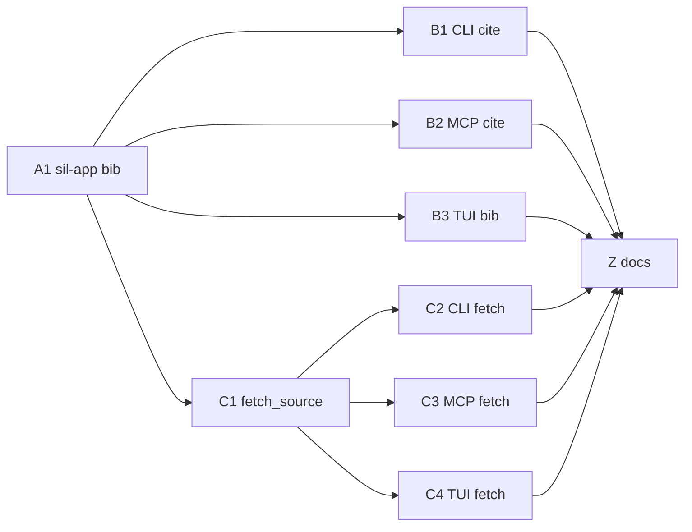

# Stage 12 / Wave sil-app — three-surface use-case layer

**Status:** Materialized — awaiting execute  
**On execute:** Ship code + docs per `prompts/PR-*.md` (product code only when an implementer runs those prompts).

| Field | Value |
|-------|--------|
| **Project** | scientist-in-loop (`sil`) |
| **Date** | 2026-08-12 |
| **Target path** | `docs/plan-sil-app/` |
| **Predecessor** | Stage 11 / `docs/pr-plan-08-12/` (crash-safe); Stage 10 MCP collapse |
| **User decisions** | Conversation, not a crate shuffle. Pain = three-surface drift. New crate `sil-app`. Unify on **richest** behavior. Slice 0 = bib writers. Slice 2 = fetch. Search/rank **out**. CLI cite stays quiet (no new proposal stdout). TUI fetch = download + official bib, **no parse**. Official bib = richest resolver. |

---

## 1. Overview

CLI (`crates/sil`), TUI (`sil-tui`), and MCP (`sil-mcp`) each orchestrate the same workflows. `crates/sil` is binary-only and already depends on TUI + MCP, so those crates cannot call CLI commands (cycle). The result is copy-pasted I/O + policy drift.

This wave adds **`sil-app`**: sync use-case functions, no UI, structured results + `CommitProposal`. Surfaces become adapters.

| Track | Theme |
|-------|--------|
| **A** | `sil-app` crate + `upsert_bib` / `promote_bib` |
| **B** | Switch CLI / MCP / TUI **explicit** bib actions |
| **C** | `fetch_source` use-case + switch three fetch adapters |
| **Z** | STAGES Stage 12 + ADR-014 + docs honesty |



**Waves**

```text
Wave 0:  A1
Wave 1:  B1 B2 B3          (parallel after A1)
Wave 2:  C1
Wave 3:  C2 C3 C4          (parallel after C1)
Wave 4:  Z
```

---

## 2. Code-truth audit (why this wave)

| Workflow | CLI | MCP | TUI |
|----------|-----|-----|-----|
| **Upsert bib** | `cite --append` → `upsert_bib_entry` (no `preserve_cite_key`, no draft, no Sci-Action, ✓ only) | `upsert_bib_entry_with_options(preserve_cite_key default true)`, optional draft, proposal, `never_committed` | `upsert_bib_entry` + always `mark_tui_added`; no proposal |
| **Promote bib** | `is_same_paper` OR cite-key; ✓ only | same match + proposal | only if already tui-added; `is_same_paper` only |
| **Fetch** | download + optional parse + official bib **iff target is DOI/arXiv** | download + optional parse (**errors swallowed**); **no bib write** | download only; empty `upsert_parsed("",…)`; parse/hydrate are other jobs |
| **Search** | FTS only | hybrid / HyDE / FTS from RAG | n/a as a command |
| **Rank** | `OnnxEmbedder::default()` | `OnnxEmbedder::default()` | `from_rag_settings` |

Root cause: no application layer. Domain helpers (`sil_core::bib`, `sil_parse::fetch_source_target`) exist; **file I/O + policy + proposal** are reimplemented per surface.

**This wave closes rows Upsert / Promote / Fetch.** Search and Rank are residual (next wave).

---

## 3. Goals / non-goals

### Goals

1. New crate `sil-app` that CLI, TUI, and MCP call for shared writes.
2. One bib writer: `upsert_bib` / `promote_bib` with richest policy.
3. One fetch orchestrator: `fetch_source` (download + optional parse + richest official bib via `upsert_bib`).
4. Never auto-commit. Use-cases return `CommitProposal`; adapters decide whether to show it.
5. Existing e2e (`e2e_cite`, `e2e_source`) stay green. MCP upsert/promote unit tests stay green (JSON shape compatible).

### Non-goals

- Search / rank / estimate / edit-section / ground-claims use-cases
- TUI hydration jobs (`jobs.rs` hydrate apply) — still a third writer until a later slice
- TUI App god-object / channel-per-job cleanup
- Splitting `sil-mcp/src/tools/mod.rs` or TUI handlers for size
- Re-homing `sil-core::bib` or `sil-parse` modules
- Python download rewrite
- Workspace lock on bib/fetch (lock stays advisory; only MCP edit-section writes it today)
- New MCP tools or CLI subcommands
- Hexagonal ports, traits-for-everything, or “MCP shells out to CLI”

---

## 4. Key decisions (KD)

| ID | Decision |
|----|----------|
| **KD-1** | New crate **`sil-app`**. Not a `sil` lib (cycle: `sil` → `sil-tui`/`sil-mcp`). |
| **KD-2** | Use-cases are **sync**, take `&AppContext`, return `Result<T, AppError>`. **No** `SilUi`, JSON, or Ratatui. |
| **KD-3** | Unify on **richest behavior**, not preserve per-surface quirks. |
| **KD-4** | **`draft` is a role flag**, not richness. TUI appends `draft=true`; CLI official append and fetch-resolved bib use `draft=false`. MCP keeps `draft` on `sil_cite` upsert. |
| **KD-5** | **`preserve_cite_key` is always true** inside `upsert_bib`. MCP schema may keep the property so old agents do not break; the use-case **ignores** `false`. |
| **KD-6** | Always re-read `references.bib`, `write_atomic_str`, completeness-aware `upsert_bib_entry_with_options`. |
| **KD-7** | Always return `CommitProposal` (`UpdateBibliography` / `PromoteBibliography` / `FetchSource` / `ParsePdf`). **Never** `git commit`. |
| **KD-8** | CLI **cite** stays quiet: keep ✓ / warn. Do **not** print the git proposal block. MCP still returns `proposal` + `never_committed`. |
| **KD-9** | `parse` on fetch is a **role flag** (like `draft`). Default **true** (CLI/MCP today). TUI fetch job passes **`parse=false`**. |
| **KD-10** | Official bib after fetch: (1) DOI/arXiv on the **target string**, then (2) `resolve_official_bibtex_for_source` on the downloaded / parsed doc. URL + `parse=false` may yield no bib (honest limit). |
| **KD-11** | Do **not** swallow parse errors (MCP today does). Put them on `FetchSourceResult.parse_error`. |
| **KD-12** | TUI empty `upsert_parsed("",…)` stays in the **TUI adapter**, not in `sil-app`. |
| **KD-13** | TUI **hydration apply** (`jobs.rs` official-bib merge) is **out**. Slice 0/2 do not touch that path. |
| **KD-14** | A1 depends only on `sil-core` + `sil-git`. C1 adds `sil-parse` (and thus `sil-db` if parse needs it). |
| **KD-15** | Docs (STAGES Stage 12, ADR-014) ship in **Z**, after adapters. This plan + prompts live in `docs/plan-sil-app/`. |

---

## 5. Target API (normative)

### 5.1 Crate layout

```
crates/sil-app/
  Cargo.toml
  src/lib.rs
  src/error.rs
  src/context.rs
  src/bib.rs      # A1
  src/fetch.rs    # C1
```

Workspace: add member + `[workspace.dependencies] sil-app`.

`sil`, `sil-tui`, `sil-mcp` gain `sil-app` dep on their adapter PRs (not in A1).

### 5.2 Context + error

```rust
pub struct AppContext {
    pub root: Utf8PathBuf,
    pub paths: ProjectPaths,
    pub config: Config,
}

impl AppContext {
    pub fn from_cwd() -> Result<Self, AppError>;
    pub fn from_root(root: impl Into<Utf8PathBuf>) -> Result<Self, AppError>;
}

pub enum AppError { /* thiserror; NotInProject, Io, Bib, Parse, … */ }
```

`from_root` loads `Config::load` or default. Does **not** open SQLite (callers / use-cases open as needed).

### 5.3 Bib (A1)

```rust
pub struct UpsertBib {
    pub entry: String,
    pub draft: bool,
}

pub struct UpsertBibResult {
    pub cite_key: String,
    pub replaced: bool,
    pub path: Utf8PathBuf,
    pub draft: bool,
    pub proposal: CommitProposal,
}

pub fn upsert_bib(ctx: &AppContext, req: UpsertBib) -> Result<UpsertBibResult, AppError>;

pub struct PromoteBib {
    pub target: String, // cite key or identity (DOI / arXiv / title) — same matching as MCP today
}

pub struct PromoteBibResult {
    pub cite_key: String,
    pub had_marker: bool,
    pub path: Utf8PathBuf,
    pub proposal: CommitProposal,
}

pub fn promote_bib(ctx: &AppContext, req: PromoteBib) -> Result<PromoteBibResult, AppError>;
```

**`upsert_bib` algorithm**

1. Reject empty entry; reject if no `@` (same validation as MCP).
2. If `draft`, `mark_tui_added_bib_entry`.
3. Re-read `paths.join(REFERENCES)` (`""` if missing).
4. `upsert_bib_entry_with_options(..., UpsertOptions { preserve_cite_key: true })`.
5. Resolve resulting cite key (same `is_same_paper` scan as MCP).
6. `write_atomic_str`.
7. `proposal_for_action(UpdateBibliography, …)`.

**`promote_bib` algorithm**

1. Missing file → error.
2. Re-read. Match `is_same_paper` **or** cite-key (case-insensitive), using the same `target_info` hack as CLI/MCP (all identity fields set to `target`).
3. `unmark_tui_added_bib_entry` on first match. Track `had_marker`.
4. No match → error.
5. `write_atomic_str`. `proposal_for_action(PromoteBibliography, …)`.

Reuse `sil_core::bib::*` and `sil_git::proposal_for_action`. Do not fork pretty/completeness logic.

### 5.4 Fetch (C1)

```rust
pub struct FetchSource {
    pub target: String,
    pub parse: bool,
}

pub struct FetchSourceResult {
    pub downloaded_path: Utf8PathBuf,
    pub parsed: Option<ParseSummary>, // filename, title, source_id, reference_count
    pub parse_error: Option<String>,
    pub bib: Option<UpsertBibResult>,
    pub fetch_proposal: CommitProposal,
    pub parse_proposal: Option<CommitProposal>,
}

pub fn fetch_source(ctx: &AppContext, req: FetchSource) -> Result<FetchSourceResult, AppError>;
```

**Algorithm**

1. `sil_parse::fetch_source_target(target, sources_dir)` — download failure is a hard error.
2. Resolve on-disk path (same absolute / sources_dir / root join as CLI/MCP).
3. If `parse` and path exists: `parse_one` with `discover_marker_runner` (MCP stub fallback is **adapter** policy for MCP only — C3 may pass a runner or keep stub in the adapter). Prefer: `fetch_source` takes no runner; uses `discover_marker_runner` and on failure returns `parse_error` without stubbing. MCP C3 can still stub by calling `parse_one` itself if tests require `SIL_MARKER_STUB`. **C1 prompt:** `fetch_source` uses `discover_marker_runner`; if runner missing and `parse=true`, set `parse_error` and continue to bib resolve. Do not invent stub content in sil-app.
4. Official bib:
   - `extract_doi(target)` → `fetch_bibtex_by_doi`
   - else `extract_arxiv_id(target)` → `fetch_bibtex_by_arxiv_id`
   - else / if still missing: build `SourceDocument` from downloaded path + parsed metadata if any → `resolve_official_bibtex_for_source`
   - on `Resolved(bib)` → `upsert_bib(ctx, UpsertBib { entry: bib, draft: false })`
   - on failure / none: `bib = None` (not a hard error)
5. `fetch_proposal = proposal_for_action(FetchSource, …)`.
6. If parse succeeded: `parse_proposal = proposal_for_action(ParsePdf, …)`.

### 5.5 Adapter mapping

| Surface | Call |
|---------|------|
| CLI `cite --append` | `upsert_bib(draft=false)`; print ✓ replaced/appended; **no** proposal block |
| CLI `cite --promote` | `promote_bib`; print ✓; **no** proposal block |
| MCP `sil_cite` upsert | validate args; `upsert_bib(draft)`; same JSON as today (`wrote`, `cite_key`, `replaced`, `path`, `draft`, `proposal`, `never_committed`) |
| MCP `sil_cite` promote | `promote_bib`; same JSON (`replaced` = `had_marker`) |
| TUI append source / viewing refs / all refs | `upsert_bib(draft=true)` per entry (or one write after building marked entries — must go through `upsert_bib` so policy holds). Then existing `queue_*_hydration` unchanged. |
| TUI promote selected | `promote_bib` with selected cite key |
| CLI `source fetch` | `fetch_source(parse=!no_parse)`; existing spinners + ✓; print fetch/parse proposals as today; if `bib` Some, existing ✓ bib messages |
| MCP `sil_sources` fetch | `fetch_source(parse=!no_parse)`; extend JSON with `bib` object / `parse_error`; do not swallow parse errors into silent `parsed=false` only |
| TUI `queue_source_fetch` | worker: `AppContext::from_root` + `fetch_source(parse=false)`; on success keep empty stub upsert + reload; also reload bib if `bib` is Some |

---

## 6. PR plan

### A1 — `sil-app` + bib use-cases

- Workspace member, crate, `AppContext`, `AppError`, `upsert_bib`, `promote_bib`.
- Unit tests in `sil-app` (temp project dir, no git required except we don't commit):
  1. upsert new entry
  2. upsert replaces incomplete / same DOI; **preserves cite key**
  3. `draft=true` writes `% [sil: tui-added]`
  4. promote strips marker; promote missing key errors
  5. `from_cwd` outside project errors
- No adapter wiring.

### B1 — CLI cite

- `commands/cite.rs` append/promote call `sil-app`. Suggestion-only path (no `--append`) unchanged.
- `e2e_cite` green. No new proposal stdout.

### B2 — MCP cite

- `handle_upsert_bib` / `handle_promote_bib` become thin wrappers.
- Existing tests in `tools/mod.rs` (~2922–3058) stay green.
- `preserve_cite_key: false` no longer changes keys (KD-5). Update or add a test that documents ignore.

### B3 — TUI explicit bib

- `bib_actions.rs`: `append_selected_source_to_bib`, `append_selected_viewing_ref_to_bib`, `append_all_viewing_refs_to_bib`, `promote_selected_bib_entry`.
- After write, keep `load_project_references_bib` + hydration queues.
- **Do not** change `jobs.rs` hydration apply.
- Existing TUI unit tests updated if they assert write internals.

### C1 — `fetch_source`

- `src/fetch.rs`; `sil-app` gains `sil-parse` (and `sil-regex` if extractors are used here rather than via parse).
- Unit tests: mock is hard (Python download). Prefer:
  - resolve-path + bib-upsert composition tested by injecting a pre-downloaded file **or**
  - test official-bib + upsert with a local file and stubbed network if existing parse tests allow
  - At minimum: `parse=false` + target DOI path that fails download is a hard error (no bib write).
- Follow existing `SIL_DOWNLOAD_SCRIPT` / fetch tests in `sil-parse` if reusable.

### C2 — CLI fetch

- `commands/source.rs` `fetch` calls `fetch_source`.
- Keep spinner + `print_proposal` for fetch/parse (CLI fetch **already** prints proposals; that is not the cite-quiet rule).
- `e2e_source::source_fetch_surfaces_download_failure` green.

### C3 — MCP fetch

- `handle_fetch_source` → `fetch_source`.
- JSON: keep `downloaded_path`, `parsed`, `title`, `source_id`, `commit_proposal`.
- Add `parse_error`, `bib` (`cite_key` / `replaced` / `proposal` or null).
- If parse fails, still return ok with `parsed=false` **and** `parse_error` set (download succeeded). Hard error only on download failure.

### C4 — TUI fetch job

- `queue_source_fetch` worker calls `fetch_source(parse=false)`.
- `FetchJobResult` may carry optional bib summary for status (“fetched + added bib”).
- Keep empty `upsert_parsed` stub + `reload_sources`.
- If bib written, reload bib list.
- Hydration jobs unchanged.

### Z — Docs

- `STAGES.md` Stage 12 ✅ (honest: bib+fetch unified; search/rank residual).
- `docs/adr/ADR-014-sil-app-usecase-layer.md`
- README: if it claims fetch/cite behavior, align (MCP fetch now writes bib).
- Do not invent new top-level dirs.

---

## 7. Verification

Per-PR verify is in each prompt. Wave-complete:

```bash
cargo test -p sil-app
cargo test -p sil --test e2e_cite --test e2e_source
cargo test -p sil-mcp
cargo test -p sil-tui
cargo clippy --workspace --all-targets -- -D warnings
cargo fmt --all -- --check
```

Optional: `cargo test --workspace` if time allows.

---

## 8. Master checklist

### Slice 0 (A + B)

- [ ] `sil-app` in workspace; `from_cwd` / `from_root`
- [ ] `upsert_bib` / `promote_bib` + unit tests
- [ ] Always `preserve_cite_key`, atomic write, proposal, never commit
- [ ] CLI cite append/promote via sil-app; quiet ✓; `e2e_cite` green
- [ ] MCP upsert/promote via sil-app; JSON compatible; never_committed tests green
- [ ] TUI explicit append/promote via sil-app; hydration **not** rewired
- [ ] No new proposal stdout on `sil source cite`

### Slice 2 (C)

- [ ] `fetch_source` composes download + optional parse + richest bib + `upsert_bib(draft=false)`
- [ ] Parse errors on result, not swallowed
- [ ] CLI fetch via sil-app; download-failure e2e green
- [ ] MCP fetch writes bib when resolver succeeds; JSON has `bib` / `parse_error`
- [ ] TUI fetch job `parse=false`; still reloads list; bib reload if written
- [ ] Empty DB stub remains TUI-only

### Z

- [ ] STAGES Stage 12
- [ ] ADR-014
- [ ] README honesty if fetch/cite claims exist

### Explicitly not done

- [ ] Search hybrid on CLI
- [ ] Rank uses RAG settings on CLI/MCP
- [ ] TUI hydration apply → `upsert_bib`
- [ ] God-file splits

---

## 9. Residual risk

1. **TUI hydration** still writes `references.bib` via `upsert_bib_entry_with_options` in `jobs.rs`. Two writers until a later slice.
2. **URL + TUI `parse=false`**: richest resolver often has no title/DOI → no bib until user parses + hydrates.
3. **MCP `preserve_cite_key: false`** becomes a no-op (KD-5). Agents that relied on key rewrite lose that.
4. **CLI `cite --append`** now preserves existing cite keys on same-paper replace (behavior change, intended).
5. **MCP fetch JSON** grows fields; old agents ignore extras. `parsed=false` plus `parse_error` is a behavior change vs silent fail.
6. **C1 download tests** are environment-sensitive (Python script). Prefer not to hit the network in unit tests.

---

## 10. Prompts

Copy-paste agent prompts: [`prompts/README.md`](prompts/README.md).

---

## 11. Conversation log (decisions source)

- Pain: three-surface drift.
- Home: new `sil-app`.
- Policy: richest behavior; `draft` and fetch `parse` are role flags.
- Slice 0 first: bib writers; then fetch.
- TUI hydration out of first cut.
- CLI cite: no new proposal stdout.
- TUI fetch: download + official bib, no parse.
- Official bib: target id then `resolve_official_bibtex_for_source`.
