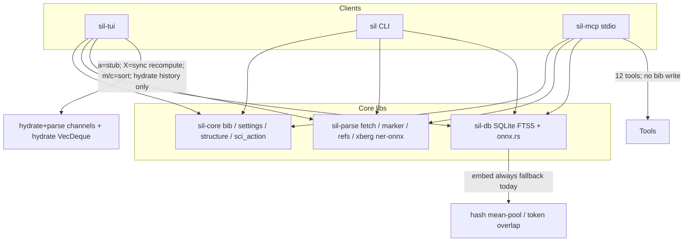
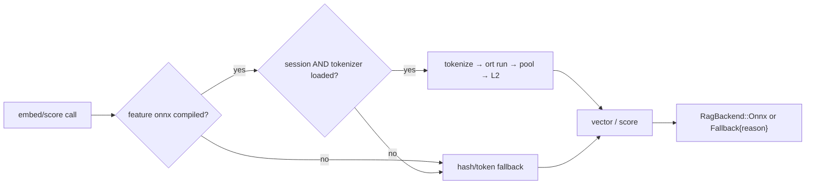
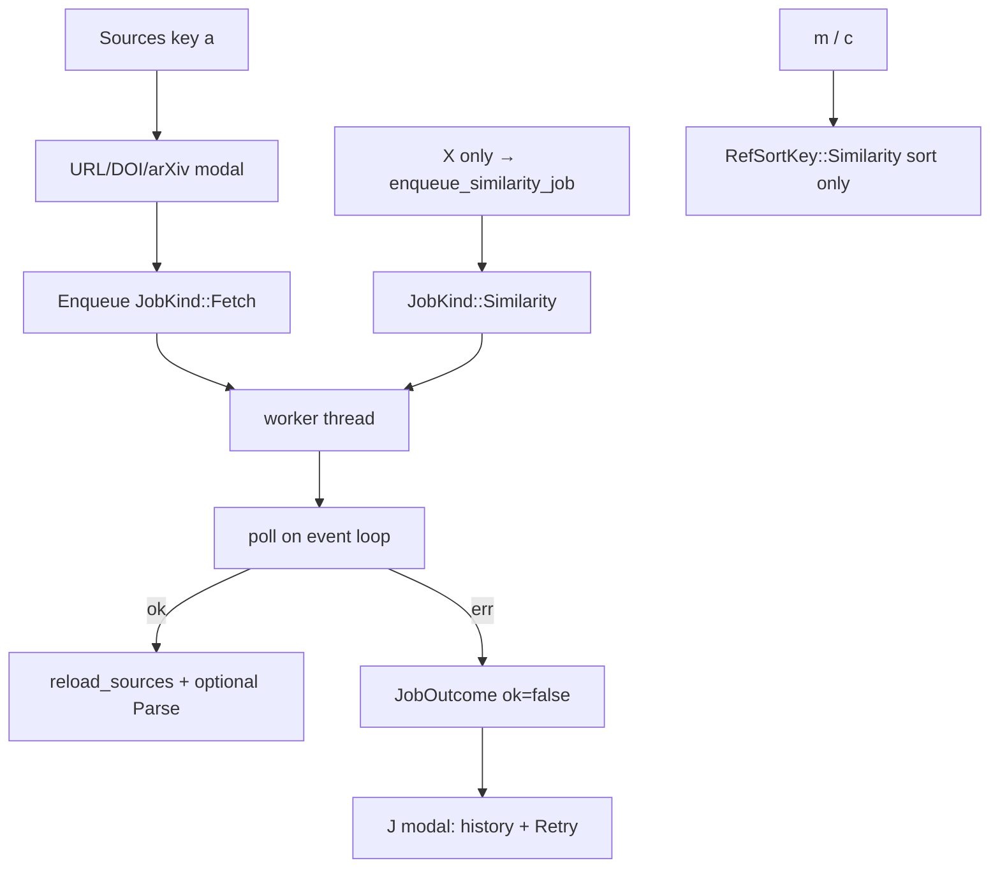
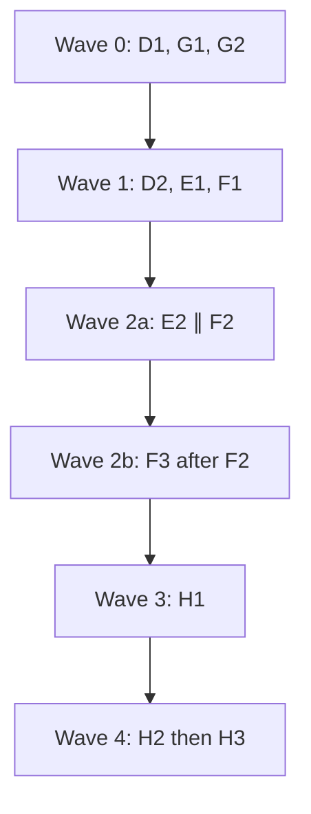
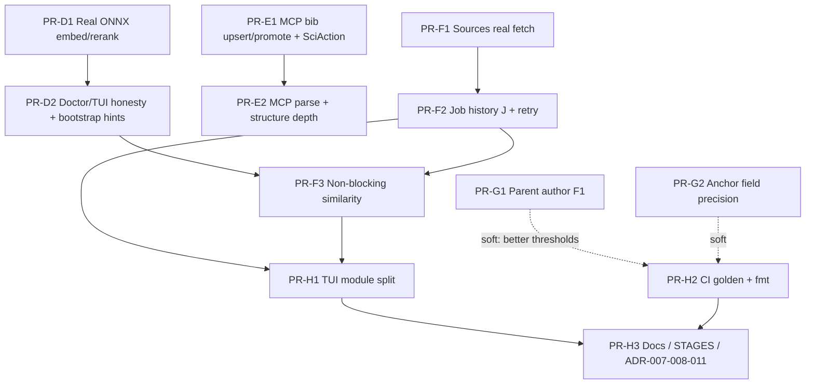

# Design: ONNX RAG Truth, Agent Bib Write, TUI Finish, Quality & Release Hygiene

| Field | Value |
|-------|--------|
| **Project** | scientist-in-loop (`sil`) |
| **Author** | _TBD_ |
| **Date** | 2026-08-07 |
| **Status** | Materialized + Wave 0 in progress (rev 4) |
| **Mode** | Canonical checklist + PR DAG + agent prompts under `prompts/` |
| **Predecessor** | `docs/pr-plan-08-04/` (merged: bib lifecycle, TUI jobs/help, parse/digest hardening, ADR-010) |
| **Workspace** | `/Users/vladimirkasterin/rust/scientist-in-loop` |

---

## Overview

Wave 08-04 closed bibliography races, TUI discoverability, golden negative-pattern FAIL, and digest parity. The product is stage-complete for MVP human loops, but four systemic gaps remain: (1) documented **ONNX dense RAG is not real** — embed/rerank always hash/token-overlap fallbacks; (2) the **agent loop cannot write bibliography or drive full parse/structure workflows** without the TUI; (3) **TUI finish items** deferred as non-goals of 08-04 still block polish (Sources `a` stub, hydrate-only job history, blocking similarity); (4) **quality and engineering hygiene** (weak fixture-level author F1, TUI monolith, CI/docs drift).

This document specifies **Wave D**: a verified, ordered PR DAG with checklists, subagent roles, verification stages, and post-approval packaging under `docs/pr-plan-08-07/`. Implementation begins only after design approval.

---

## Background & Motivation

### Predecessor outcomes (08-04 / ADR-010)

Accepted policies already in tree:

- Pretty BibTeX + completeness-aware `upsert_bib_entry_with_options` (`crates/sil-core/src/bib.rs`)
- Cite-key preservation on hydrate; `% [sil: tui-added]` lifecycle; release strip
- TUI write serialization: re-read disk before write; promote/delete-during-flight safety
- Help overlay (`?`/`F1`), parse queue (`e`/`E`), hydration status chrome + **hydrate history ring**
- Golden negatives clean; resolve fallback + Jaccard gate; native journal digest

### Code-truth audit (2026-08-07)

Claims from the product brief were checked against the tree. Results:

| Claim | Code truth | Correction |
|-------|------------|------------|
| ONNX always falls back | **Confirmed.** `OnnxEmbedder::embed` / `OnnxReranker::score` ignore model path existence (`let _ = …exists()`) and always call fallback (`crates/sil-db/src/onnx.rs`). | — |
| No `ort` in sil-db | **Confirmed.** `crates/sil-db/Cargo.toml` has no `ort`/ONNX runtime dep; no workspace `onnx` feature. | — |
| MCP 12 tools, no bib write | **Confirmed.** Tools: search, context, suggest citations, list/update todo, skills, workspace context, get_structure, build_and_doctor, propose_commit, fetch_source. No `sil_upsert_bib` / `sil_promote_bib`. | STAGES.md still says “11 core MCP tools” and claims real ONNX — **docs lie**. |
| Structure set via MCP | **Partial.** `sil_get_structure` supports `action=update` for section completion (`Draft`/`Empty` only via `completed: bool`). Schema advertises `word_count` but handler **ignores** it. `Section` has no word target field. | E2 deepens real fields only (`completion` enum + claim/points content). |
| Sources `a` register-only | **Confirmed.** `handle_modal_add_source_link_mode` writes a markdown stub and DB upsert; status: `"Registered … link stub (no download)"` (`app.rs` ~2713–2753). | 08-04 B3 preferred real fetch; still incomplete. |
| Job history / unified jobs | **Partial.** Separate channels + sets: `hydration_tx/rx`, `parse_tx/rx`, `in_flight_hydration_keys`, `in_flight_parse_ids`. **Hydrate-only** ring: `recent_hydration_outcomes: VecDeque<HydrationHistoryEntry>` capped at **20** (`app.rs` ~491–519, ~889+). No unified `BackgroundJobs` / `JobKind` / fetch/parse/similarity history / retry modal. | F2 **generalizes** hydrate history — does not invent a second ring. |
| Similarity blocks UI | **Confirmed.** **`X` only** calls `recompute_draft_ref_similarities` on the event loop with `OnnxEmbedder::default()` (`app.rs` ~1318–1369, ~2079–2081). **`m` / `c` are sort-only** (`RefSortKey::Similarity`, ~2071–2077); help: `m / c` sort, `X` recompute (~252–253). Help still says “ONNX embeddings” on `X`. | F3: async **recompute on `X` only**; leave `m`/`c` sort. |
| TUI monolith LOC | **Confirmed.** `app.rs` **4671** LOC; `ui.rs` **2100** LOC. | — |
| Golden author F1 / field prec | **Confirmed** in `tests/golden_dataset/reports/candidate_scorecard.md` (file H1 still mislabeled “Baseline”). Macro parent authors F1 **0.92 PASS**, but **BEE-RAG 0.53**, **HiChunk 0.46**. Macro field prec **0.94**, but **structure_predict_hallucination 65%**. Zero negative pollution. | Wave G targets **weak fixtures**; use per-fixture table, not H1 title. |
| CI golden + fmt | **Missing.** `.github/workflows/ci.yml`: `cargo build/test/clippy` on ubuntu + `test` on macos; **no** `fmt --check`, **no** golden job. | — |
| Model cache default | **Already** `~/.cache/sil/models` via `RagSettings::model_cache_dir` (`settings.rs`). | Keep; do not reintroduce `/Volumes/happy-disk` (still in README for xberg). |
| Dual ADR-007 | **Confirmed.** Parent-metadata + split-view TUI both numbered 007; no ADR-008/011. | Normative renumber in H3 (see KD-12). |
| SciAction bib variants | **Missing.** `SciAction` = Init, Update, ParsePdf, UpdateStructure, AddFigure, AddData, EditDraft, PromoteToFinal, FetchSource only. | E1 adds bib variants. |
| Doctor `Check` shape | **`name`, `ok`, `detail` only** — no free-form extra fields. | D2 extends struct additively (see API). |
| Feature graph | `sil` depends on `sil-db`, `sil-tui`, `sil-mcp`; **no** `[features]` on any of them today. | Feature only on `sil-db` + re-export on **`sil`**. |
| xberg ONNX | Workspace `xberg` with **`ner-onnx`** already linked via `sil-parse`. | D1 spike for dual-runtime. |

### Pain points

1. **Capability overclaim** — README / STAGES / MCP tool descriptions advertise “Local ONNX Dense RRF” while runtime is hash embeddings.
2. **Agent incomplete** — MCP can fetch sources and update TODOs but cannot permanently manage `references.bib` or re-parse without gaps.
3. **TUI residual friction** — Stub ingest; hydrate-only history; no retry modal; blocking similarity.
4. **Quality cliff on hard fixtures** — Macro gates hide per-fixture author and field-precision failures.
5. **Engineering debt** — Monolith TUI; CI cannot enforce format or extraction quality; dual ADR-007.

---

## Goals & Non-Goals

### Goals

| Track | Goal |
|-------|------|
| **D. ONNX truth** | Real dense embed + rerank behind feature `onnx` with **pinned tokenizer+session contract**; honest doctor/TUI when fallback; **HF export recipe** for models (script stretch only) |
| **E. Agent bib + MCP** | Sci-Action-governed MCP tools for bib upsert/promote, parse, structure depth; **never** auto-commit |
| **F. TUI finish** | Real Sources fetch on `a`; generalized job history `J` + retry; non-blocking similarity jobs |
| **G. Parse quality** | Lift BEE-RAG/HiChunk parent author F1; improve weak anchor field precision fixtures |
| **H. Engineering** | TUI module split; CI golden + fmt; docs/ADR/README/STAGES truth |

### Non-goals

- Auto-commit (never)
- Replacing Marker / xberg
- Full keybinding prefix-map redesign (document collisions only; optional later)
- Public crates.io publish (optional release notes + installer only)
- Full IDE-grade in-TUI paper editor
- Windows CI (stretch note only)
- Shipping large production ONNX model binaries in-repo (tiny **test fixtures** allowed under `crates/sil-db/tests/fixtures/`)
- Changing default CI to require GPU or multi-GB model downloads
- HTTP remote embed API
- `structure.yaml` schema expansion for word targets
- Structured (non-BibTeX) MCP bib field objects in v1

---

## Current architecture (relevant slices)



### Key symbols today

| Component | Path | Notes |
|-----------|------|--------|
| Embed/rerank stubs | `crates/sil-db/src/onnx.rs` | `DEFAULT_EMBEDDING_DIM = 384`; L2-normalized hash pool; no session |
| Hybrid search | `crates/sil-db/src/chunks.rs` `search_hybrid*` | Uses `OnnxEmbedder` for dense leg (hash today) |
| Draft–ref similarity | `crates/sil-db/src/references.rs` + TUI/CLI | Cosine via embedder |
| RagSettings | `crates/sil-core/src/settings.rs` | Defaults: `bge-small-en-v1.5`, `ms-marco-MiniLM-L-6-v2`, cache `~/.cache/sil/models` |
| Bib upsert | `sil_core::bib::upsert_bib_entry_with_options` | Completeness + pretty + preserve_cite_key |
| SciAction | `crates/sil-core/src/sci_action.rs` | No bib variants yet |
| Structure | `crates/sil-core/src/structure.rs` | `Section { id, title, level, completion, main_claim, secondary_points, required_content }` |
| MCP tools | `crates/sil-mcp/src/tools.rs` | 12 tools; fetch reuses `sil_parse::fetch_source_target` |
| TUI jobs | `crates/sil-tui/src/app.rs` | `HydrationHistoryEntry`, `recent_hydration_outcomes` (cap 20), dual mpsc |
| Doctor | `crates/sil/src/commands/doctor.rs` | `Check { name, ok, detail }` |
| CI | `.github/workflows/ci.yml` | build/test/clippy; no fmt/golden |
| xberg | workspace + sil-parse | `ner-onnx` feature already on |

---

## Proposed Design

### D — ONNX feature policy (normative)

```text
default build (no onnx feature)
  → hash/token fallback (current behavior)
  → doctor + TUI: mode=fallback, reason=feature_disabled

cargo build -p sil --features onnx
  → if tokenizer assets + model.onnx load OK: mode=onnx
  → else: mode=fallback with explicit reason (never mode=onnx)
```

**Rules:**

1. Never silently claim ONNX when running fallback. **`mode=onnx` requires successful session + tokenizer load.**
2. Feature flag lives on **`sil-db` only**, re-exported on user-facing **`sil`** binary (`onnx = ["sil-db/onnx"]`). Path deps `sil-tui` / `sil-mcp` inherit via Cargo feature unification when built through `sil`. Do **not** require separate feature flags on sil-mcp/sil-tui for v1.
3. Model cache default remains `~/.cache/sil/models/` (`RagSettings.model_cache_dir`).
4. Embeddings always L2-normalized (fallback and ONNX).
5. When feature=onnx but path/tokenizer/load fails → degrade to fallback **and** surface reason on status API.
6. **Forbidden:** reporting `mode=onnx` for “raw mean-pool over model weights/bytes” or any path that did not run a real tokenizer → ort session → pooling pipeline.



#### D1 — Normative inference contract

##### Workspace pins (D1 must set)

| Dep | Location | Policy |
|-----|----------|--------|
| `ort` | `[workspace.dependencies]` + `sil-db` optional | Pin exact version at implement time (prefer latest stable 2.x that builds on ubuntu+macos CI). Prefer **`ort` download-binaries / vendored feature** so CI does not need system ORT. Document chosen feature flags in PR. |
| `tokenizers` | workspace + `sil-db` optional under `onnx` | Pin exact version; used for HuggingFace-compatible WordPiece/BPE JSON. |

##### On-disk layout (resolved via existing `RagSettings` precedence)

Default names remain `onnx_embedder_model = "bge-small-en-v1.5"` and `onnx_reranker_model = "ms-marco-MiniLM-L-6-v2"`.

**Directory package** (preferred under `model_cache_dir` or `onnx_models_dir`):

```text
~/.cache/sil/models/bge-small-en-v1.5/
  model.onnx              # or {name}.onnx
  tokenizer.json          # required for mode=onnx
  # optional: special_tokens_map.json, config.json (ignored if present)
```

**Explicit file path** (`onnx_embedder_path` pointing at a `.onnx` file): tokenizer is sibling `tokenizer.json` in the same directory, or `{stem}.tokenizer.json`. If tokenizer missing → `Fallback { reason: "missing_tokenizer" }`, **not** onnx mode.

Same layout rules for reranker directory/file.

##### Embed pipeline (`try_onnx_embed`) — only path that may set `mode=onnx`

1. Load `Session` from resolved `model.onnx` once; cache on `OnnxEmbedder`.
2. Load `tokenizers::Tokenizer` from `tokenizer.json` once.
3. Encode text → `input_ids`, `attention_mask` (and `token_type_ids` if graph requires; default zeros).
4. Bind inputs by **name** when present in graph metadata; else positional order documented in code comments after first successful fixture run. Expected dtypes: **int64** ids/mask unless model metadata says int32.
5. Run session → take last hidden state or pooled output tensor:
   - If output rank-2 `[batch, dim]` → use row 0.
   - If rank-3 `[batch, seq, dim]` → **mean-pool over sequence** using attention mask (not CLS-only unless fixture model is CLS-only; document choice after fixture validation).
6. **L2-normalize** → `Vec<f32>` of length `dim` (expect 384 for bge-small class).

##### Rerank pipeline (`try_onnx_score`)

1. Load cross-encoder session + tokenizer.
2. Encode `(query, document)` pair per model convention (typical: single sequence with separator token).
3. Run → scalar logit or `[batch, 1]`; return `f32` relevance score (no requirement to sigmoid unless fixture does).

##### `RagSettings` runtime application

| Setting | D1 behavior |
|---------|-------------|
| `execution_provider` | **CPU only** for v1 (KD-15). Non-`cpu` values → log/detail note, still CPU. CUDA/CoreML deferred. |
| `num_threads` | Applied to ort session options / intra-op threads when API allows; default 4. |
| path fields | Existing resolve_* precedence unchanged. |

##### Status API

```rust
#[derive(Debug, Clone, PartialEq, Eq)]
pub enum RagBackend {
    Fallback { reason: RagFallbackReason },
    Onnx { dim: usize },
}

#[derive(Debug, Clone, Copy, PartialEq, Eq)]
pub enum RagFallbackReason {
    FeatureDisabled,
    ModelPathMissing,
    MissingTokenizer,
    SessionLoadFailed,
    // ...
}

impl OnnxEmbedder {
    pub fn backend(&self) -> RagBackend { /* ... */ }
}
```

`mode=onnx` **iff** `RagBackend::Onnx { .. }`. Missing tokenizer is never silent success.

##### Test fixtures (D1)

- Default tests: **no** models; fallback only; non-equal texts → non-identical hash vectors (already true).
- Optional `#[ignore]` or `#[cfg(feature = "onnx")]` tests with **tiny checked-in fixtures** under `crates/sil-db/tests/fixtures/onnx_min/`:
  - minimal `model.onnx` + `tokenizer.json` (can be identity-like / small vocab) sufficient to prove session path and that two different strings produce non-identical vectors **through ort**, not through fallback.
- Export recipe for full bge/ms-marco models: **documented HF export steps only** (pinned revision + install under `~/.cache/sil/models/…`). Optional bootstrap script is stretch only. **Full models not in git.**

##### Dual-runtime spike (mandatory D1 note / checklist)

Workspace already pulls `xberg` with **`ner-onnx`**. **D1 merge is blocked** (KD-20) until:

1. `cargo build -p sil --features onnx` succeeds on linux+macos **with** current xberg, **or**
2. An **explicit documented incompatibility constraint is user-approved** (not implementer-only).

If conflict: try aligning ort major with xberg’s transitive ORT / same crate version first; record outcome in PR description.

##### Implementation sketch

```rust
// sil-db/Cargo.toml
[features]
default = []
onnx = ["dep:ort", "dep:tokenizers"]

// crates/sil/Cargo.toml
[features]
default = []
onnx = ["sil-db/onnx"]
// sil-db = { workspace = true }  // feature unification when -p sil --features onnx
```

```rust
impl OnnxEmbedder {
    pub fn embed(&self, text: &str) -> Result<Vec<f32>, DbError> {
        match self.try_onnx_embed(text) {
            Some(Ok(v)) => Ok(v), // only if backend is Onnx
            _ => self.embed_fallback(text),
        }
    }
}
```

### D2 — Doctor / TUI honesty + model bootstrap

#### Doctor JSON shape (matches serde of extended `Check`)

Today:

```rust
struct Check { name: String, ok: bool, detail: String }
```

**Normative D2 change** (additive, non-breaking for consumers that ignore unknown fields if any; Rust serde consumers of exact struct need recompile):

```rust
#[derive(Debug, Serialize)]
struct Check {
    name: String,
    ok: bool,
    detail: String,
    /// Optional structured payload for machine parsers (null omitted or present).
    #[serde(skip_serializing_if = "Option::is_none")]
    extra: Option<serde_json::Value>,
}
```

Example `sil doctor --json` dense_rag check when feature off:

```json
{
  "name": "dense_rag",
  "ok": true,
  "detail": "fallback (hash); reason=feature_disabled; dim=384",
  "extra": {
    "mode": "fallback",
    "reason": "feature_disabled",
    "dim": 384,
    "embedder_path": null,
    "reranker_path": null,
    "tokenizer_ok": false
  }
}
```

**`ok` semantics:**

| Situation | `ok` | Rationale |
|-----------|------|-----------|
| Feature off / intentional fallback | **true** | Not a project health failure |
| Feature on, models missing, fallback active | **true** with warning detail (or second check `dense_rag_models` ok=false) | Process works; models optional |
| Feature on, session load error when paths *were* configured but corrupt | **false** on optional `dense_rag_models` check | Misconfiguration |

TUI: Settings RAG section + footer badge when similarity/search uses fallback; help text must not say unconditional “ONNX embeddings”.

**D2 model bootstrap (user-final):** ship **HF export recipe only** — pinned model/tokenizer export steps, expected directory layout under `~/.cache/sil/models/`, and doctor detail when paths missing. Optional `scripts/bootstrap_rag_models.sh` / `sil doctor --fix-rag` is **stretch only**, not acceptance.

### E — MCP bibliography write policy (normative)

```text
sil_upsert_bib / sil_promote_bib
  → path: ProjectPaths::new(root).join(rel::REFERENCES)
      // rel::REFERENCES = "references.bib"; same as TUI/CLI today
      // (no ProjectPaths::references() helper exists — optional sugar out of scope)
  → re-read disk → upsert_bib_entry_with_options / promote helpers → write
  → draft=true → mark % [sil: tui-added]  (default draft=false)
  → preserve_cite_key default true
  → return proposal text for SciAction::UpdateBibliography / PromoteBibliography
  → NEVER git commit; no file lock beyond re-read (same as TUI; coordinate with human)
```

#### SciAction variants (E1 — required in sil-core)

Add to `crates/sil-core/src/sci_action.rs`:

| Variant | Trailer value | When |
|---------|---------------|------|
| `UpdateBibliography` | `update-bibliography` | `sil_upsert_bib` proposal |
| `PromoteBibliography` | `promote-bibliography` | `sil_promote_bib` proposal |

Update: `as_str`, `FromStr`, serde kebab-case, unit tests round-trip, any trailer tables in docs. `sil_propose_commit` action filter docs may list them. **Do not** reuse `EditDraft` or `FetchSource` for bib writes.

```mermaid
sequenceDiagram
  participant Agent
  participant MCP as sil-mcp
  participant Disk as references.bib
  participant Core as sil-core::bib

  Agent->>MCP: sil_upsert_bib(entry: string, draft?)
  MCP->>Disk: read current
  MCP->>Core: mark if draft; upsert_bib_entry_with_options
  Core-->>MCP: updated content
  MCP->>Disk: write
  MCP->>MCP: proposal_for_action(UpdateBibliography)
  MCP-->>Agent: wrote, cite_key, replaced, proposal, never_committed
```

#### Tools

| Tool | PR | Behavior |
|------|-----|----------|
| `sil_upsert_bib` | E1 | **String BibTeX only** (`entry: string`); `draft` default false; `preserve_cite_key` default true |
| `sil_promote_bib` | E1 | Strip tui-added for cite_key and/or doi/arxiv match; re-read/write |
| `sil_parse_source` | E2 | Parse existing PDF/MD in `sources/` into SQLite (no download) |
| Deepen `sil_get_structure` | E2 | Full `completion` enum + optional claim/points fields (KD-16) |
| `sil_rank_draft` (optional) | E2 | Wrap `recompute_draft_ref_similarities` + return rankings |

**`sil_upsert_bib` v1 contract:**

| Input | Type | Notes |
|-------|------|--------|
| `entry` | string | Required. Full BibTeX entry block. Empty/invalid → error |
| `draft` | bool | Default false |
| `preserve_cite_key` | bool | Default true |

**Return JSON:**

```json
{
  "wrote": true,
  "cite_key": "smith2024",
  "replaced": true,
  "path": "/abs/project/references.bib",
  "draft": false,
  "proposal": "... commit message with Sci-Action: update-bibliography ...",
  "never_committed": true
}
```

Errors: missing project, empty entry, unparseable entry (no `@`), write IO failure. Completeness/tui-added interaction: identical to core upsert + optional mark before upsert.

**Concurrency:** re-read before write (TUI pattern). No cross-process file lock. Agents should not race the human TUI; last writer wins with re-read mitigation only.

#### E2 — Structure (real model only)

`Section` fields (code truth): `id`, `title`, `level`, `completion` (`empty|outline|draft|polished`), `main_claim`, `secondary_points`, `required_content`.

**Normative E2 surface** (deepen existing `sil_get_structure`; **no** new tool name):

| Arg | Behavior |
|-----|----------|
| `action` | `read` \| `update` |
| `section_id` | required for update |
| `completion` | string enum all four states (preferred over bool) |
| `completed` | **deprecated compatibility**: `true`→`draft`, `false`→`empty` if `completion` absent |
| `main_claim` | optional string update |
| `secondary_points` | optional string array replace |
| `required_content` | optional string array replace |
| `word_count` | **remove from schema or ignore with documented no-op** — field does not exist on `Section`; schema change for word targets is **non-goal** |

`SciAction::UpdateStructure` remains appropriate for structure proposals if E2 returns a proposal; optional.

### F — TUI Sources `a` + background jobs

```text
a → modal URL/DOI/arXiv
  → background job: sil_parse::fetch_source_target (same as MCP/CLI)
  → on success: reload_sources (+ optional parse enqueue)
  → on failure: JobOutcome failed + J modal retry

X → JobKind::Similarity recompute (after F3; only recompute entry point today)
m / c → sort by existing draft-similarity scores only (unchanged; never enqueue)
```

#### Background job model — generalization of existing hydrate history

**Do not invent a parallel ring buffer.** Promote:

| Today | Target |
|-------|--------|
| `HydrationHistoryEntry { label, success, detail }` | `JobOutcome { id, kind, label, ok, detail, duration_ms?, retry_payload?, finished_at }` |
| `recent_hydration_outcomes` cap 20 | `BackgroundJobs.recent: VecDeque<JobOutcome>` cap **≥20** (keep 20 or raise to 50) |
| `hydration_tx/rx` + `parse_tx/rx` | Keep channels; add `fetch_tx/rx`, `similarity_tx/rx` **or** one enum channel in F2 |
| `in_flight_hydration_keys` / `in_flight_parse_ids` | Fold into `in_flight: HashMap<JobId, JobKind>` over F1–F2 without breaking hydrate tests |

```rust
#[derive(Debug, Clone, Copy, PartialEq, Eq, Hash)]
enum JobKind { Hydrate, Fetch, Parse, Similarity }

struct JobOutcome {
    id: JobId,
    kind: JobKind,
    label: String,
    ok: bool,
    detail: String,
    duration_ms: Option<u64>, // optional; for J modal observability
    retry_payload: Option<RetryPayload>,
}
```

**Migration path:**

1. **F1** — Add fetch channel + `in_flight` keys for fetch; on outcome, **push into existing** `recent_hydration_outcomes` **or** immediately rename to generalized deque if low-churn; status chrome includes Fetch. Reuse `classify_source_input` + `fetch_source_target` (parity with MCP/CLI).
2. **F2** — Rename/generalize history → `JobOutcome`; unify poll helpers; **`J` modal** list + Retry on `!ok` with payload; help documents `J`. Parse/hydrate/fetch all write the same deque.
3. **F3** — **Depends on F2** (`F2 → F3`). Replace the **`X`-only** sync call to `recompute_draft_ref_similarities` with `enqueue_similarity_job` (`JobKind::Similarity`) + draft-hash token; cancel-or-skip apply if draft changed. **Do not** wire `m`/`c` to recompute (they stay sort-only). Grep callers of `recompute_draft_ref_similarities` — today only the `X` handler.

**Shift+A:** **Deferred** (KD-17). F1 does not implement stub hatch unless residual stub code is free to keep behind Shift+A with honest label; acceptance does not require Shift+A.



#### Keybinding notes (F2/F3)

| Key | Context | Notes |
|-----|---------|--------|
| `J` | Normal mode, top-level | Job history modal (uppercase). Lowercase `j` remains navigation if already bound — verify no conflict in Sources/Refs/modals. |
| `a` | Sources | Real fetch |
| `m` / `c` | References | **Sort only** by existing cosine scores (`RefSortKey::Similarity`). **Never** enqueue recompute. |
| `X` | References | **Only** recompute entry point → async `enqueue_similarity_job` after F3. Help: honest RAG wording (D2), not unconditional “ONNX embeddings”. |
| `?` / `F1` | All | Help strings updated for `J`, `a`, and accurate `m`/`c` vs `X` split |

Checklist: grep all `KeyCode` handlers and `recompute_draft_ref_similarities` callers; ensure modal focus does not steal `J` unintentionally or document modal-local behavior.

### G — Parse quality

| Fixture / metric | Candidate today | Target |
|------------------|-----------------|--------|
| BEE-RAG authors F1 | 0.53 | ≥ 0.75 (stretch toward gate 0.85) |
| HiChunk authors F1 | 0.46 | ≥ 0.75 |
| structure_predict_hallucination anchor field prec | 0.65 | ≥ 0.80 |
| Ref negative pollution | 0 | stay 0 |
| Macro gates already PASS | title/year/authors/negatives/count/recall/prec | no regressions |

**Process (agent prompts must require):**

1. **Root-cause appendix first** (timebox ≤½ of PR): diff `gold_parent.yaml` / `gold_references.yaml` vs current extraction for the fixture(s); hypothesize failure mode (citation bleed, byline scope, field mis-align, etc.).
2. Implement minimal fix in `sil-parse` / `sil-regex` / post-filters.
3. Re-score **per-fixture table** in `candidate_scorecard.md` (ignore misleading H1 “Baseline” until H2 regenerates title).
4. If ≥0.75 unreachable without gate regressions → stop, document residual, **do not** loosen macro gates; mark PR exploration-complete with rollback recommendation.

### H — Engineering hygiene

- **H1** Split `app.rs` / `ui.rs` after **F2 and F3** (serial).
- **H2** CI (**user-final**): `cargo fmt --check` on **every PR**. Golden job on **PR CI hard-fails** on gate FAIL / negative pollution as soon as H2 lands (not nightly-only incubation). Keep PR latency reasonable: cache, offline score path, **skip heavy Marker re-parse** when scoring committed fixtures / `current_extraction`. Nightly may still run a heavier path. Document local golden run. Prefer regenerating scorecard H1 to “Candidate” when rewriting reports.
- **H3** Docs + **normative ADR mapping** (KD-12):
  1. Keep `ADR-007-parent-metadata-extraction-improvements.md` as **ADR-007**.
  2. Renumber `ADR-007-split-view-references-tui.md` → **`ADR-008-split-view-references-tui.md`** with status note + redirect header (“Formerly misnumbered ADR-007”).
  3. Write **`ADR-011-onnx-feature-and-mcp-bib.md`** capturing onnx feature policy + MCP bib write + SciAction variants (not optional prose-only).
  4. Grep/update in-repo links: STAGES, README, pr-plans, other ADRs.
  5. Fix Stage 6 ONNX overclaim; Stage 8+ Wave D; remove happy-disk paths.

---

## API / Interface Changes

### Cargo features (normative)

```toml
# Cargo.toml workspace.dependencies (D1)
ort = { version = "<pin>", /* features: download-binaries or equivalent */ }
tokenizers = { version = "<pin>" }

# crates/sil-db/Cargo.toml
[features]
default = []
onnx = ["dep:ort", "dep:tokenizers"]

# crates/sil/Cargo.toml  — sole user-facing enable path
[features]
default = []
onnx = ["sil-db/onnx"]
```

User enable: **`cargo build -p sil --features onnx`**. Default CI never passes the feature.

### MCP tool schemas

```json
// sil_upsert_bib (v1 string-only)
{
  "entry": { "type": "string", "description": "Full BibTeX entry block" },
  "draft": { "type": "boolean", "default": false },
  "preserve_cite_key": { "type": "boolean", "default": true }
}

// sil_promote_bib
{
  "cite_key": { "type": "string" },
  "doi": { "type": "string" },
  "arxiv_id": { "type": "string" }
}

// sil_get_structure update (deepened)
{
  "action": "update",
  "section_id": "intro",
  "completion": "polished",
  "main_claim": "optional",
  "secondary_points": ["optional"],
  "required_content": ["optional"]
}

// sil_parse_source
{
  "source_id": "optional",
  "path": "optional path under sources/",
  "all_unparsed": { "type": "boolean", "default": false }
}
```

### TUI keys

| Key | Action |
|-----|--------|
| `a` | Real fetch job (Sources); parity with MCP/CLI classify+fetch |
| `J` | Job history modal; Retry on Failed |
| `m` / `c` | Sort references by **existing** draft-similarity scores (no recompute) |
| `X` | Enqueue draft–ref similarity **recompute** (non-blocking after F3; only recompute key) |
| `?` / `F1` | Help — document new keys; keep `m`/`c` vs `X` split accurate |

---

## Data Model Changes

| Store | Change | Migration |
|-------|--------|-----------|
| SQLite | None required for Wave D core | N/A |
| `references.bib` | Same format; agent writes use same markers/pretty rules | Re-read before write |
| `structure.yaml` | E2 writes existing fields only (completion + claims/points) | No schema migration |
| `SciAction` | +`UpdateBibliography`, +`PromoteBibliography` | Code + docs; old commits unaffected |
| Settings | No schema break | N/A |
| In-memory TUI | Generalize `HydrationHistoryEntry` → `JobOutcome` | Ephemeral |

Storage: production models ~30–130MB user-installed; tiny test fixtures only in-repo.

---

## Alternatives Considered

### 1. Always-on `ort` dependency (no feature flag)

| Pros | Cons |
|------|------|
| Single code path | Links native libs on every CI/dev machine |

**Decision:** Reject. Feature-gated `onnx`.

### 2. MCP bib write via shelling out to CLI only

**Decision:** Reject. Call libraries from tools (same as `sil_fetch_source`).

### 3. Separate job systems per kind forever

**Decision:** Reject. F2 generalizes hydrate history.

### 4. Auto-download models in D1 / supported bootstrap script in D2

**Decision:** Reject auto-download for D1. D2 ships **HF export recipe only** (user-final); optional bootstrap script is stretch, not acceptance.

### 5. Nightly-only golden before PR-blocking

**Decision:** **Rejected by user.** H2 lands **PR-blocking golden** immediately (hard-fail on gate FAIL / negative pollution) with latency-bounded PR job; nightly may run heavier path.

### 6. Reuse xberg’s ONNX / NER stack for dense embeddings

| Pros | Cons |
|------|------|
| One native stack | xberg NER models ≠ bge embed / ms-marco cross-encoder; API not designed for general text embed; couples RAG to parse crate |

**Decision:** Reject for dense RAG. Keep sil-db `ort` path; spike only for **link coexistence**, not API reuse.

### 7. HTTP remote embed API as interim “honest” dense path

| Pros | Cons |
|------|------|
| Real vectors without local ort | Network, privacy, non-determinism, contradicts local-first MVP |

**Decision:** Reject. Local fallback hash remains the only non-onnx path.

---

## Security & Privacy Considerations

| Threat | Severity | Mitigation |
|--------|----------|------------|
| MCP writes arbitrary BibTeX / structure | Med | Project-local; no auto-commit; Sci-Action proposal for human review |
| Path traversal in fetch/parse | Med | Existing `sil-parse` guards |
| Model download supply chain | Med–High | D2 = recipe only (user installs); stretch script would pin URLs + checksums |
| Prompt injection via papers | Existing | Document trust boundary |
| Dual ONNX runtimes | Med–High | D1 blocked until link or user-approved constraint; feature default off |

---

## Observability

| Layer | Signal |
|-------|--------|
| Doctor | `dense_rag` check: `detail` + `extra.{mode,reason,dim,paths,tokenizer_ok}` |
| TUI | Footer job counts; badge “RAG: fallback”; `J` history with optional `duration_ms` |
| MCP | Search/rank may include `rag_mode` when cheap |
| Logs | Session/tokenizer load failures explicit |

Latency targets (local CPU, bge-small class):

| Op | Target |
|----|--------|
| Single embed | &lt; 50ms p95 after warm session |
| Draft–ref similarity ≤500 refs | &lt; 5s wall (background; UI never blocked) |
| MCP upsert_bib | &lt; 100ms local disk |

**Hooks:** `JobOutcome.duration_ms` optional for `J` modal; not required for merge.

---

## Rollout Plan



| Wave | PRs | Parallel? | Notes |
|------|-----|-----------|--------|
| 0 | D1, G1, G2 | Yes | D1 includes ort/xberg spike |
| 1 | D2, E1, F1 | Yes (D2 after D1) | E1/F1 independent of onnx |
| 2a | E2, F2 | Yes after F1 (E2 after E1 preferred) | F2 generalizes history |
| 2b | F3 | **Serial after F2** (+ D2 for honest RAG badge on similarity) | Avoid dual job patterns |
| 3 | H1 | Serial after F2+F3 | |
| 4 | H2, H3 | H2 then H3; **fmt + PR-blocking golden land in H2** | Golden PR job hard-fail; nightly heavy path optional; G* improve fixture scores but do not delay gate plumbing |

**No `D2 → F2` edge** — job history does not need doctor RAG fields. **`F2 → F3` is required.**

**Rollback:** each PR independently revertable; no DB migrations. Feature `onnx` default off.

---

## Subagent roles & contracts

| Role | Responsibility |
|------|----------------|
| **Orchestrator** | Wave dispatch, merge order, conflict triage |
| **Implementer** | One agent per PR; checklist-driven |
| **Verifier** | Acceptance commands; residual risk |
| **Docs agent** | H3 + listed doc deltas |
| **Quality agent** | G1/G2 + golden scoring |

### Shared invariants

1. **Never auto-commit.**
2. Bib writes: pretty + completeness-aware; re-read disk before write.
3. **`mode=onnx` only after tokenizer+session success** — never claim ONNX on fallback.
4. TUI hydration remains non-blocking; new jobs follow poll pattern.
5. Release strip only removes `% [sil: tui-added]` from packages.
6. Match existing Rust style; no drive-by refactors outside PR scope.
7. `cargo test` / clippy clean; workspace green before merge.
8. Prefer unit tests co-located with modules.
9. Sci-Action trailers for bib writes use **UpdateBibliography** / **PromoteBibliography** only.

### Verification stages V0–V7

| Stage | When | Gate |
|-------|------|------|
| **V0** | Pre-merge Wave 0 | `cargo test -p sil-db` green without models; no default `ort` link |
| **V1** | After D1 | Fallback tests green; `cargo build -p sil --features onnx` links with xberg **or** user-approved constraint; fixture ort path non-identical vectors; dual-runtime spike recorded |
| **V2** | After D2 | `sil doctor --json` has `extra.mode` (or equivalent) for dense_rag; TUI fallback badge |
| **V3** | After E1 | MCP upsert/promote; HEAD unchanged in temp git repo; SciAction trailers parse |
| **V4** | After F1–F3 | Real fetch; `J` retry; `X` recompute non-blocking; `m`/`c` still sort-only |
| **V5** | After G1–G2 | Fixture targets or documented residual; negatives 0 |
| **V6** | After H1 | TUI tests green |
| **V7** | After H2–H3 | PR CI: fmt --check + golden hard-fail; ADR-007/008/011 consistent |

---

## Testing strategy (by layer)

| Layer | Coverage |
|-------|----------|
| **Unit sil-db** | Fallback embed/score; L2; onnx fixture session when feature on |
| **Unit sil-core** | SciAction new variants; structure completion enum; upsert matrices |
| **Unit/MCP** | upsert/promote; **temp git: HEAD before/after identical**; parse/structure |
| **TUI** | Fetch enqueue; generalized history; similarity stale-hash skip; help keys; existing hydrate race tests still pass |
| **Golden** | Per-fixture authors/field prec |
| **E2E** | Doctor JSON `extra`; cite/source as needed |
| **CI** | build/test/clippy + fmt --check + **PR-blocking golden** (+ optional nightly heavy) |

---

## Risks

| Risk | Severity | Mitigation |
|------|----------|------------|
| `ort` / platform linking | High | Feature-gated; download-binaries; macOS+Linux |
| **ort + xberg ner-onnx dual runtime** | High | Mandatory D1 spike; align versions or document incompatibility |
| Tokenizer/model export mismatch | High | Fixed pipeline; missing tokenizer → fallback not onnx; tiny fixtures |
| F2+F3 merge conflicts on app.rs | Med | **Serialize F3 after F2**; H1 after both |
| Agents permanent bib writes | Med | draft flag; Sci-Action; human commit |
| Golden PR gate flaky / slow | Med | Offline score; cache; skip Marker on PR job; nightly for heavy re-extract if needed |
| G targets unreachable | Med | Timeboxed root-cause; no gate loosening |
| Over-scoping E2 | Low | Existing Section fields only |

---

## Key Decisions

| ID | Decision | Rationale |
|----|----------|-----------|
| KD-1 | Feature **`onnx`** on `sil-db`; re-export **only on `sil`** binary | User-facing enable path; feature unification for path deps; CI light |
| KD-2 | **No auto-download** in D1; D2 = **HF export recipe only** (pinned steps + `~/.cache/sil/models`); optional bootstrap script stretch only | User-final; avoid CI/network coupling |
| KD-3 | MCP `draft` default **false** | Permanent agent adds; draft opt-in |
| KD-4 | MCP bib tools **never** git commit; return **SciAction::UpdateBibliography / PromoteBibliography** proposal text | Hard invariant + real enum variants |
| KD-5 | `preserve_cite_key: true` default on MCP upsert | ADR-010 align |
| KD-6 | Sources **`a` = real fetch** (MCP/CLI parity) | Completes 08-04 B3 |
| KD-7 | **Generalize** `HydrationHistoryEntry` / `recent_hydration_outcomes` → unified jobs; cap ≥20; key **`J`** | Avoid second history buffer |
| KD-8 | Similarity **recompute** non-blocking on **`X` only** (`m`/`c` remain sort); draft-hash skip; **F2 → F3** | Match existing UX; one job model for recompute |
| KD-9 | H2: **fmt --check + PR-blocking golden** (hard-fail on gate FAIL / negative pollution); PR job latency-bounded; nightly optional heavy path | User-final (override prior nightly-first) |
| KD-10 | TUI module split **after F2+F3** | Reduce churn |
| KD-11 | crates.io 0.2.0 **out of scope** | — |
| KD-12 | **ADR-007** keep parent-metadata; split-view → **ADR-008**; Wave D → **ADR-011** (required) | Executable renumber |
| KD-13 | G targets BEE-RAG/HiChunk authors F1 **≥0.75**; structure_predict field prec **≥0.80** | Fixture-level |
| KD-14 | onnx feature on but assets missing → **fallback + reason**, process lives | Usability + honesty |
| KD-15 | **CPU-only** execution provider for v1 | Defer CUDA complexity |
| KD-16 | Deepen **`sil_get_structure`** (no new tool name); full `completion` enum; **no word_count field** | Match real `Section` model; less agent churn |
| KD-17 | **Shift+A stub hatch deferred**; F1 acceptance = real fetch only | Clear F1 scope |
| KD-18 | D1: **`mode=onnx` only with tokenizer+session**; pin ort+tokenizers; tiny fixtures OK; no raw-weight “onnx” | Real dense RAG or honest fallback |
| KD-19 | `sil_upsert_bib` v1 = **string BibTeX only** | Matches `upsert_bib_entry_with_options` |
| KD-20 | D1 **blocked** until `cargo build -p sil --features onnx` links with xberg `ner-onnx`, **or** an explicit documented incompatibility is user-approved | User-final dual-runtime policy |

---

## PR Plan

### DAG



### Wave table

| Wave | PRs | Parallel? |
|------|-----|-----------|
| Wave 0 | D1, G1, G2 | Yes |
| Wave 1 | D2, E1, F1 | Yes (D2 after D1; E1/F1 independent) |
| Wave 2a | E2, F2 | Yes (E2 after E1 preferred; F2 after F1) |
| Wave 2b | F3 | **After F2** (and D2) |
| Wave 3 | H1 | Serial after F2+F3 |
| Wave 4 | H2, H3 | H2 then H3; H2 = fmt + PR golden hard-fail |

### PR summaries

#### PR-D1 — Real ONNX embed + rerank (feature-gated)

| | |
|--|--|
| **Title** | Real ONNX embed/rerank behind `onnx` feature |
| **Depends** | — |
| **Primary crates** | `sil-db`, workspace deps, `sil` features only |
| **Changes** | Pin `ort`+`tokenizers`; feature `onnx`; session+tokenizer load; pipelines per contract; `RagBackend` status; L2; CPU threads; dual-runtime spike with xberg; tiny fixtures; unit tests fallback always |
| **Out of scope** | Auto-download; UI; MCP; CUDA; raw mean-pool-as-onnx |
| **Acceptance** | Default tests green without models; with feature+fixtures, vectors from **ort path** differ for non-equal texts; `backend()` is Fallback without tokenizer; **`cargo build -p sil --features onnx` links with xberg** (or user-approved constraint doc) |

#### PR-D2 — Doctor / TUI honesty + model bootstrap hints

| | |
|--|--|
| **Title** | Honest Dense RAG status in doctor and TUI |
| **Depends** | D1 |
| **Primary crates** | `sil` doctor (`Check.extra`), `sil-tui` settings/footer/help |
| **Changes** | dense_rag check + ok semantics; TUI badge; no unconditional ONNX help; no happy-disk; **HF export recipe** for models under `~/.cache/sil/models` (script/`--fix-rag` stretch only) |
| **Acceptance** | `sil doctor --json` includes `extra.mode` / reason; intentional fallback `ok=true`; recipe documented |

#### PR-E1 — MCP bibliography write path + SciAction

| | |
|--|--|
| **Title** | MCP bib upsert/promote + SciAction variants |
| **Depends** | — |
| **Primary crates** | `sil-core` sci_action, `sil-mcp` tools |
| **Changes** | `UpdateBibliography` / `PromoteBibliography`; string-only upsert; promote; re-read; proposal; never commit |
| **Acceptance** | Permanent + draft without TUI; temp git **HEAD unchanged**; trailers parse |

#### PR-E2 — MCP parse + structure depth

| | |
|--|--|
| **Title** | MCP parse + structure completion depth |
| **Depends** | E1 preferred |
| **Primary crates** | `sil-mcp`, `sil-parse`, `sil-core::structure` |
| **Changes** | `sil_parse_source`; deepen `sil_get_structure` (four-state completion + claims/points); drop/no-op `word_count`; optional rank |
| **Acceptance** | Agent parse + polished completion without TUI |

#### PR-F1 — Sources real fetch on `a`

| | |
|--|--|
| **Title** | Sources `a` real fetch job |
| **Depends** | — |
| **Primary crates** | `sil-tui`, `sil-parse` |
| **Changes** | Replace stub with `fetch_source_target`; fetch channel/in-flight; reload; optional parse; record outcome into history deque (existing or transitional) |
| **Acceptance** | DOI/arXiv/URL same classify behavior as MCP/CLI; failure in status/history |

#### PR-F2 — Job history modal + retry

| | |
|--|--|
| **Title** | Generalize job history `J` + retry |
| **Depends** | F1 preferred |
| **Primary crates** | `sil-tui` |
| **Changes** | Promote `HydrationHistoryEntry` → `JobOutcome`; unify recent deque; `J` modal; Retry; help; key collision grep |
| **Acceptance** | Failed hydrate/fetch/parse visible; retry re-enqueues; existing hydrate tests adapted/green |

#### PR-F3 — Non-blocking draft–ref similarity

| | |
|--|--|
| **Title** | Async similarity recompute (`X` only) |
| **Depends** | **F2** (required), D2 (honest status / help wording) |
| **Primary crates** | `sil-tui`, `sil-db` |
| **Changes** | Replace sync `X` → `recompute_draft_ref_similarities` with `enqueue_similarity_job`; draft hash; skip stale; settings embedder; **leave `m`/`c` as sort-only**; update help ONNX wording on `X` |
| **Acceptance** | UI accepts keys during `X` job; stale results discarded; `m`/`c` never start a job; grep shows only `X` (or enqueue helper) as recompute path |

#### PR-G1 — Parent author F1

| | |
|--|--|
| **Title** | Lift BEE-RAG / HiChunk parent authors F1 |
| **Depends** | — |
| **Changes** | Root-cause appendix then fix; no macro regression |
| **Acceptance** | Both fixtures ≥0.75 or documented residual + stop |

#### PR-G2 — Anchor field precision

| | |
|--|--|
| **Title** | Anchor field precision weak fixtures |
| **Depends** | — |
| **Acceptance** | structure_predict_hallucination field prec ≥0.80; negatives 0 |

#### PR-H1 — TUI module split

| | |
|--|--|
| **Depends** | F2 + F3 |
| **Acceptance** | Behavior-preserving; tests green |

#### PR-H2 — CI golden + fmt

| | |
|--|--|
| **Depends** | Soft after G* for better fixture scores; **plumbing not blocked on G*** |
| **Changes** | `cargo fmt --check` on every PR; **golden job on PR CI hard-fails** on gate FAIL / negative pollution; latency-bounded (cache, skip heavy Marker); optional nightly heavy path; local golden docs; scorecard title hygiene |
| **Acceptance** | Unformatted PR fails; golden FAIL/negatives fail the PR; PR job stays reasonably fast |

#### PR-H3 — Docs, STAGES, ADR hygiene

| | |
|--|--|
| **Depends** | Last |
| **Changes** | ADR-007 keep / ADR-008 renumber / **ADR-011 write**; README/STAGES truth; happy-disk gone; pr-plan-08-07 link |
| **Acceptance** | No silent ONNX; single ADR numbering story |

---

## Detailed PR checklists (appendix)

### PR-D1 checklist

- [ ] Workspace pin `ort` + `tokenizers`; `sil-db` feature `onnx = ["dep:ort", "dep:tokenizers"]`
- [ ] `sil` re-export: `onnx = ["sil-db/onnx"]` only user-facing flag
- [ ] Normative pipeline: tokenize → session → pool → L2
- [ ] Directory/file layout + missing_tokenizer → Fallback, not Onnx
- [ ] Apply `num_threads`; CPU-only EP (KD-15)
- [ ] `RagBackend` / `backend()` API
- [ ] **Forbidden:** raw mean-pool-as-onnx
- [ ] Tiny fixtures under `crates/sil-db/tests/fixtures/` optional/ignored CI path
- [ ] Dual-runtime spike vs xberg `ner-onnx`; result in PR body
- [ ] **Do not merge D1** until `cargo build -p sil --features onnx` links with current xberg, **or** user-approved written incompatibility constraint (KD-20)
- [ ] Default `cargo test -p sil-db` green without models / without feature
- [ ] Acceptance: ort-path non-identical vectors with fixtures

### PR-D2 checklist

- [ ] Extend `Check` with `extra: Option<Value>`
- [ ] dense_rag check; `ok` semantics table
- [ ] TUI Settings + footer badge
- [ ] Help no unconditional “ONNX embeddings”
- [ ] No happy-disk in touched docs
- [ ] Document HF export recipe (pinned steps + `~/.cache/sil/models` layout) — **required**
- [ ] Optional stretch only: bootstrap script / `--fix-rag` (not acceptance)
- [ ] Acceptance: doctor JSON machine-parseable mode/reason + recipe present

### PR-E1 checklist

- [ ] Add `SciAction::UpdateBibliography` (`update-bibliography`)
- [ ] Add `SciAction::PromoteBibliography` (`promote-bibliography`)
- [ ] FromStr/as_str/tests/trailer tables
- [ ] `sil_upsert_bib` string entry only + draft + preserve_cite_key
- [ ] `sil_promote_bib`
- [ ] Bib path: `ProjectPaths::new(root).join(rel::REFERENCES)` (or `root.join(rel::REFERENCES)` — same as TUI/CLI; **no** `references()` helper required)
- [ ] Re-read disk before write
- [ ] Return JSON shape with `never_committed: true`
- [ ] Proposal uses new SciAction variants
- [ ] **Test:** temp project `git init`; upsert/promote; `git rev-parse HEAD` unchanged
- [ ] No `Command::new("git").arg("commit")` in tool path

### PR-E2 checklist

- [ ] `sil_parse_source`
- [ ] Deepen `sil_get_structure`: `completion` four states; main_claim / secondary_points / required_content
- [ ] `completed` bool backward-compat only
- [ ] Remove or document no-op `word_count`
- [ ] Optional `sil_rank_draft`
- [ ] Tests parse + structure write

### PR-F1 checklist

- [ ] Modal Enter → fetch job via `fetch_source_target`
- [ ] Parity with MCP/CLI classify (DOI/arXiv/URL)
- [ ] Success: `reload_sources`; optional parse
- [ ] Failure recorded for history
- [ ] Help: `a` real fetch
- [ ] Shift+A **not** required (KD-17)
- [ ] Acceptance: real download

### PR-F2 checklist

- [ ] Generalize `HydrationHistoryEntry` → `JobOutcome` (or wrap)
- [ ] Migrate `recent_hydration_outcomes`; cap ≥20
- [ ] Unify poll recording for hydrate/parse/fetch
- [ ] Key `J` modal + Retry with payload
- [ ] Grep key collisions; help overlay
- [ ] Optional `duration_ms`
- [ ] Existing hydrate race/history tests green
- [ ] Acceptance: failed job retries

### PR-F3 checklist

- [ ] **After F2 merge**
- [ ] Grep `recompute_draft_ref_similarities` callers — today **`X` only** (`app.rs` ~2079–2081)
- [ ] Single `enqueue_similarity_job` used **only** by the `X` handler (not `m`/`c`)
- [ ] `m` / `c` remain `RefSortKey::Similarity` + `sort_source_references` only
- [ ] Draft hash staleness skip on job complete
- [ ] Settings-based embedder; show fallback badge if applicable (D2)
- [ ] Help: `X` recompute with honest RAG wording; `m / c` still “sort by score”
- [ ] UI non-blocking during recompute job
- [ ] Outcomes in unified history

### PR-G1 checklist

- [ ] Root-cause appendix (gold vs current authors) for BEE-RAG + HiChunk
- [ ] Minimal fix; no high-F1 fixture regressions
- [ ] Score per-fixture table (not H1 title)
- [ ] ≥0.75 or stop with residual doc
- [ ] Negatives 0

### PR-G2 checklist

- [ ] Root-cause appendix for structure_predict_hallucination fields
- [ ] Field prec ≥0.80
- [ ] Negatives 0

### PR-H1 checklist

- [ ] Split after F2+F3
- [ ] Behavior-preserving
- [ ] Tests green

### PR-H2 checklist

- [ ] `cargo fmt --check` on every PR (independent of G)
- [ ] **Golden job on PR CI** — hard-fail on gate FAIL and/or negative pollution
- [ ] PR golden latency-bounded: cache deps/fixtures; score offline path; **skip heavy Marker re-parse** on PR
- [ ] Optional nightly job for heavier re-extract / full path
- [ ] Document local golden command
- [ ] Scorecard title hygiene note (“Candidate”)

### PR-H3 checklist

- [ ] ADR-007 keep parent-metadata
- [ ] Renumber split-view → ADR-008 + redirect header
- [ ] Write ADR-011 onnx feature + MCP bib + SciAction
- [ ] Update all in-repo links
- [ ] README/STAGES truth; happy-disk removed
- [ ] Cross-link pr-plan-08-07

---

## Post-approval materialization (execution packaging)

**Done (2026-08-07):** this tree is live:

```text
docs/pr-plan-08-07/
  pr-plan.md                 # this document (canonical)
  prompts/
    README.md                # dispatch rules, waves, invariants
    PR-D1-real-onnx.md … PR-H3-docs-stage-adr.md  # 12 prompts
```

Plus `docs/adr/ADR-011-onnx-feature-and-mcp-bib.md` in H3 (content can draft from this design §D+E).

Prompt rules: one agent per PR; self-contained; worktree isolation; invariants + acceptance from checklists; commit only if user asks.

### Master execution checklist

#### Design / packaging

- [x] Audit codebase for post-08-04 gaps
- [x] Design review loop (0 open issues) + user OQ resolution
- [x] Write `docs/pr-plan-08-07/pr-plan.md` + `prompts/*`

#### Wave 0 (code — uncommitted WIP)

- [x] **PR-D1** feature-gated ONNX (`ort` 2.0.0-rc.13 + `tokenizers` 0.23); `RagBackend` honesty; dual-runtime `cargo build -p sil --features onnx` **PASS** with xberg
- [x] **PR-G1** BEE-RAG / HiChunk parent authors F1 → **1.00** (target ≥0.75)
- [x] **PR-G2** structure_predict_hallucination field prec → **95%** (target ≥0.80); negatives 0
- [x] Crate tests: `sil-db` 50, `sil-parse` 97, `sil-regex` 17; clippy clean on touched crates

#### Wave 1+

- [ ] PR-D2 Doctor/TUI honesty
- [ ] PR-E1 MCP bib write + SciAction
- [ ] PR-F1 Sources real fetch
- [ ] Wave 2a E2 + F2; Wave 2b F3
- [ ] Wave 3 H1; Wave 4 H2 (fmt + golden PR gate) + H3 docs/ADR

---

## Open Questions

**None remaining.** User-final answers (2026-08-07) resolved the last three items:

| # | Topic | Resolution | KD |
|---|--------|------------|-----|
| 1 | D2 model bootstrap | **HF export recipe only** (pinned export steps + paths under `~/.cache/sil/models`); optional script/`--fix-rag` stretch only | KD-2 |
| 2 | Golden CI timing | **PR-blocking as soon as H2 lands**: `fmt --check` every PR + golden hard-fail on gate FAIL / negative pollution; latency-bounded PR job; nightly may run heavy path | KD-9 |
| 3 | ort / xberg conflict | **Block D1** until both link, or an explicit documented constraint is user-approved | KD-20 |

Earlier soft defaults already in KDs: structure tool name (KD-16), Shift+A (KD-17), CPU-only EP (KD-15), tokenizer contract (KD-18), upsert string-only (KD-19), ADR mapping (KD-12), F2→F3 / `X`-only recompute (KD-8).

---

## References

| Resource | Path |
|----------|------|
| Predecessor plan | `docs/pr-plan-08-04/pr-plan.md` |
| ADR-009 / ADR-010 | `docs/adr/ADR-009-*.md`, `ADR-010-*.md` |
| Dual ADR-007 (pre-H3) | `docs/adr/ADR-007-parent-metadata-extraction-improvements.md`, `ADR-007-split-view-references-tui.md` |
| SciAction | `crates/sil-core/src/sci_action.rs` |
| Structure | `crates/sil-core/src/structure.rs` |
| ONNX stubs | `crates/sil-db/src/onnx.rs` |
| MCP tools | `crates/sil-mcp/src/tools.rs` |
| TUI jobs / history | `crates/sil-tui/src/app.rs` (`HydrationHistoryEntry`, channels) |
| Doctor Check | `crates/sil/src/commands/doctor.rs` |
| Golden **candidate** scorecard (H1 mislabeled Baseline) | `tests/golden_dataset/reports/candidate_scorecard.md` |
| CI | `.github/workflows/ci.yml` |

---

## Revision Summary

**Rev 4 (2026-08-07)** — user-final Open Questions resolved; status **Approved for materialization**:

- **D2 bootstrap (KD-2):** HF export recipe only under `~/.cache/sil/models`; script/`--fix-rag` stretch only.
- **Golden CI (KD-9):** H2 lands PR-blocking golden (hard-fail on gate FAIL / negative pollution) + `fmt --check`; PR job latency-bounded; nightly heavy optional. Prior “nightly first, two weeks” superseded.
- **ort/xberg (KD-20):** Block D1 until link succeeds or explicit documented constraint approved.
- Open Questions section emptied; H2/D1/D2 checklists and rollout notes aligned.

**Rev 3 (2026-08-07)** — residual re-review fixes:

- **F3 / keys:** Code-truth split restored — **`X` = only recompute** (`recompute_draft_ref_similarities`); **`m`/`c` = sort-only** (`RefSortKey::Similarity`). Removed all “X/m enqueue” language; Mermaid, KD-8, V4, F3 checklist/acceptance, TUI keys table, architecture diagram updated. Help still documents split; D2/F3 fix “ONNX embeddings” wording on `X` only.
- **Bib path:** Use `ProjectPaths::new(root).join(rel::REFERENCES)` (matches TUI `root.join(rel::REFERENCES)` / CLI `paths.join(rel::REFERENCES)`). Explicitly **no** `ProjectPaths::references()` helper.

**Rev 2 (2026-08-07)** — addressed design review Issues 1–20:

- **D1 normative contract:** ort+tokenizers pins, on-disk layout, embed/rerank pipelines, CPU-only EP, `mode=onnx` only with tokenizer+session, forbid raw-weight onnx, fixtures, xberg dual-runtime spike.
- **SciAction:** `UpdateBibliography` / `PromoteBibliography` trailers.
- **ADR map:** 007 keep parent-metadata; 008 split-view; 011 onnx+mcp bib required.
- **DAG:** `F2 → F3` required; Wave 2a/2b; drop `D2 → F2`; H2 fmt independent of G.
- **Jobs:** generalize `HydrationHistoryEntry` / `recent_hydration_outcomes`; audit row corrected to partial history.
- **Doctor:** `Check.extra` + ok semantics.
- **E2:** real `Section` fields; no word_count schema; deepen `sil_get_structure`.
- **E1:** string-only upsert; return JSON; HEAD unchanged test.
- **Features:** sil-db + sil re-export only.
- **Alternatives:** reject xberg-reuse and remote embed.
- **KDs 15–19**; Open Questions then reduced to 3 (closed in rev 4).
- **G process:** root-cause appendix + timebox; scorecard labeling note.
- **Keys / latency:** collision checklist; optional `duration_ms`.
