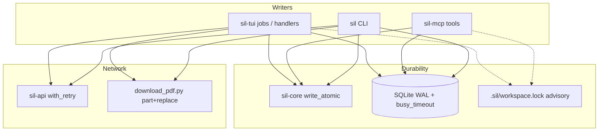

# Stage 11 / Wave 08-12 — Crash-safe robustness

**Status:** Materialized — awaiting execute  
**On execute:** Ship code per `prompts/PR-*.md` (product code only when an implementer runs those prompts).

| Field | Value |
|-------|--------|
| **Project** | scientist-in-loop (`sil`) |
| **Date** | 2026-08-12 |
| **Baseline** | Stage 10 complete (MCP 19 → 6); Stage 9 partial (estimate + co-author MCP in tree) |
| **Predecessor** | `docs/plan-08-10/` (MCP collapse) + leftover notes in `docs/pr-plan-09-08/` |
| **Target path** | `docs/pr-plan-08-12/` |
| **User decisions** | Robustness-only wave. Soft concurrency (atomic writes + SQLite WAL; lock stays advisory). Doctor-repair / embed-cache PK **out**. |

---

## 1. Overview

The product loop is feature-complete for a human + agent paper workspace. What is still fragile is **durability**: a killed process, a SQLITE_BUSY collision, a failed re-parse, or a 429 can leave the project half-written or stuck.

Wave 08-12 is a **robustness-only** DAG. No leftover Stage 9 product tracks (GPU EP, golden expand, extra MCP verbs, exclusive locking). Goal: a crash or a flaky network cannot destroy `paper_draft.tex`, `references.bib`, the SQLite index, or a TUI job slot.

| Track | Theme |
|-------|--------|
| **A** | Atomic file writes (shared helper, then all project writers) |
| **B** | SQLite WAL + `busy_timeout` + doctor `integrity_check` |
| **C** | Force re-parse without delete-first data loss |
| **D** | API retry/backoff + arXiv HTTPS + PDF temp+rename |
| **E** | TUI worker `catch_unwind` + async (non-blocking) estimate |
| **F** | E2E crash / recovery / SQLITE_BUSY gates |
| **Z** | STAGES Stage 11 + ADR-013 |


---

## 2. Code-truth audit (2026-08-12)

Checked against the tree after Stage 10. Claims that looked like leftover Stage 9 quality work are **already green** and are not this wave.

| Claim / fear | Code truth | 08-12 action |
|--------------|------------|--------------|
| Golden author F1 cliffs (BEE-RAG / HiChunk) | **Fixed.** Candidate scorecard: both fixtures F1 **1.00**; all macro gates PASS; 0/1035 polluted. | Out of scope |
| MCP 19 tools / docs drift | **Fixed.** Six tools; STAGES Stage 10 ✅ | Out of scope |
| TUI estimate missing | **Partial.** `JobKind::Estimate` exists but `run_estimate_job` is **synchronous** on the event loop (`jobs.rs` ~718–770). | **E2** |
| Workspace lock coordinates writers | **Advisory only.** `write_lock` overwrites; last writer wins. User chose **not** to honor `is_busy`. | Residual, documented |
| `fs::write` for draft / bib / config / structure | **Confirmed.** TUI (`bib_actions`, `handlers`, hydration poll), MCP (`tools/mod.rs` draft+bib), `Structure::save`, `GlobalSettings`/`SettingsCache::save`, doctor `--fix` bib, estimate reports. Mid-write kill → truncated file. | **A1 + A2** |
| SQLite WAL / busy_timeout | **Missing.** `SilDb::open` only `Connection::open` + migrate. TUI jobs each `SilDb::open` on a worker thread. Default rollback journal + no timeout → `SQLITE_BUSY`. | **B1** |
| Force re-parse data loss | **Confirmed.** TUI `queue_source_parse` `force=true` calls `db.remove_source` **before** `parse_one`. Failed Marker/xberg → empty index. CLI still correctly rejects a second parse (`e2e_hardening::reparse_same_pdf_fails_idempotently`). | **C1** |
| API 429 / 5xx | **Fail-fast.** `ApiError::RateLimited` returned immediately. Global 250 ms gap only (`ratelimit.rs`). No retry, no backoff, no `Retry-After`. | **D1** |
| arXiv export URL | **HTTP.** `http://export.arxiv.org/api/query` in `sil-api/src/arxiv.rs`. BibTeX path already HTTPS. | **D1** |
| PDF download | **In-place write.** `python/download_pdf.py` `dest.write_bytes(data)` after a single `urlopen`. Crash → truncated PDF. No retry. | **D2** |
| TUI worker panic | **Uncaught.** Five `thread::spawn` sites in `jobs.rs` (hydrate ref/source, parse, fetch, similarity). Panic → no channel send → `in_flight_*` never cleared. Bib checkers already use `catch_unwind`. | **E1** |
| Embed-cache PK | **Bug.** Table PK is `content_hash` only; lookup is `(content_hash, model_name)`. Cross-model collision. | **Out** (user declined doctor/cache track). Residual. |
| Release / assets / recent / pack | Present in tree. | Out of scope |

### Pain points this wave closes

1. **Truncated manuscripts** — process death during `fs::write` of `paper_draft.tex` or `references.bib`.
2. **Lost parse** — Shift+E re-parse deletes the row, then fails.
3. **Stuck TUI** — worker panic or blocking estimate freezes chrome / in-flight sets.
4. **Flaky literature I/O** — one 429 or one killed download poisons hydration / fetch.
5. **Silent SQLITE_BUSY** — TUI + CLI + MCP opening the same DB without WAL or timeout.

---

## 3. Goals / non-goals

### Goals

1. One shared **atomic write** primitive; every durable project file goes through it.
2. SQLite opens with **WAL + `busy_timeout=5000`**; doctor reports `PRAGMA integrity_check`.
3. Force re-parse **upserts in a transaction**; a failed re-parse leaves the previous index intact.
4. External HTTP: bounded retry on 429/5xx/transport; arXiv export over **HTTPS**.
5. PDF fetch writes `*.pdf.part` then `os.replace`; retry transient errors.
6. Every TUI background job is panic-isolated; estimate is a real async job.
7. E2E/unit gates so these invariants stay green.
8. STAGES Stage 11 + ADR-013 tell the truth.

### Non-goals

- Honoring `is_busy` or exclusive `flock` (user chose **soft**)
- Doctor `--fix` rebuild / FTS rebuild / embed-cache composite PK (declined)
- New MCP tools or CLI verbs
- GPU EP, golden fixture expand, Releases polish, Windows CI
- Auto-commit
- HTTP remote embed API
- Changing default parse idempotency (second `sil source parse` without force still fails)

---

## 4. Architecture (after 08-12)



**Invariant:** a crash mid-write leaves either the previous complete file **or** a leftover `.*.tmp.*` / `*.pdf.part` — never a truncated destination.

---

## 5. Key Decisions

| ID | Decision | Rationale |
|----|----------|-----------|
| **KD-1** | Robustness-only wave. No leftover Stage 9 product. | Fragility is durability, not missing features. Golden / MCP collapse already shipped. |
| **KD-2** | Soft concurrency: atomic + WAL. Lock stays advisory. Last writer can still win across processes. | User choice. Stops *corruption*, not *overwrites*. |
| **KD-3** | Shared `sil_core::write_atomic` / `write_atomic_str`. Same-directory temp + `fsync` + `rename`. | Same-volume rename is atomic on POSIX. One helper, many call sites. |
| **KD-4** | Temp name: `.{filename}.{pid}.{uniq}.tmp` next to the target. Best-effort delete on error. | Avoids colliding writers; leftover temps are obvious and gitignore-able. |
| **KD-5** | Windows replace-via-remove is acceptable residual if `rename` cannot overwrite. No extra crate. | No Windows CI this wave. Document in ADR-013. |
| **KD-6** | Every `SilDb::open` / `open_in_memory` sets `journal_mode=WAL`, `busy_timeout=5000`, `foreign_keys=ON`, `synchronous=NORMAL`. | WAL allows concurrent readers + one writer; timeout converts BUSY into a wait. |
| **KD-7** | Gitignore `*.db-wal` / `*.db-shm` if missing from init templates. | WAL sidecar files must not be committed. |
| **KD-8** | Doctor grows a **read-only** `sqlite integrity` check (`PRAGMA integrity_check`). No auto-rebuild. | User declined repair track; reporting is in-scope for B1. |
| **KD-9** | `parse_one` gains `ParseOptions { allow_reparse: bool }` (default `false`). Force path **must not** `remove_source` first. | Preserves CLI idempotency test; fixes TUI `E`/`Shift+E`. |
| **KD-10** | Re-parse + first parse: `upsert_parsed` + refs + chunks in **one SQLite transaction**. Failure rolls back. | Partial index is a corruption class. |
| **KD-11** | Retry policy: **3 attempts**, backoff 250 ms × 2^(n-1) (250/500/1000), optional ±20% jitter, cap 2 s. Retry only `RateLimited`, HTTP 5xx, transport. Never retry 404 / parse / invalid id. | Bounded; predictable; does not hammer Crossref. |
| **KD-12** | Existing 250 ms `enforce_api_ratelimit` stays **in front of** each attempt. | Politeness + retry are complementary. |
| **KD-13** | `http://export.arxiv.org` → `https://export.arxiv.org`. | Cleartext API is an avoidable integrity/privacy hole. |
| **KD-14** | PDF download: write `{dest}.part`, validate `%PDF` (or content-type pdf), `os.replace`, unlink `.part` on failure. Retry 429/5xx/`URLError` with the same 3-attempt policy. | Matches KD-3 for binaries. |
| **KD-15** | All TUI `thread::spawn` job bodies wrap `catch_unwind`. Panic → `Err("worker panicked: …")` on the existing channel so `in_flight_*` always clears. | Same pattern as `sil-parse` bib checkers. |
| **KD-16** | Estimate becomes a background job (channel + `in_flight_estimate` + poll), same shape as similarity. L0 stays read-only on the draft. | Blocking the event loop is a robustness bug, not a feature. |
| **KD-17** | Never auto-commit. Atomic write ≠ git commit. | House invariant. |
| **KD-18** | ADR-013 + STAGES Stage 11. | House closer. |
| **KD-19** | Embed-cache composite PK is **explicit residual**, not a drive-by in B1. | User declined that track. Schema change would mix concerns. |

---

## 6. Subagent roles

| Role | PRs | Notes |
|------|-----|-------|
| **core-engineer** | A1, A2 | Atomic helper + call-site sweep |
| **db-engineer** | B1 | WAL / timeout / integrity check only |
| **parse-engineer** | C1 | `ParseOptions` + transaction; no TUI chrome |
| **api-engineer** | D1 | Retry helper + HTTPS |
| **script-engineer** | D2 | `download_pdf.py` only (+ tiny test if present) |
| **tui-engineer** | E1, E2 | Jobs only; no keymap redesign |
| **test-engineer** | F1 | New e2e + unit gates; no product behavior |
| **docs-closer** | Z | STAGES + ADR-013 + README honesty |
| **verifier** | after each wave | Read-only test matrix |

**Dispatch rules:** one agent / PR; worktree isolation; self-contained prompts; out-of-scope is a hard ban; done = green verify + residual risk note.

---

## 7. Wave order

### Wave 0 (parallel)

| PR | Title | Role | Depends |
|----|-------|------|---------|
| **A1** | `write_atomic` primitive in sil-core | core-engineer | — |
| **B1** | SQLite WAL + busy_timeout + doctor integrity | db-engineer | — |
| **D1** | API retry/backoff + arXiv HTTPS | api-engineer | — |
| **D2** | PDF download temp+rename + retry | script-engineer | — |
| **E1** | TUI job `catch_unwind` isolation | tui-engineer | — |

**V0 gate:** `cargo test --workspace` still green (behavior-preserving except D1 HTTPS URL + D2 write path).

### Wave 1

| PR | Title | Role | Depends |
|----|-------|------|---------|
| **A2** | Adopt atomic writes at all durable call sites | core-engineer | **A1** |
| **C1** | Re-parse without delete-first; transactional upsert | parse-engineer | — |
| **E2** | Async TUI estimate job | tui-engineer | **E1** |

### Wave 2

| PR | Title | Role | Depends |
|----|-------|------|---------|
| **F1** | E2E crash / recovery / BUSY / re-parse-preserve | test-engineer | **A2, B1, C1, D1, D2** (E2 soft) |

### Wave 3

| PR | Title | Role | Depends |
|----|-------|------|---------|
| **Z** | STAGES Stage 11, ADR-013, README durability note | docs-closer | all must-ship |

Optional tag **v1.1.1** (patch: robustness) after Z. Not required to merge the wave.

---

## 8. Per-PR specs (agent-ready)

### PR-A1 — Atomic write primitive ⭐

- **Files:** new `crates/sil-core/src/atomic.rs`; export from `lib.rs`.
- **API (normative):**
  - `write_atomic(path: &Utf8Path, bytes: &[u8]) -> io::Result<()>`
  - `write_atomic_str(path: &Utf8Path, text: &str) -> io::Result<()>`
  - Create parent dirs; write temp in the **same directory**; `File::sync_all` on the temp; `fs::rename` onto the destination; delete temp on any error after create.
- **Tests (unit, no extra crates):**
  1. Write + read-back.
  2. Overwrite existing file; destination always contains complete new or complete old (never a mix) after a successful return.
  3. Failed write (e.g. temp path on a file-as-parent) leaves destination unchanged.
  4. Temp naming includes pid and does not collide for two sequential writes.
- **Out:** migrating call sites (A2); Windows-special crate.
- **Verify:** `cargo test -p sil-core`; `cargo clippy -p sil-core --all-targets -- -D warnings`.

### PR-A2 — Adopt atomic writes

- **Must switch** production writes of:
  - `paper_draft.tex` — `sil-tui` handlers, `sil-mcp` edit/todo
  - `references.bib` — `sil-tui` bib_actions + hydration poll, `sil-mcp` cite upsert/promote, `sil doctor --fix`
  - `.sil/structure.yaml` — `Structure::save`
  - `.sil/config.yaml` — TUI settings save
  - `~/.config/sil/settings.yaml` / cache — `GlobalSettings::save`, `SettingsCache::save`
  - `.sil/workspace.lock` — `write_lock`
  - estimate reports under `.sil/reviews/` — `write_estimate_report`
  - `sil-latex` split section files — `write_draft_sections`
- **Do not** rewrite test fixtures that `fs::write` sample YAML into tempdirs unless they go through `save()`.
- **Init scaffold** (`write_if_missing`) may stay non-atomic: first create, no overwrite of user data.
- **Verify:** `rg -n 'fs::write\\(' crates/sil-tui/src crates/sil-mcp/src crates/sil-core/src crates/sil-agent/src crates/sil-latex/src crates/sil/src/commands` — remaining hits are tests, init-if-missing, or non-project files (explained in PR notes). Tests: `cargo test -p sil-core -p sil-tui -p sil-mcp -p sil-agent -p sil-latex`.

### PR-B1 — SQLite WAL + busy_timeout + integrity

- **Files:** `crates/sil-db/src/lib.rs` (`open` / `open_in_memory`), `crates/sil-db/src/schema.rs` (pragma batch), `crates/sil/src/commands/doctor.rs`, init `.gitignore` template if needed.
- **On every open, after connect, before/with migrate:**
  ```
  PRAGMA journal_mode = WAL;
  PRAGMA busy_timeout = 5000;
  PRAGMA foreign_keys = ON;
  PRAGMA synchronous = NORMAL;
  ```
- Doctor: new check `sqlite integrity` — run `PRAGMA integrity_check;` (or `integrity_check(1)`); `ok` iff result is `ok`. **No rebuild.**
- Tests: two `SilDb::open` on the same file; concurrent writer + reader do not return `SQLITE_BUSY` immediately. Assert `PRAGMA journal_mode` is `wal` on a file-backed DB (in-memory may stay `memory` — document and do not fail the test).
- Gitignore: `*.db-wal`, `*.db-shm` in `templates` / init gitignore if absent.
- **Out:** embed-cache PK change; FTS rebuild; changing schema versions beyond pragmas.
- **Verify:** `cargo test -p sil-db -p sil`; `cargo clippy -p sil-db --all-targets -- -D warnings`.

### PR-C1 — Re-parse without data loss

- **Files:** `crates/sil-parse/src/batch.rs` (+ maybe `lib.rs` re-export), `crates/sil-tui/src/app/jobs.rs` (`queue_source_parse`), MCP parse handler if it has a force path, `crates/sil-db` if a transactional helper is needed.
- **`ParseOptions { allow_reparse: bool }`**, default false. `parse_one` keeps today’s signature via a wrapper or defaulted options so CLI/MCP unparsed path is unchanged.
- When `allow_reparse=true`, skip `AlreadyParsed` rejection; **do not** `remove_source`.
- Wrap `upsert_parsed` + `save_source_references` + any chunk insert in **one transaction**. On error, old rows remain.
- TUI force: delete the `db.remove_source` line; pass `allow_reparse=true`.
- Tests:
  1. Unit: parse → force re-parse with failing runner → `get_source_content` still returns first text.
  2. Existing `reparse_same_pdf_fails_idempotently` still fails (default path).
  3. Force re-parse success replaces content (search finds new token, not only old).
- **Out:** changing Marker; TUI chrome; deleting sources from disk.
- **Verify:** `cargo test -p sil-parse -p sil-tui`; `cargo test -p sil --test e2e_hardening`.

### PR-D1 — API retry + HTTPS

- **Files:** new `crates/sil-api/src/retry.rs`; `arxiv.rs` / `crossref.rs` / `doi.rs` / `openreview.rs` call sites; `lib.rs`.
- **`RetryPolicy`**: max_attempts=3, base=250 ms, factor=2, cap=2 s, jitter ±20%.
- **`should_retry(err)`:** `RateLimited` | `NetworkError` whose message indicates 5xx or transport. Not `NotFound` / `ParseError` / `InvalidIdentifier`.
- Helper `with_retry(policy, || Result<T, ApiError>)` sleeps between attempts (use a small `sleeper` hook or `#[cfg(test)]` instant sleeper so tests are fast).
- Switch `http://export.arxiv.org` → `https://export.arxiv.org`.
- Keep `enforce_api_ratelimit()` on each attempt.
- Tests: classifier table; retry-3-then-ok with a closure counter; no-retry on NotFound (counter == 1).
- **Out:** changing User-Agent; new APIs; mock HTTP servers.
- **Verify:** `cargo test -p sil-api`; clippy `-p sil-api`.

### PR-D2 — PDF download temp+rename + retry

- **Files:** `python/download_pdf.py` (and any tiny unit if the repo already tests it; otherwise a `pytest` is **not** required — keep a `if __name__` smoke or a Rust e2e with `SIL_DOWNLOAD_SCRIPT` pointing at a local stub).
- Write to `dest.with_name(dest.name + ".part")` (or `dest.as_posix() + ".part"`).
- After body: require `%PDF` magic **or** `content-type` contains `pdf` (same as today); then `os.replace(part, dest)`.
- On exception: unlink `.part` if present; retry up to 3 times on HTTP 429/5xx and `URLError`; do not retry HTTP 404/4xx (except 429).
- Do not clobber an existing good PDF with a failed retry (replace only after validation).
- **Out:** rewriting classify/DOI resolution; native Rust downloader.
- **Verify:** at least one scripted check (Python snippet or e2e with a stub script that writes a non-PDF first then a PDF — or unit-test the helpers if factored). Workspace tests still green.

### PR-E1 — TUI job panic isolation

- **Files:** `crates/sil-tui/src/app/jobs.rs` (and a tiny helper if it keeps the file readable).
- Wrap **all five** current `thread::spawn` bodies (hydrate ref, hydrate source, parse, fetch, similarity) in `catch_unwind(AssertUnwindSafe(...))`.
- On panic: still `send` a failure result with a stable prefix `worker panicked:` so poll paths clear `in_flight_*` and push a failed `JobOutcome` with retry payload when one exists.
- Shared helper preferred: `spawn_job(move || Result<T, String>)` + map panic → `Err`.
- Test: a unit test that queues a job whose closure panics (inject via `#[cfg(test)]` hook **or** a `pub(crate)` helper test) and asserts `in_flight` is empty after poll.
- **Out:** making estimate async (E2); changing job UI chrome.
- **Verify:** `cargo test -p sil-tui --lib`; clippy `-p sil-tui`.

### PR-E2 — Async estimate

- **Files:** `crates/sil-tui/src/app/{jobs.rs,types.rs,mod.rs,handlers}` as needed.
- Same shape as similarity: `estimate_tx/rx`, `in_flight_estimate: bool`, `poll_background_estimate`.
- `run_estimate_job` only enqueues; L0 runs on a worker; panic-isolated (E1 helper).
- Still read-only on `paper_draft.tex`; optional write remains under `.sil/reviews/` if the existing path already writes — do not newly write the draft.
- Dedup: second trigger while in flight → status `already estimating`.
- Help text: if it implies estimate is instant/blocking, say “background job”.
- **Out:** L1 LLM panel; new keys beyond what already triggers estimate.
- **Verify:** `cargo test -p sil-tui --lib`; event-loop test that `run_estimate_job` returns without waiting for L0.

### PR-F1 — E2E / recovery gates

- **Files:** `crates/sil/tests/e2e_hardening.rs` (extend), plus targeted unit tests only if a gap remains after A–E.
- **Required cases:**
  1. **Re-parse preserve:** parse with stub token `first`; force re-parse via the library API (or TUI-equivalent `ParseOptions { allow_reparse: true }`) with a failing runner; `sil source search first` still hits. (CLI has no `--force` today — do **not** invent a CLI flag just for the test; use `sil-parse` unit/e2e helper.)
  2. **Default re-parse still fails:** keep `reparse_same_pdf_fails_idempotently`.
  3. **SQLITE_BUSY:** file-backed DB, two connections, overlapping write; no `database is locked` without timeout (sil-db test is enough if already in B1 — F1 only adds if B1 did not).
  4. **Atomic write:** sil-core unit already in A1; F1 adds one CLI-level check only if cheap (e.g. `structure.yaml` save via a command still loads).
  5. **Download stub:** `SIL_DOWNLOAD_SCRIPT` that writes a `.part` then a valid tiny PDF; dest exists and is a PDF; no leftover `.part`.
- **Out:** live Crossref/arXiv; new product flags.
- **Verify:** `cargo test -p sil --test e2e_hardening --test e2e_source`; `cargo test -p sil-core -p sil-db -p sil-parse -p sil-api`.

### PR-Z — Docs closer

- **Files:** `STAGES.md` Stage 11 ✅; `docs/adr/ADR-013-crash-safe-robustness.md`; README short “Durability” note (atomic writes, WAL, retry); link `docs/pr-plan-08-12/`.
- ADR contents: KD table, advisory-lock residual, Windows rename residual, embed-cache PK residual.
- **Out:** code.
- **Verify:** tool counts still 6; no claim of exclusive locking or embed-cache PK fix.

---

## 9. Verification stages

| V | When | Gate |
|---|------|------|
| V0 | start / Wave 0 | `cargo test --workspace` |
| V1 | A1–A2 | no production `fs::write` on draft/bib/config/structure/lock/settings |
| V2 | B1 | file DB `journal_mode=wal`; doctor integrity line; no instant BUSY |
| V3 | C1 | failed force re-parse preserves prior FTS; default second parse still errors |
| V4 | D1–D2 | retry unit table; arXiv URL is https; download replace-after-validate |
| V5 | E1–E2 | panicked worker clears in_flight; estimate does not block |
| V6 | F1 | e2e_hardening green including new cases |
| V7 | Z | ADR-013 + Stage 11; clippy `-D warnings` |

### Global test matrix

| Layer | What |
|-------|------|
| Unit | `write_atomic`, retry classifier, WAL pragma, parse transaction, catch_unwind helper |
| E2E | hardening + source parse/search |
| TUI | job poll after panic; estimate enqueue |
| MCP | edit/cite still `never_committed`; HEAD unchanged |
| Doctor | integrity check present; RAG honesty unchanged |
| CI | existing fmt / test / clippy / golden — no new golden fixtures |

---

## 10. Risks

| Risk | Mitigation |
|------|------------|
| Last-writer-wins across TUI + MCP remains | Accepted (KD-2). Document in ADR-013. Revisit as 08-xx “honor lock” if it bites. |
| Windows `rename` cannot replace | KD-5 residual; POSIX is the supported path this wave. |
| WAL sidecars surprise users | Gitignore + doctor still opens the same `paths.db()`. |
| Retry slows hydration under persistent 500s | 3 attempts, < ~2 s extra worst case per call; fail after that as today. |
| C1 transaction misses chunk writes | Audit `parse_one` callees; put **all** DB mutations in the same `transaction`. |
| Embed-cache PK still wrong | Explicit residual; do not “fix while in B1”. |
| Scope creep into exclusive locking | Out-of-scope hard ban in every prompt. |

---

## 11. Prompt files to create on materialization

Under `docs/pr-plan-08-12/prompts/`:

```
README.md
PR-A1-atomic-write.md
PR-A2-adopt-atomic-writes.md
PR-B1-sqlite-wal.md
PR-C1-reparse-preserve.md
PR-D1-api-retry-https.md
PR-D2-download-atomic.md
PR-E1-job-panic-isolation.md
PR-E2-async-estimate.md
PR-F1-e2e-recovery.md
PR-Z-docs-adr-013.md
```

Each prompt format (same as 08-07 / 09-08):

```markdown
# PR-XX — Title
## Role
## Goal
## Requirements (numbered)
## Out of scope
## Verify (bash)
## Deliverable
```

---

## 12. Approval checklist (user)

- [x] Robustness-only (no Stage 9 leftovers, no new features)
- [x] Soft concurrency: atomic + WAL; lock stays advisory
- [x] Must-ship: A atomic, B SQLite, C re-parse, D network, E TUI jobs, F e2e
- [x] Doctor repair + embed-cache PK **out** (residual in ADR-013)
- [x] Approve this DAG and prompt set
- [x] Materialize `docs/pr-plan-08-12/**` (this tree)
- [ ] Execute Wave 0 (or `/execute-plan`)

---

## 13. Immediate next action

Plan + prompts are materialized under `docs/pr-plan-08-12/`.

**Recommended first execution:** Wave 0 = A1 + B1 + D1 + D2 + E1 in parallel (no file overlap if A1 only adds `atomic.rs`). Then Wave 1 (A2, C1, E2), Wave 2 (F1), Wave 3 (Z).

---

## Residual (explicitly not this wave)

1. Advisory lock still last-writer-wins (TUI + MCP + CLI).
2. Embed-cache PRIMARY KEY is `content_hash` only; lookup is hash+model.
3. Doctor cannot rebuild a corrupt DB / FTS.
4. No exclusive file lock; no Windows CI proof of `rename` replace.
5. Stage 9 leftovers (GPU, golden expand, release checksums) remain leftover.
