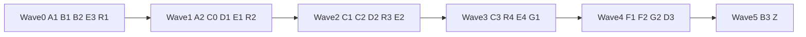
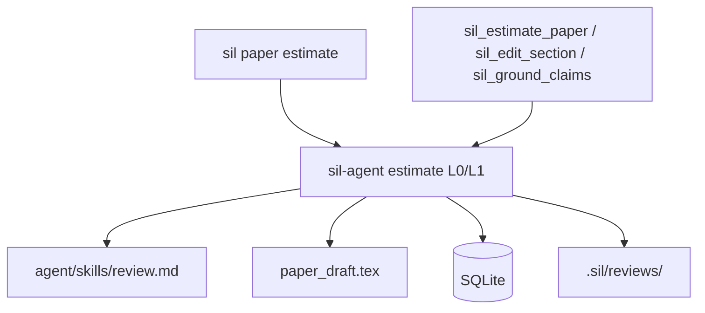

# Stage 9 / Wave 09-08 — Full PR Plan (to materialize as `docs/pr-plan-09-08/`)

**Status:** Design ready for user approval  
**On approval:** Write `docs/pr-plan-09-08/pr-plan.md` + `prompts/*.md` + `prompts/README.md` (no product code until a later execute step).

| Field | Value |
|-------|--------|
| **Project** | scientist-in-loop (`sil`) |
| **Date** | 2026-08-09 |
| **Baseline** | v1.0.0; Stages 0–8 complete |
| **Predecessor** | `docs/pr-plan-08-07/` |
| **Target path** | `docs/pr-plan-09-08/` |

---

## 1. Overview

Ship **everything** residual after v1.0 as ordered waves, plus a **native manuscript estimate** path inspired by [Imbad0202/academic-research-skills](https://github.com/Imbad0202/academic-research-skills) (`academic-paper-reviewer`).

| Track | Theme |
|-------|--------|
| **A** Trust | Docs honesty, scorecard hygiene |
| **B** Quality | BEE-RAG/HiChunk author F1; field precision |
| **C** Co-Author | MCP section edit, promote/split, claim grounding, lock |
| **D** RAG | Bootstrap, embedding cache, GPU stretch |
| **E** TUI/Eng | Keymap, recent projects, split tools.rs |
| **F** Ship | GitHub Releases, install/Windows smoke |
| **G** Research | Assets registry, `paper pack` repro |
| **R** Estimate | ARS-inspired skill + CLI + MCP + TUI (native) |



---

## 2. ARS analysis → sil design (Track R)

### How ARS academic-paper-reviewer works

Upstream skill ([SKILL.md](https://github.com/Imbad0202/academic-research-skills/blob/main/academic-paper-reviewer/SKILL.md), v1.10.0):

1. **Phase 0** — field analysis → configure 5 personas (Journal-Fit, Methodology, Domain, Perspective, Devil’s Advocate).
2. **Phase 1** — independent parallel reviews (no cross-talk).
3. **Phase 2** — editorial synthesizer → decision + revision roadmap.
4. **Scores** — 0–100 rubrics; ≥80 Accept, 65–79 Minor, 50–64 Major, \<50 Reject.
5. **Modes** — full, quick, methodology-focus, guided, re-review, calibration.
6. **Iron rules** — read-only on manuscript; no fabricated findings; DA CRITICAL adjudicated; human checkpoints.
7. **License** — **CC-BY-NC 4.0** (cannot vendor wholesale into commercial use; attribution required).

Also relevant: full ARS suite has deep-research, academic-paper writer, 10-stage pipeline, claim-faithfulness audit — **out of scope** for sil Stage 9 except patterns we reimplement.

### sil native mapping (KD-R)

| ARS | sil |
|-----|-----|
| SKILL.md + 7 agents | `agent/skills/review.md` + `review/{rubrics,personas,report_template}.md` **original prose** |
| `/ars-review` | `sil paper estimate` |
| Stage 3 panel | L0 heuristic offline + L1 prompt pack for external LLM agents |
| Decision letter | `.sil/reviews/review_*/report.md` + `report.json` |
| Revision roadmap | optional `.sil/improvement/suggestion_n` |
| Read-only iron rule | estimate path **never** writes `paper_draft.tex` |
| MCP | `sil_estimate_paper` |
| TUI | job `Estimate` + open last report |

**Do not:** git submodule ARS, copy agent markdown verbatim, claim sil scores are peer-review truth.

**Attribution:** footer in skill + `report.json.attribution` + NOTICE citing Cheng-I Wu / ARS + link.

### Estimate report schema (normative)

```json
{
  "schema_version": 1,
  "mode": "quick|full|methodology",
  "decision": "accept|minor_revision|major_revision|reject",
  "overall_score": 0,
  "dimensions": {
    "significance": 0, "novelty": 0, "methodology": 0,
    "clarity": 0, "related_work": 0, "reproducibility": 0, "ethics": 0
  },
  "findings": [{"id":"F1","persona":"methodology","severity":"critical|major|minor","location":"…","summary":"…","suggestion":"…"}],
  "da_critical": [],
  "revision_roadmap": [],
  "read_only": true,
  "layer": "L0_heuristic|L1_agent",
  "attribution": "Inspired by Academic Research Skills academic-paper-reviewer (CC-BY-NC 4.0); sil-native implementation."
}
```

**L0 (always, no API):** structure completion, word counts, TODO density, undefined citations (`sil-latex` health), incomplete bib notes, empty sections, missing abstract/intro signals → dimension priors + findings.

**L1 (agent):** skill text instructs multi-persona panel; host LLM fills scores; sil validates JSON schema.

---

## 3. Goals / non-goals

### Goals

1. Honest docs (16 MCP tools; ONNX feature-gated).
2. Fixture parse quality lifts without loosening macro gates.
3. Agent co-author: MCP edit section + ground claims; never auto-commit.
4. Native estimate skill + CLI + MCP + TUI.
5. RAG bootstrap + embed cache.
6. Optional Releases; engineering splits.
7. STAGES Stage 9 + ADR-012.

### Non-goals

- Vendoring ARS / Claude hooks / full 10-stage pipeline
- Auto-commit / auto journal submit
- crates.io publish (unless later KD)
- Full IDE TUI editor
- Multi-GB models in git
- Verbatim ARS copyrighted prose

---

## 4. Architecture



---

## 5. Key Decisions

| ID | Decision |
|----|----------|
| KD-1 | Multi-track Stage 9 single plan; execute by waves |
| KD-2 | ARS inspiration only; original sil skill + attribution |
| KD-3 | Estimate read-only on manuscript |
| KD-4 | L0 offline always; L1 optional agent |
| KD-5 | Reports under `.sil/reviews/` |
| KD-6 | MCP edit: re-read + optional content hash |
| KD-7 | Embed cache keyed by model/dim/content hash |
| KD-8 | RAG download opt-in only |
| KD-9 | GPU stretch |
| KD-10 | publish=false default |
| KD-11 | Never auto-commit |
| KD-12 | ADR-012 for Stage 9 |
| KD-13 | Decision thresholds 80/65/50 |
| KD-14 | No ARS submodule |

---

## 6. Subagent roles

| Role | PRs | Notes |
|------|-----|-------|
| **implementer** | default | One PR only |
| **quality-extractor** | B* | golden re-score mandatory |
| **skill-author** | R1 | markdown/schemas |
| **mcp-engineer** | C*, R3, E3 | never-commit tests |
| **tui-engineer** | E*, R4 | keep jobs non-blocking |
| **rag-engineer** | D* | honesty mode=onnx |
| **release-engineer** | F* | workflows |
| **docs-closer** | A*, Z | no behavior |
| **verifier** | after each wave | read-only test matrix |

**Dispatch rules:** one agent/PR; worktree isolation; self-contained prompts; out-of-scope hard ban; done = green verify + residual risk.

---

## 7. Wave order (step-by-step)

### Wave 0 (parallel)

| PR | Title | Role | Depends |
|----|-------|------|---------|
| **A1** | Docs honesty (tools=16, ONNX honest) | docs-closer | — |
| **B1** | Parent author F1 BEE-RAG/HiChunk ≥0.75 | quality-extractor | — |
| **B2** | Field precision structure_predict ≥0.80 | quality-extractor | — |
| **E3** | Split sil-mcp `tools.rs` | mcp-engineer | — |
| **R1** | review skill templates + schema + SkillSelection | skill-author | — |

**V0/V1/V2 gates:** workspace tests; README truth; golden residual documented or improved.

### Wave 1

| PR | Title | Role | Depends |
|----|-------|------|---------|
| **A2** | Scorecard title + failure-breakdown hygiene | docs-closer | A1 soft |
| **C0** | SciAction EstimatePaper/GroundClaims + advisory lock helpers | implementer | — |
| **D1** | doctor --fix-rag harden + opt-in download flag | rag-engineer | — |
| **E1** | Keymap collision audit + help docs | tui-engineer | — |
| **R2** | estimate L0 core + `sil paper estimate` CLI | implementer | **R1** |

**V3/V5 partial:** estimate CLI fixture; SciAction round-trip.

### Wave 2

| PR | Title | Role | Depends |
|----|-------|------|---------|
| **C1** | MCP `sil_edit_section` | mcp-engineer | C0 |
| **C2** | MCP promote/split parity | mcp-engineer | C1 soft |
| **D2** | Embedding vector cache + invalidate | rag-engineer | D1 soft |
| **R3** | MCP `sil_estimate_paper` | mcp-engineer | R2 |
| **E2** | Recent projects picker | tui-engineer | — |

**V3/V4/V5:** MCP edit HEAD unchanged; estimate MCP; cache tests.

### Wave 3

| PR | Title | Role | Depends |
|----|-------|------|---------|
| **C3** | MCP `sil_ground_claims` | mcp-engineer | C0, search stack |
| **R4** | TUI estimate job + report view | tui-engineer | R2, jobs chrome |
| **E4** | handlers further split (optional) | tui-engineer | — |
| **G1** | Assets/results registry + `sil paper assets` | implementer | — |

### Wave 4

| PR | Title | Role | Depends |
|----|-------|------|---------|
| **F1** | GitHub Releases binaries on tag | release-engineer | — |
| **F2** | install.sh polish + Windows smoke CI | release-engineer | — |
| **G2** | `sil paper pack` repro bundle | implementer | G1 soft |
| **D3** | GPU EP stretch (optional) | rag-engineer | D2 |

### Wave 5

| PR | Title | Role | Depends |
|----|-------|------|---------|
| **B3** | Golden expand 2–3 fixtures (optional) | quality-extractor | B1/B2 |
| **Z** | STAGES Stage 9, ADR-012, README estimate section | docs-closer | all must-ship |

Optional tag **v1.1.0** after Z.

---

## 8. Per-PR specs (agent-ready)

### PR-A1 — Docs honesty

- **Files:** `README.md`, `STAGES.md` (Stage 6 tool count), MCP section.
- **Change:** 16 tools listed; ONNX requires `--features onnx` + models; fallback honesty; remove “always 100% ONNX”.
- **Verify:** `rg -n '12 core|11 core|100% Local ONNX' README.md STAGES.md` clean or contextual; manual count vs `list_tools()`.
- **Out:** code behavior.

### PR-A2 — Scorecard hygiene

- Regenerate scorecard H1 “Candidate”; fix contradictory failure bullets.
- **Verify:** `uv run tests/golden_dataset/scripts/score_against_current.py`.

### PR-B1 — Author F1

- Root-cause appendix first; fix sil-parse/sil-regex; re-score.
- **Accept:** BEE-RAG & HiChunk F1 ≥0.75 or documented residual; macro PASS; pollution 0.
- **Verify:** golden scripts + `cargo test -p sil-parse -p sil-regex`.

### PR-B2 — Field precision

- Target structure_predict_hallucination field prec ≥0.80.
- Same process/verify as B1.

### PR-B3 — Golden expand (optional)

- +2–3 fixtures + labels + validate_dataset.

### PR-C0 — SciAction + lock

- Add `EstimatePaper`, `GroundClaims` if missing; `workspace_lock` advisory API in sil-core.
- **Tests:** round-trip SciAction; lock serde.

### PR-C1 — `sil_edit_section`

- Args: section_id / search-replace / expected_hash; write draft; proposal edit-draft; never commit.
- **Tests:** temp git HEAD stable; hash mismatch errors.

### PR-C2 — promote/split MCP

- Agent-accessible promote draft + split sections with proposals.

### PR-C3 — `sil_ground_claims`

- Claims → hybrid search → ranked cites; `apply` default false.
- **Tests:** fixture source+claim.

### PR-D1 — RAG bootstrap

- Harden `--fix-rag`; optional `--download-rag-models` with sha256 pins; default no network in tests.

### PR-D2 — Embed cache

- SQLite vectors; invalidate on parse content hash; doctor cache stats.

### PR-D3 — GPU (stretch)

- CoreML/CUDA when configured; else CPU + reason.

### PR-E1 — Keymap audit

- Document collisions in help; one-line safe fixes only.

### PR-E2 — Recent projects

- `~/.config/sil/recent.yaml`; open from TUI/CLI.

### PR-E3 — MCP tools split

- `tools/{mod,search,bib,structure,todos,estimate}.rs` behavior-preserving.
- **Verify:** `cargo test -p sil-mcp`.

### PR-E4 — handlers split (optional)

### PR-F1 — GitHub Releases

- Tag `v*` → macOS/Linux binaries + checksums.

### PR-F2 — Install / Windows smoke

- install.sh; optional windows `cargo test -p sil-core`.

### PR-G1 — Assets registry

- Link data/figures to labels; list command.

### PR-G2 — paper pack

- Repro zip: structure, skills hash, agent README, reviews, manifests (not huge data).

### PR-R1 — Review skill ⭐

- **Role:** skill-author  
- **Deliver:**
  - `templates/agent/skills/review.md` — modes quick|full|methodology; iron rules; sil paths; ARS attribution
  - `templates/agent/skills/review/rubrics.md`
  - `templates/agent/skills/review/personas.md`
  - `templates/agent/skills/review/report_template.md`
  - schema file for report JSON
  - `SkillSelection::from_task` keywords: review, estimate, critique, peer review, referee
  - init installs under `agent/skills/`
- **Out:** no LLM API client required
- **Verify:** sil-agent skill load tests; init e2e skill present

### PR-R2 — Estimate CLI ⭐

- `sil_agent::estimate` L0 + report write
- CLI: `sil paper estimate [--mode] [--json] [--write]`
- Read-only draft; `--write` → `.sil/reviews/…`
- **Verify:** fixture draft JSON schema; decision mapping; git HEAD unchanged
- Sci-Action proposal when write metadata

### PR-R3 — MCP estimate ⭐

- Tool `sil_estimate_paper` {mode, write, include_sources_summary}
- never_committed; read_only true
- **Verify:** sil-mcp tests

### PR-R4 — TUI estimate

- Async JobKind::Estimate; open last report; help keys
- Non-blocking acceptance

### PR-Z — Docs close

- STAGES Stage 9 ✅; ADR-012 (estimate + co-author + cache + license note); README “Estimate” section; link pr-plan-09-08

---

## 9. Verification stages V0–V9

| V | When | Gate |
|---|------|------|
| V0 | start | `cargo test --workspace` |
| V1 | A1 | docs truth |
| V2 | B1–B2 | fixtures or residual; golden CI green |
| V3 | C1 | MCP edit never commit |
| V4 | D1–D2 | bootstrap + cache |
| V5 | R1–R3 | skill+CLI+MCP estimate read-only |
| V6 | R4 | TUI job |
| V7 | E3 | MCP split tests |
| V8 | F1 | release workflow |
| V9 | Z | ADR-012 + Stage 9; clippy -D warnings |

### Global test matrix

| Layer | What |
|-------|------|
| Unit | SciAction, estimate L0, cache, skills |
| Parse golden | B* |
| MCP | edit, estimate, ground; HEAD |
| TUI | estimate job |
| E2E | `sil paper estimate`, doctor fix-rag |
| CI | fmt, test, clippy, golden; release optional |

---

## 10. Risks

| Risk | Mitigation |
|------|------------|
| CC-BY-NC contamination | Original prose only + attribution |
| Scores treated as truth | L0/L1 labels + disclaimer |
| Edit races | hash + advisory lock |
| Scope explosion | one PR / hard out-of-scope |
| B* unreachable | timebox residual |

---

## 11. Prompt files to create on materialization

Under `docs/pr-plan-09-08/prompts/`:

```
README.md                 # dispatch rules + wave table + index
PR-A1-docs-honesty.md
PR-A2-scorecard-hygiene.md
PR-B1-author-f1.md
PR-B2-field-precision.md
PR-B3-golden-expand.md
PR-C0-sciaction-lock.md
PR-C1-mcp-edit-section.md
PR-C2-mcp-promote-split.md
PR-C3-mcp-ground-claims.md
PR-D1-rag-bootstrap.md
PR-D2-embed-cache.md
PR-D3-gpu-ep.md
PR-E1-keymap-audit.md
PR-E2-recent-projects.md
PR-E3-mcp-tools-split.md
PR-E4-handlers-split.md
PR-F1-github-releases.md
PR-F2-install-windows.md
PR-G1-assets-registry.md
PR-G2-paper-pack.md
PR-R1-review-skill.md
PR-R2-estimate-cli.md
PR-R3-mcp-estimate.md
PR-R4-tui-estimate.md
PR-Z-docs-adr-012.md
```

Each prompt format (same as 08-07):

```markdown
# PR-XX — Title
## Role
## Goal
## Requirements (numbered)
## Out of scope
## Verify (bash)
## Deliverable
```

---

## 12. Approval checklist (user)

- [ ] Approve full multi-track scope (or drop tracks)
- [ ] Approve ARS **inspiration** + CC-BY-NC attribution approach (not vendor)
- [ ] Approve L0 heuristic always / L1 agent optional
- [ ] Approve MCP draft edit (C1) despite concurrency risk
- [ ] Approve optional GitHub Releases (F1)
- [ ] On approve: **materialize** `docs/pr-plan-09-08/**` only (no product code yet) OR materialize + start Wave 0

---

## 13. Immediate next action after approve

1. Write `docs/pr-plan-09-08/pr-plan.md` (this plan, polished).
2. Write all `prompts/*.md` agent briefs.
3. Stop and wait for “execute Wave 0” (or full execute-plan).

**Recommended first execution:** Wave 0 = A1 + R1 + E3 in parallel (safe), B1/B2 serial or parallel quality agents.
