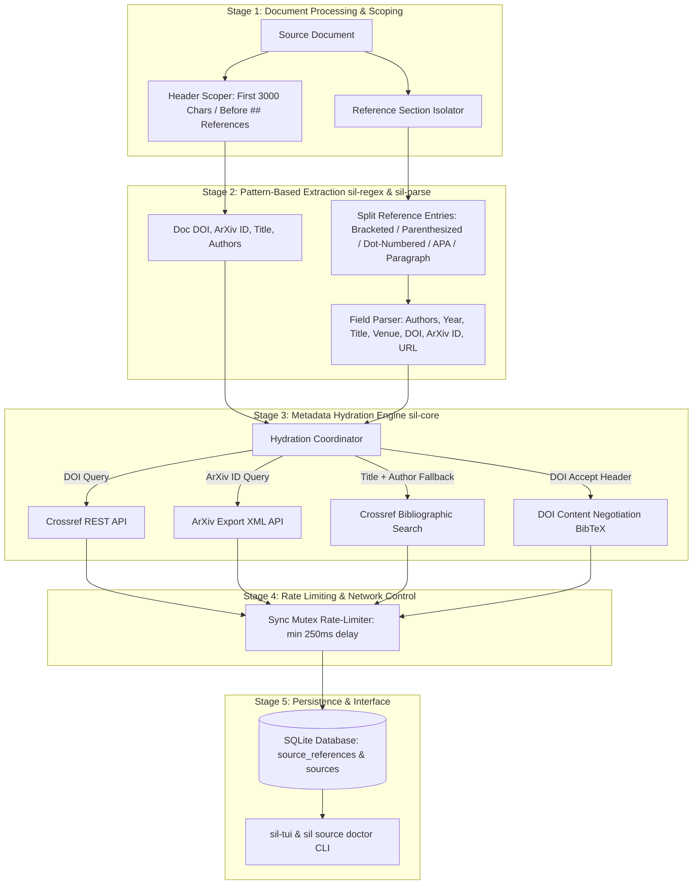
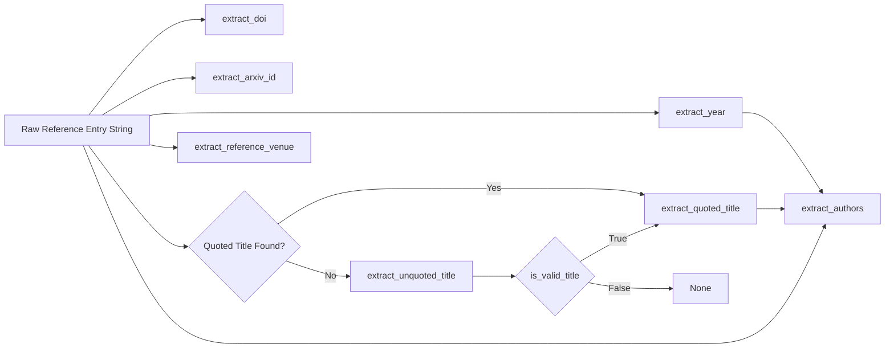

# Reference, Author, and Title Extraction Pipeline (Detailed Specification)

## 1. Executive Summary & Architecture Overview

Scientist-In-Loop (`sil`) uses a multi-stage pipeline to extract metadata from source documents (PDF, Markdown, LaTeX) and embedded bibliography blocks. The pipeline guarantees strict scoping between document-level metadata and citation-level references, executes pattern-based extraction with zero runtime Python dependencies, and enriches data via throttled academic REST APIs (Crossref, ArXiv, OpenAlex).



---

## 2. Regular Expressions & Pattern Definitions (`sil-regex`)

All regular expressions are compiled lazily using `std::sync::LazyLock<Regex>` in `crates/sil-regex/src/lib.rs`.

### 2.1 Document & Citation Identifier Patterns

1. **Digital Object Identifier (DOI)**:
   ```regex
   \b10\.\d{4,9}/[-._;()/:A-Za-z0-9]+\b
   ```
   - *Cleaner*: Trims trailing punctuation (`.`, `,`, `;`, `)`, `]`).

2. **ArXiv Identifier**:
   ```regex
   (?i)\b(?:arxiv:\s*)?(\d{4}\.\d{4,5}(?:v\d+)?|[a-z\-]+(?:\.[a-z\-]+)?/\d{7}(?:v\d+)?)\b
   ```
   - Matches modern format (`1706.03762v1`), legacy format (`arxiv:math/0405001`), and prefixed strings.

3. **Publication Year**:
   ```regex
   \b(1[89]\d{2}|20[0-2]\d|2030)\b
   ```
   - Restricted to valid publication bounds (`1800`–`2030`).

4. **Quoted Titles**:
   ```regex
   ["“]([^"”\r\n]{2,})[”"]
   ```
   - Captures titles wrapped in straight double quotes (`"..."`) or curly quotes (`“...”`).

5. **Generic URL Extractor**:
   ```regex
   (?i)\bhttps?://[^\s<>]+|\bURL\s*<([^>]+)>
   ```

---

### 2.2 Heading & Section Boundary Patterns

1. **Reference Section Heading**:
   ```regex
   (?i)^\s*#*\s*(?:\d+\.?)?\s*(?:\*\*|__)?\s*(references|bibliography|literature cited|works cited|references and notes)(?:\*\*|__)?\b
   ```
   - Matches Markdown headers (`# References`, `## Bibliography`, `8. References`, `## **References**`).

2. **Non-Reference / Section Termination Heading**:
   ```regex
   (?i)^\s*#*\s*(?:\d+\.?)?\s*(appendix|author contributions|acknowledgements|acknowledgments|figures|tables|supplementary|supplemental|ethics statement|declarations|competing interests|conflict of interest|about the authors|biography|author biographies)\b
   ```
   - Immediately stops reference collection to avoid parsing appendixes or author bios as citations.

---

### 2.3 Citation Entry & Author Detection Patterns

1. **Reference Entry Start**:
   ```regex
   ^\s*(?:[\-*•]\s+)?(?:<span[^>]*>.*?</span>\s*)?(?:\[\d+\]|\(\d+\)|\d+[\.\)]|\([^\)]*\d{4}\)|\[[^\]]*\d{4}\]|[A-Z][a-z]+[,\;\:]\s+[A-Z]|[A-Z][a-z]+(?:\s+[A-Z]\.|\s+[A-Z][a-z]+)+[,\;\.])
   |^\s*(?:[\-*•]\s+(?:<span[^>]*>.*?</span>\s*)?|<span[^>]*>.*?</span>\s*)[A-Z][a-z]+(?:\s+[A-Z][a-z]+)*\s+et\s+al
   ```
   - Detects numbered citations (`[1]`, `1.`), APA author-year styles (`(Vaswani 2017)`), and bullet-prefixed entries with HTML anchor tags (`<span id="..."></span>`).

2. **Author List Verification (`is_author_list`)**:
   ```regex
   (?i)\b(?:and|&)\s+[A-Z][a-zA-Za-z\-']+(?:\s+[A-Z][a-zA-Za-z\-']+)?$
   ```
   - Validates comma-separated tokens to ensure candidate strings are author lists (e.g. `Firstname Surname, Firstname Surname, and Surname`) and not article titles.

3. **Inline Bullet Separator Expansion**:
   ```regex
   (\.|\b)\s+[\-*•]\s+([A-Z])
   ```
   - Converts inline bullet points (`. - Author Name`) into newline-delimited entries.

---

## 3. Reference Section Isolation & Splitting Algorithm (`sil-parse`)

### 3.1 Two-Phase Entry Splitting
1. **Phase 1: Numbering Format Detection**
   - Scans reference lines for format consistency:
     - `Bracketed`: `[1]`, `[2]`, ...
     - `Parenthesized`: `(1)`, `(2)`, ...
     - `DotNumbered`: `1.`, `2.`, ...
   - If detected, `split_by_sequential_markers` processes entries sequentially by expected index `n`, grouping multi-line text into a single entry until `n+1` is encountered.

2. **Phase 2: Fallback (Unnumbered / Paragraph Splitting)**
   - If no numeric pattern is detected, `split_by_paragraphs` splits entries using double-newlines or bullet entries while filtering math equations (`$$...$$`), HTML noise, and page numbers (`**558 559 560**`).

### 3.2 Field Extraction Rules (`parse_entry_metadata`)



- **Venue Extraction (`extract_reference_venue`)**: Matches against known venue strings (`Nature`, `Science`, `PNAS`, `NeurIPS`, `ICML`, `ICLR`, `CVPR`, `ACL`, `IEEE Transactions`, `CoRR`, `arXiv`) or captures patterns matching `Proceedings of ...` / `Journal of ...`.

---

## 4. API Interaction Patterns & Network Protocol

### 4.1 Throttling & Rate-Limiting Implementation
All external API requests are protected by a global thread-safe rate limiter in `crates/sil-parse/src/journal_digest.rs`:

```rust
static LAST_API_CALL: LazyLock<Mutex<Option<Instant>>> = LazyLock::new(|| Mutex::new(None));

pub fn enforce_api_ratelimit() {
    if let Ok(mut guard) = LAST_API_CALL.lock() {
        if let Some(last) = *guard {
            let elapsed = last.elapsed();
            let min_delay = Duration::from_millis(250);
            if elapsed < min_delay {
                std::thread::sleep(min_delay - elapsed);
            }
        }
        *guard = Some(Instant::now());
    }
}
```

### 4.2 External Provider Interaction Protocols

| Provider | Endpoint | Parameters / Headers | Output Format | Purpose |
| :--- | :--- | :--- | :--- | :--- |
| **Crossref Works** | `GET https://api.crossref.org/works/{doi}` | `User-Agent: scientist-in-loop/0.1.0 (mailto:info@scientist-in-loop.org)` | JSON (`message`) | Retrieve exact paper metadata by DOI |
| **Crossref Search** | `GET https://api.crossref.org/works` | `query.bibliographic={title}+{authors}&rows=1` | JSON (`message.items`) | Resolve missing DOI from title & author |
| **DOI Content Negotiation** | `GET https://doi.org/{doi}` | `Accept: application/x-bibtex`<br>`Redirects: 5` | Plaintext BibTeX (`@article{...}`) | Fetch official BibTeX citation |
| **ArXiv API** | `GET http://export.arxiv.org/api/query` | `id_list={arxiv_id}` | XML Atom Feed (`<entry>`) | Fetch arXiv paper title, authors, summary |
| **ArXiv BibTeX** | `GET https://arxiv.org/bibtex/{arxiv_id}` | Direct HTTP GET | Plaintext BibTeX | Fetch arXiv BibTeX entry |

---

## 5. Metadata Hydration Protocol (`resolve_official_bibtex`)

When generating or resolving references, `sil-parse` attempts network hydration in strict precedence order:

1. **Direct DOI Negotiation**: If `entry.doi` is present, fetch BibTeX via `https://doi.org/{doi}` with `Accept: application/x-bibtex`.
2. **Direct ArXiv Lookup**: If `entry.arxiv_id` is present, fetch BibTeX from `https://arxiv.org/bibtex/{arxiv_id}`.
3. **Crossref Title & Author Search**: If no DOI/ArXiv ID exists, perform bibliographic search on `https://api.crossref.org/works?query.bibliographic=...`. If a DOI is resolved, negotiate BibTeX via `https://doi.org/{doi}`.
4. **Local Fallback (`entry.to_bibtex()`)**: Construct a synthetic BibTeX block from extracted local fields if offline or if API lookups fail.

---

## 6. Database Storage & TUI Sorting Integration

### 6.1 Database Schema (`sil-db` / SQLite)

```sql
CREATE TABLE IF NOT EXISTS source_references (
    id TEXT PRIMARY KEY,
    source_id TEXT NOT NULL,
    citation_index INTEGER NOT NULL,
    raw_text TEXT NOT NULL,
    title TEXT,
    authors TEXT,
    year INTEGER,
    venue TEXT,
    doi TEXT,
    arxiv_id TEXT,
    url TEXT,
    FOREIGN KEY(source_id) REFERENCES sources(id) ON DELETE CASCADE
);
```

### 6.2 Interactive TUI Reference Sorting (`sil-tui`)
`sil-tui` provides interactive keybindings to re-sort reference lists dynamically:

- **`y`**: Sort by **Publication Year** (descending/ascending).
- **`s`**: Sort by **Source Document ID**.
- **`v` / `j`**: Sort alphabetically by **Venue** (Journal / Conference name).
- **`i` / `n`**: Reset to original **Citation Index** order (`citation_index`).
