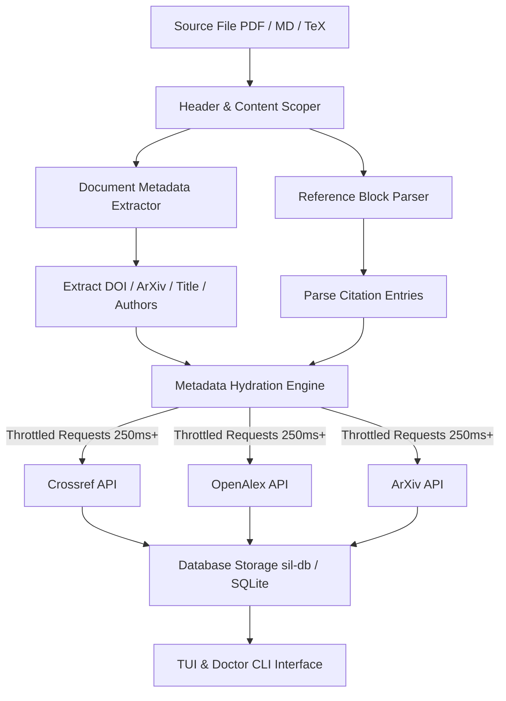

# Reference, Author, and Title Extraction Pipeline

## 1. Overview
This document specifies the end-to-end extraction and metadata hydration pipeline for Scientist-In-Loop (`sil`). The pipeline processes raw input documents (PDF, Markdown, LaTeX), extracts document-level metadata (Title, Authors, DOI, ArXiv ID, Year, Venue) alongside embedded reference lists (`## References` or BibTeX entries), and enriches metadata using rate-limited API providers (Crossref, OpenAlex, ArXiv).

---

## 2. Pipeline Stages

### Stage 1: Document Scoping & Scoped Extraction
To avoid false-positive metadata extraction (e.g., picking up the DOI of the first cited paper in the `## References` section as the document's main DOI):
- **Header Scoping**: Document DOI and ArXiv IDs are extracted strictly from the header region (the first 3,000 characters or text preceding `## References` / `\begin{thebibliography}`).
- **Body Scoping**: Reference lists are isolated and parsed separately.

### Stage 2: Pattern-Based Extraction (`sil-parse` / `sil-regex`)
- **Document Metadata**: Extracted using fast Regex pattern matching and structured markers (`Title:`, `# Title`, `Author:`, `doi.org/...`, `arXiv:...`).
- **Reference Entry Parsing**:
  - **Markdown/Plain Text**: Splits by numerical tags (`[1]`, `1.`) or list items, capturing raw string, title, authors, year, and venue.
  - **LaTeX/BibTeX**: Parses `\cite{...}` and `.bib` entries for explicit fields (`title`, `author`, `journal`, `booktitle`, `year`, `doi`).

### Stage 3: Metadata Hydration Engine (`sil-core`)
When an extracted reference or source document contains incomplete details (e.g., missing `venue`, incomplete author lists, or absent DOI):
1. **Resolution Priority**:
   - Query **Crossref API** if DOI is present.
   - Query **ArXiv API** if ArXiv ID is present.
   - Fall back to **OpenAlex API** search using raw citation text or title + first author.
2. **Field Normalization**:
   - Map venue string to standard conference/journal fields.
   - Normalize author names to `Last, First M.`.

### Stage 4: API Rate-Limiting & Throttling
To ensure compliance with public academic APIs and prevent rate-limit blocks (HTTP 429):
- Mandatory inter-request delay (`>= 250ms`).
- User-Agent configured with polite mailto headers (`scientist-in-loop/0.1.0`).

### Stage 5: Persistence & Interaction (`sil-db` / `sil-tui`)
- Extracted references are stored in SQLite table `source_references` with schema:
  - `id`, `source_id`, `citation_index`, `raw_text`, `title`, `authors`, `year`, `venue`, `doi`, `arxiv_id`.
- Dynamic sorting supported in `sil-tui`:
  - **Year** (`y`)
  - **Source Document** (`s`)
  - **Venue** (`v` / `j`)
  - **Index** (`i` / `n`)

---

## 3. Architecture Tradeoffs & Design Decisions

| Decision | Rationale | Tradeoff |
| :--- | :--- | :--- |
| **Strict Header Scoping** | Prevents references' DOIs from overwriting main source document metadata. | Might miss DOIs located in document footers beyond 3,000 chars. |
| **Throttled Sync HTTP (`ureq`)** | Simple, reliable rate-limiting execution without complex async state across CLI calls. | Slower batch processing for large reference sets. |
| **Pure Rust Parser Fallback** | Removes heavy Python/Marker dependencies for fast startup. | May handle non-standard OCR/PDF layouts with lower accuracy than LLM models. |

---

## 4. Verification & Testing Strategy
1. **Unit Tests**: Test scoped regex matching on header vs reference sections (`crates/sil-parse`).
2. **Integration Tests**: Verify SQLite reference insertion and schema migration (`crates/sil-db`).
3. **CLI Doctor Verification**: Run `sil source doctor` to test extraction across sample papers.
