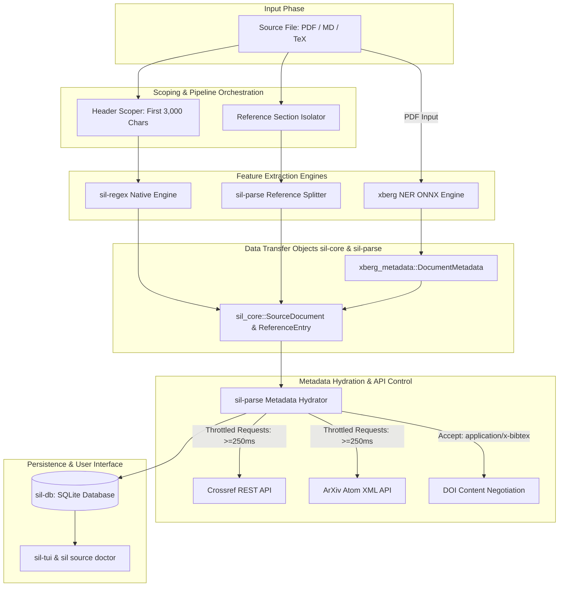

# Reference, Author, and Title Extraction Pipeline (Comprehensive Specification)

## 1. Executive Summary & Architecture Overview

Scientist-In-Loop (`sil`) employs a high-performance, multi-layered extraction architecture designed to process source documents (PDF, Markdown, LaTeX) and convert them into clean, structured Data Transfer Objects (DTOs).

The architecture features:
1. **Zero-Dependency Native Fast Fallback**: Regular expressions and pattern recognition via `sil-regex` & `sil-parse`.
2. **Deep Semantic Extraction via `xberg` Engine**: Onnx-backed Named Entity Recognition (NER) for rich structural PDF parsing.
3. **Throttled Network Hydration Protocol**: External API lookups across Crossref, ArXiv, and OpenAlex.
4. **Strict Document vs. Reference Scoping**: Header-scoped metadata extraction to guarantee parent document identities are never contaminated by cited paper DOIs.



---

## 2. Core Data Transfer Objects (DTOs) & Data Contracts

Data transfer across crates is governed by strongly typed, serialized structures defined in `crates/sil-core` and `crates/sil-parse`.

### 2.1 `sil_core::SourceDocument`
Represents the parent source document entity stored in the database.

```rust
#[derive(Debug, Clone, PartialEq, Eq, Serialize, Deserialize)]
pub struct SourceDocument {
    pub id: SourceId,                  // Opaque unique identifier key
    pub path: Utf8PathBuf,             // Relative filesystem path
    pub filename: String,              // Original filename
    pub kind: SourceKind,              // Format: Pdf, Markdown, Html, Text, Code, Dataset
    pub parsed: bool,                  // Indicates if parsed content is stored in DB
    pub status: Option<DocumentStatus>,// Document status (Valid, Corrupted, NotFound, etc.)
    pub title: Option<String>,         // Document title
    pub authors: Option<String>,       // Document author(s)
    pub abstract_text: Option<String>, // Abstract paragraph text
    pub doi: Option<String>,           // Document-level Digital Object Identifier
    pub year: Option<i32>,             // Publication year
    pub venue: Option<String>,         // Journal / Conference venue
    pub references_text: Option<String>,// Raw unparsed reference section text
}
```

### 2.2 `sil_core::ReferenceEntry`
Represents an individual extracted citation/reference entry within a paper's bibliography.

```rust
#[derive(Debug, Clone, PartialEq, Eq, Serialize, Deserialize)]
pub struct ReferenceEntry {
    pub id: String,              // Unique identifier (e.g. "{source_id}_ref_{index}")
    pub source_id: SourceId,     // Parent SourceId reference
    pub ref_index: usize,        // 1-based sequential index in bibliography
    pub raw_text: String,        // Complete raw unparsed reference line/paragraph
    pub title: Option<String>,   // Parsed publication title
    pub authors: Option<String>, // Parsed author list string
    pub year: Option<i32>,       // Publication year (1800..=2030)
    pub venue: Option<String>,   // Journal or conference name
    pub doi: Option<String>,     // Reference DOI (10.xxxx/...)
    pub arxiv_id: Option<String>,// ArXiv identifier (e.g. 1706.03762)
    pub url: Option<String>,     // External publication URL
}
```

### 2.3 `sil_parse::xberg_metadata::DocumentMetadata`
Intermediary DTO populated during ML-driven extraction using the `xberg` crate.

```rust
#[derive(Debug, Clone, Serialize, Deserialize, JsonSchema, PartialEq, Eq)]
pub struct DocumentMetadata {
    pub title: String,          // Extracted document title
    pub authors: Vec<String>,   // Vector of extracted author names
    pub citations: Vec<String>, // Vector of extracted reference strings
}
```

### 2.4 `sil_core::JournalPublication`
External API transfer object for Crossref/ArXiv API responses.

```rust
pub struct JournalPublication {
    pub doi: Option<String>,
    pub title: String,
    pub authors: String,
    pub journal: String,
    pub year: Option<u32>,
    pub abstract_text: String,
    pub citation_count: Option<u32>,
    pub url: String,
    pub pdf_url: Option<String>,
}
```

---

## 3. `xberg` Named Entity Recognition (NER) Integration

For PDF files, `sil-parse` integrates the `xberg` crate, utilizing an ONNX-backed Named Entity Recognition model to extract titles, author names, and citation entities directly from unstructured layout streams.

### 3.1 Model Cache & Environment Initialization
To maintain deterministic execution across environments, `xberg` sets its HuggingFace cache directory to a local dedicated path:

```rust
let cache_dir = Path::new("/Volumes/happy-disk/models/xberg/huggingface");
if let Ok(_) = std::fs::create_dir_all(cache_dir) {
    unsafe {
        std::env::set_var("HF_HOME", cache_dir);
    }
}
```

### 3.2 NER Extraction Configuration & Pipeline Execution
`extract_metadata` configures ONNX backend custom labels to capture target document fields:

```rust
let config = ExtractionConfig {
    ner: Some(NerConfig {
        backend: NerBackendKind::Onnx,
        custom_labels: vec![
            "title".to_string(),
            "author".to_string(),
            "citation".to_string(),
        ],
        ..Default::default()
    }),
    ..Default::default()
};

let input = ExtractInput::from_uri(path_str);
let result = extract(input, &config).await?;
```

### 3.3 DTO Mapping from `xberg` Results
Extracted entities are mapped into `xberg_metadata::DocumentMetadata`:

```rust
for entity in doc.entities.iter().flatten() {
    match &entity.category {
        EntityCategory::Custom(label) if label == "title" => {
            if metadata.title.is_empty() {
                metadata.title = entity.text.clone();
            }
        }
        EntityCategory::Custom(label) if label == "author" => {
            metadata.authors.push(entity.text.clone());
        }
        EntityCategory::Custom(label) if label == "citation" => {
            metadata.citations.push(entity.text.clone());
        }
        _ => {}
    }
}
```

---

## 4. Regular Expression Engine & Pattern Definitions (`sil-regex`)

All regular expressions are compiled lazily using `std::sync::LazyLock<Regex>` in `crates/sil-regex/src/lib.rs`.

### 4.1 Document & Citation Identifier Patterns

1. **Digital Object Identifier (DOI)**:
   ```regex
   \b10\.\d{4,9}/[-._;()/:A-Za-z0-9]+\b
   ```
   - *Cleaner*: Trims trailing punctuation (`.`, `,`, `;`, `)`, `]`).

2. **ArXiv Identifier**:
   ```regex
   (?i)\b(?:arxiv:\s*)?(\d{4}\.\d{4,5}(?:v\d+)?|[a-z\-]+(?:\.[a-z\-]+)?/\d{7}(?:v\d+)?)\b
   ```
   - Matches modern format (`1706.03762v1`), legacy format (`arxiv:math/0405001`), and prefixed strings.

3. **Publication Year**:
   ```regex
   \b(1[89]\d{2}|20[0-2]\d|2030)\b
   ```
   - Restricted to valid publication bounds (`1800`–`2030`).

4. **Quoted Titles**:
   ```regex
   ["“] [^"”\r\n]{2,} [”"]
   ```
   - Captures titles wrapped in straight double quotes (`"..."`) or curly quotes (`“...”`).

5. **Generic URL Extractor**:
   ```regex
   (?i)\bhttps?://[^\s<>]+|\bURL\s*<([^>]+)>
   ```

---

### 4.2 Heading & Section Boundary Patterns

1. **Reference Section Heading**:
   ```regex
   (?i)^\s*#*\s*(?:\d+\.?)?\s*(?:\*\*|__)?\s*(references|bibliography|literature cited|works cited|references and notes)(?:\*\*|__)?\b
   ```
   - Matches Markdown headers (`# References`, `## Bibliography`, `8. References`, `## **References**`).

2. **Non-Reference / Section Termination Heading**:
   ```regex
   (?i)^\s*#*\s*(?:\d+\.?)?\s*(appendix|author contributions|acknowledgements|acknowledgments|figures|tables|supplementary|supplemental|ethics statement|declarations|competing interests|conflict of interest|about the authors|biography|author biographies)\b
   ```
   - Immediately stops reference collection to avoid parsing appendixes or author bios as citations.

---

### 4.3 Citation Entry & Author Detection Patterns

1. **Reference Entry Start**:
   ```regex
   ^\s*(?:[\-*•]\s+)?(?:<span[^>]*>.*?</span>\s*)?(?:\[\d+\]|\(\d+\)|\d+[\.\)]|\([^\)]*\d{4}\)|\[[^\]]*\d{4}\]|[A-Z][a-z]+[,\;\:]\s+[A-Z]|[A-Z][a-z]+(?:\s+[A-Z]\.|\s+[A-Z][a-z]+)+[,\;\.])
   |^\s*(?:[\-*•]\s+(?:<span[^>]*>.*?</span>\s*)?|<span[^>]*>.*?</span>\s*)[A-Z][a-z]+(?:\s+[A-Z][a-z]+)*\s+et\s+al
   ```
   - Detects numbered citations (`[1]`, `1.`), APA author-year styles (`(Vaswani 2017)`), and bullet-prefixed entries with HTML anchor tags (`<span id="..."></span>`).

2. **Author List Verification (`is_author_list`)**:
   ```regex
   (?i)\b(?:and|&)\s+[A-Z][a-zA-Za-z\-']+(?:\s+[A-Z][a-zA-Za-z\-']+)?$
   ```
   - Validates comma-separated tokens to ensure candidate strings are author lists (e.g. `Firstname Surname, Firstname Surname, and Surname`) and not article titles.

3. **Inline Bullet Separator Expansion**:
   ```regex
   (\.|\b)\s+[\-*•]\s+([A-Z])
   ```
   - Converts inline bullet points (`. - Author Name`) into newline-delimited entries.

4. **BEE-RAG Line-Wrap Continuation Joining (PR-C1)**:
   - When processing unstructured PDF or Markdown reference lists, citations often span across multiple wrapped physical lines without an explicit entry boundary.
   - `sil-parse::references` tests non-boundary candidate lines against `REF_ENTRY_START_REGEX`. If a line is not a new reference entry start, it is joined into the active citation buffer with normalized spacing and hyphenation repair, preventing fragmented references on complex documents (such as `BEE-RAG` benchmarks).

---

## 5. API Interaction Patterns & Network Control Protocol

### 5.1 Global Rate-Limiter Implementation
All external REST calls are protected by a global thread-safe rate limiter in `crates/sil-parse/src/journal_digest.rs`:

```rust
static LAST_API_CALL: LazyLock<Mutex<Option<Instant>>> = LazyLock::new(|| Mutex::new(None));

pub fn enforce_api_ratelimit() {
    if let Ok(mut guard) = LAST_API_CALL.lock() {
        if let Some(last) = *guard {
            let elapsed = last.elapsed();
            let min_delay = Duration::from_millis(250);
            if elapsed < min_delay {
                std::thread::sleep(min_delay - elapsed);
            }
        }
        *guard = Some(Instant::now());
    }
}
```

### 5.2 External Provider Interaction Matrix

| Provider | Endpoint | Headers / Params | Output DTO | Purpose |
| :--- | :--- | :--- | :--- | :--- |
| **Crossref Works** | `GET https://api.crossref.org/works/{doi}` | `User-Agent: scientist-in-loop/0.1.0 (mailto:info@scientist-in-loop.org)` | `JournalPublication` | Lookup paper metadata via DOI |
| **Crossref Search** | `GET https://api.crossref.org/works` | `query.bibliographic={title}+{authors}&rows=1` | `JournalPublication` | Search DOI by title + author |
| **DOI Content Negotiation** | `GET https://doi.org/{doi}` | `Accept: application/x-bibtex`<br>`Redirects: 5` | Plaintext BibTeX | Retrieve official BibTeX string |
| **ArXiv API** | `GET http://export.arxiv.org/api/query` | `id_list={arxiv_id}` | `JournalPublication` | Query arXiv metadata feed |
| **ArXiv BibTeX** | `GET https://arxiv.org/bibtex/{arxiv_id}` | Direct HTTP GET | Plaintext BibTeX | Fetch arXiv BibTeX entry |

---

## 6. Metadata Hydration Protocol (`resolve_official_bibtex`) (PR-C2)

When resolving official BibTeX metadata for an extracted reference or source document, `sil-parse` executes a hardened fallback chain with Jaccard similarity validation:

1. **Direct DOI Content Negotiation**: If `doi` is available (e.g. `10.xxxx/...`), attempt direct BibTeX fetch via `https://doi.org/{doi}` with header `Accept: application/x-bibtex`.
2. **Direct arXiv BibTeX Fetch**: If `arxiv_id` is present (or normalized from DOI/URL), query `https://arxiv.org/bibtex/{arxiv_id}`.
3. **Crossref Title & Author Search with Jaccard Gating**:
   - If no direct identifier exists, construct a Crossref bibliographic search query: `https://api.crossref.org/works?query.bibliographic={title}+{authors}&rows=1`.
   - **Jaccard Similarity Gating ($\ge 0.60$)**: Before accepting the top Crossref result, `sil-parse` computes token-based Jaccard similarity between the search title and the candidate paper title.
   - If `Jaccard(query_title, candidate_title) >= 0.60`, the candidate DOI is accepted and official BibTeX is fetched via DOI content negotiation.
   - If `Jaccard < 0.60`, the candidate is rejected as a false positive, avoiding incorrect metadata hydration.
4. **Local Fallback (`entry.to_bibtex()`)**: If network requests fail, identifiers are absent, or Jaccard validation fails, `sil-parse` safely constructs a synthetic local BibTeX stub from extracted local fields, marked with `% [sil: tui-added]`.

---

## 7. Database Persistence & TUI Interaction

### 7.1 Database Schema (`sil-db` / SQLite)

```sql
CREATE TABLE IF NOT EXISTS source_references (
    id TEXT PRIMARY KEY,
    source_id TEXT NOT NULL,
    citation_index INTEGER NOT NULL,
    raw_text TEXT NOT NULL,
    title TEXT,
    authors TEXT,
    year INTEGER,
    venue TEXT,
    doi TEXT,
    arxiv_id TEXT,
    url TEXT,
    FOREIGN KEY(source_id) REFERENCES sources(id) ON DELETE CASCADE
);
```

### 7.2 Interactive TUI Reference Sorting (`sil-tui`)
`sil-tui` provides interactive keybindings to re-sort reference lists dynamically:

- **`y`**: Sort by **Publication Year** (descending/ascending).
- **`s`**: Sort by **Source Document ID**.
- **`v` / `j`**: Sort alphabetically by **Venue** (Journal / Conference name).
- **`i` / `n`**: Reset to original **Citation Index** order (`citation_index`).
